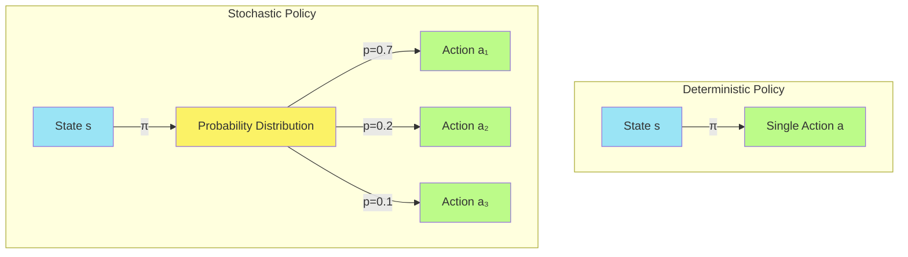
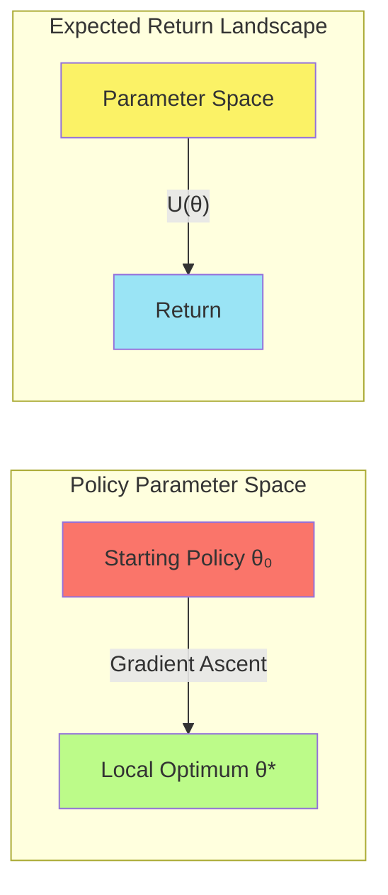
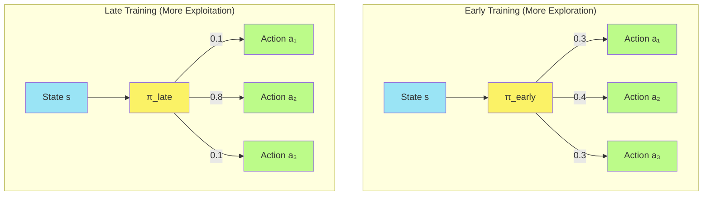
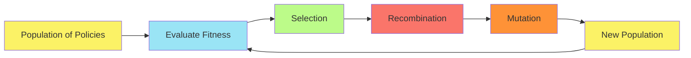
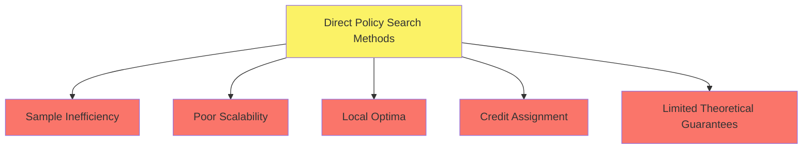

# S-2: Policy-Based Methods in Deep Reinforcement Learning

# C-1: Foundations of Policy-Based Reinforcement Learning

1. Introduction to Policy-Based Methods
    - Policy Definition and Representation
    - Stochastic vs Deterministic Policies
    - Advantages Over Value-Based Methods
    - Neural Network Policy Representations
2. Core Concepts in Policy Learning
    - The Policy Function
    - Expected Return Optimization
    - Policy Parameter Space
    - Exploration vs Exploitation Balance
3. Hill Climbing and Direct Policy Search
    - Hill Climbing Algorithm
    - Stochastic Policy Search
    - Beyond Hill Climbing
    - Limitations of Simple Search Methods

#### Introduction to Policy-Based Methods

Policy-based reinforcement learning represents a fundamental paradigm shift from traditional value-based approaches.
Instead of estimating the value of states or state-action pairs, policy-based methods directly learn the optimal policy
that maps states to actions. This direct approach offers several advantages, particularly in complex environments with
continuous action spaces or partial observability.

##### Policy Definition and Representation

A policy, denoted as $\pi$, is fundamentally a decision-making strategy that guides an agent's behavior in an
environment. In formal terms, a policy defines a mapping from states to actions. This mapping can take one of two
principal forms:

###### Deterministic Policies

A deterministic policy $\pi$ maps each state $s$ directly to a specific action $a$:

$$\pi(s) \rightarrow a$$

This means that in a given state, the agent will always select the same action with 100% certainty. For example, in a
chess game, a deterministic policy would always make the same move given the same board configuration.

###### Stochastic Policies

A stochastic policy $\pi$ maps each state $s$ to a probability distribution over the possible actions:

$$\pi(a|s) \rightarrow [0,1]$$

Here, $\pi(a|s)$ represents the probability of taking action $a$ in state $s$. The sum of probabilities across all
possible actions equals 1, forming a valid probability distribution. This introduces an element of randomness in the
agent's behavior, allowing for exploration and greater flexibility.

For instance, in a poker game, a stochastic policy might assign a 70% probability to raising, 20% to calling, and 10% to
folding in a particular game state, allowing for strategic unpredictability.

##### Stochastic vs Deterministic Policies

While both policy types have their applications, stochastic policies offer several crucial advantages in reinforcement
learning:

1. **Enhanced Exploration**: By maintaining non-zero probabilities for multiple actions, stochastic policies naturally
   encourage exploration of the state-action space, helping to discover optimal strategies that might be missed by a
   purely exploitative approach.
2. **Robustness to Uncertainty**: In partially observable environments where the agent lacks complete information,
   stochasticity allows for hedging against uncertainty.
3. **Handling Multi-modal Optimal Solutions**: Some problems have multiple equally optimal solutions. A stochastic
   policy can capture this by assigning equal probabilities to equally good actions.
4. **Gradient-Based Optimization**: Stochastic policies are typically differentiable with respect to their parameters,
   enabling efficient gradient-based optimization methods.
5. **Convergence Properties**: In certain environments, particularly competitive or adversarial settings, stochastic
   policies may be necessary to achieve Nash equilibria or other stable solutions.

The following diagram illustrates the key differences between deterministic and stochastic policies:



##### Advantages Over Value-Based Methods

Policy-based methods offer several compelling advantages over traditional value-based approaches like Q-learning:

1. **Effective in Continuous Action Spaces**: Value-based methods typically require discretization of continuous action
   spaces, which becomes computationally intractable as the dimensionality increases. Policy-based methods can naturally
   parameterize continuous action distributions (e.g., using Gaussian distributions).
2. **Handling High-Dimensional Action Spaces**: Even with discrete actions, when the action space is large, finding the
   maximum value action becomes challenging. Policy-based methods directly output action probabilities, avoiding this
   maximization problem.
3. **Learning Stochastic Policies**: Value-based methods typically result in deterministic policies (choosing the action
   with maximum value), whereas policy-based methods can learn truly stochastic policies when beneficial.
4. **Better Convergence Properties**: Policy gradient methods often exhibit more stable learning behavior with smoother
   convergence, particularly when using neural network function approximators.
5. **Memory Efficiency**: Policy-based methods often require less memory as they don't need to store action values for
   every state-action pair.

The following table summarizes these comparative advantages:

| Aspect              | Policy-Based Methods                          | Value-Based Methods                          |
| ------------------- | --------------------------------------------- | -------------------------------------------- |
| Action Space        | Natural for continuous and high-dimensional   | Struggles with continuous actions            |
| Policy Type         | Can learn stochastic policies                 | Typically deterministic                      |
| Convergence         | Often more stable with function approximation | May diverge with function approximation      |
| Memory Requirements | Can be more efficient                         | May require large tables or complex networks |
| Exploration         | Built into stochastic policies                | Requires explicit exploration strategies     |

##### Neural Network Policy Representations

In deep reinforcement learning, policies are typically represented using neural networks. The architecture depends on
the action space:

###### Discrete Action Spaces

For discrete action spaces, the policy network typically outputs action probabilities through a softmax activation
function:

```python
class DiscretePolicy(nn.Module):
    def __init__(self, state_dim, hidden_dim, action_dim):
        super().__init__()
        self.fc1 = nn.Linear(state_dim, hidden_dim)
        self.fc2 = nn.Linear(hidden_dim, action_dim)

    def forward(self, state):
        x = F.relu(self.fc1(state))
        action_probs = F.softmax(self.fc2(x), dim=-1)
        return action_probs
```

In this network, the input is the environment state (or observation), and the output is a probability distribution over
discrete actions. The softmax function ensures that the outputs sum to 1, forming a valid probability distribution.

###### Continuous Action Spaces

For continuous action spaces, the policy network typically parameterizes a probability distribution, often a Gaussian
distribution with learnable mean and standard deviation:

```python
class ContinuousPolicy(nn.Module):
    def __init__(self, state_dim, hidden_dim, action_dim):
        super().__init__()
        self.fc1 = nn.Linear(state_dim, hidden_dim)
        self.mean = nn.Linear(hidden_dim, action_dim)
        self.log_std = nn.Parameter(torch.zeros(action_dim))

    def forward(self, state):
        x = F.relu(self.fc1(state))
        mean = self.mean(x)
        std = self.log_std.exp()
        return mean, std  # Parameters of Gaussian distribution

    def sample_action(self, state):
        mean, std = self.forward(state)
        normal = torch.distributions.Normal(mean, std)
        action = normal.sample()
        return action
```

This network outputs the parameters of a Gaussian distribution (mean and standard deviation) for each action dimension.
Actions are then sampled from this distribution during execution.

#### 2. Core Concepts in Policy Learning

##### The Policy Function

The policy function $\pi_\theta(a|s)$ lies at the heart of policy-based reinforcement learning. This function gives the
probability of taking action $a$ in state $s$, parameterized by $\theta$ (typically the weights of a neural network).
The fundamental objective in policy-based RL is to find the optimal parameter values $\theta^*$ that maximize the
expected cumulative reward.

<div align="center">  <p style="color: #555;">Figure: Connection between supervised learning and policy gradients</p> </div>

This figure illustrates the policy gradient approach, which can be understood as:

$$\nabla_\theta U(\theta) \approx \hat{g} = \sum_{t=0}^{H} \nabla_\theta \log \pi_\theta(a_t|s_t)R(\tau)$$

Breaking this down:

- $\nabla_\theta \log \pi_\theta(a_t|s_t)$ is the direction of steepest increase in the log probability of selecting
  action $a_t$ in state $s_t$
- $R(\tau)$ is the cumulative reward for the trajectory
- The product means we increase the probability of actions that led to good outcomes ($R(\tau) > 0$) and decrease the
  probability of actions that led to poor outcomes ($R(\tau) < 0$)

This approach differs fundamentally from supervised learning, where the gradient is computed directly from labeled data.
In reinforcement learning, we must estimate the gradient based on the rewards that often arrive after many timesteps.

##### Expected Return Optimization

The primary objective in policy optimization is to maximize the expected return $U(\theta)$:

$$U(\theta) = \mathbb{E}*{\tau \sim \pi*\theta}[R(\tau)] = \sum_{\tau} P(\tau; \theta)R(\tau)$$

Where:

- $\tau$ represents a trajectory (a sequence of states, actions, and rewards)
- $P(\tau; \theta)$ is the probability of trajectory $\tau$ under policy $\pi_\theta$
- $R(\tau)$ is the return (cumulative reward) from trajectory $\tau$

The probability of a trajectory is determined by the policy and the environment dynamics:

$$P(\tau; \theta) = p(s_0)\prod_{t=0}^{H-1} \pi_\theta(a_t|s_t)p(s_{t+1}|s_t,a_t)$$

Where:

- $p(s_0)$ is the probability of starting in state $s_0$
- $\pi_\theta(a_t|s_t)$ is the probability of taking action $a_t$ in state $s_t$ under policy $\pi_\theta$
- $p(s_{t+1}|s_t,a_t)$ is the transition probability determined by the environment dynamics

The return $R(\tau)$ can be calculated in various ways:

1. **Total return**: $R(\tau) = \sum_{t=0}^{H} r_t$
2. **Discounted return**: $R(\tau) = \sum_{t=0}^{H} \gamma^t r_t$, where $\gamma \in [0,1]$ is a discount factor
3. **Average reward**: $R(\tau) = \frac{1}{H}\sum_{t=0}^{H} r_t$

The policy gradient theorem provides a way to compute the gradient of the expected return:

$$\nabla_\theta U(\theta) = \mathbb{E}*{\tau \sim \pi*\theta}\left[\sum_{t=0}^{H} \nabla_\theta \log \pi_\theta(a_t|s_t)R(\tau)\right]$$

This gradient is estimated empirically by sampling trajectories and averaging the gradients.

##### Policy Parameter Space

The policy parameter space refers to the multi-dimensional space defined by all possible values of the parameter vector
$\theta$. Each point in this space represents a specific policy. The optimization process can be visualized as
navigating this parameter space to find regions of high expected return.

<div align="center">  <p style="color: #555;">Figure: Comparison between supervised learning and reinforcement learning</p> </div>

As shown in this figure, the fundamental difference between supervised learning and reinforcement learning lies in how
gradients are computed:

1. **Supervised Learning**: Immediate feedback through labeled data provides direct gradients
2. **Reinforcement Learning**: Delayed rewards require estimating gradients based on sampled returns

This difference makes optimization in reinforcement learning more challenging, as the feedback signal is often delayed,
sparse, and noisy.

The policy parameter space has several important characteristics:

1. **High-dimensionality**: Modern neural networks may have millions of parameters
2. **Non-convexity**: The expected return landscape typically contains many local optima
3. **Plateaus and saddle points**: Large regions with near-zero gradients
4. **Sensitivity to initialization**: Different starting points may converge to different solutions

To visualize policy parameter spaces, consider the following simplified 2D representation:



##### Exploration vs Exploitation Balance

The exploration-exploitation dilemma is a fundamental challenge in reinforcement learning: should the agent exploit its
current knowledge to maximize immediate rewards, or explore to gather more information that might lead to better
long-term outcomes?

Policy-based methods address this dilemma through stochastic policies:

1. **Exploration**: Maintained by assigning non-zero probabilities to multiple actions
2. **Exploitation**: Gradually increased by raising probabilities for actions that yield higher returns

This balance can be controlled through several mechanisms:

1. **Temperature parameter** ($\tau$) in softmax: $\pi(a|s) = \frac{e^{z_a/\tau}}{\sum_i e^{z_i/\tau}}$
    - Higher $\tau$ → more uniform distribution → more exploration
    - Lower $\tau$ → more peaked distribution → more exploitation
2. **Entropy regularization**: Adding an entropy term to the objective function
   $$U'(\theta) = U(\theta) + \alpha H(\pi_\theta)$$ where
   $H(\pi_\theta) = -\sum_s d^\pi(s) \sum_a \pi_\theta(a|s) \log \pi_\theta(a|s)$
    - Higher $\alpha$ → more exploration
    - Lower $\alpha$ → more exploitation
3. **Noise in action selection**: Adding Gaussian noise to actions in continuous spaces
   $$a' = a + \epsilon, \text{ where } \epsilon \sim \mathcal{N}(0, \sigma^2)$$
    - Higher $\sigma$ → more exploration
    - Lower $\sigma$ → more exploitation

The exploration-exploitation tradeoff varies throughout training:

- Early training: More exploration to discover promising regions of the state-action space
- Late training: More exploitation to refine the policy around the best-discovered strategies

The following diagram illustrates how the probability distribution over actions evolves during training:



#### 3. Hill Climbing and Direct Policy Search

Before diving into sophisticated policy gradient methods, it's worth exploring simpler approaches like hill climbing and
direct policy search algorithms. These methods provide foundational insights and can be effective for certain classes of
problems.

##### Hill Climbing Algorithm

Hill climbing is one of the simplest optimization algorithms for policy search. It operates directly in parameter space
without using gradient information:

###### Basic Hill Climbing Procedure:

1. **Initialization**: Start with a randomly initialized policy with parameters $\theta_0$

2. **Evaluation**: Evaluate the current policy by executing it in the environment and calculating the return

3. **Perturbation**: Generate a slightly modified policy with parameters $\theta' = \theta + \Delta\theta$, where
   $\Delta\theta$ is a small random noise vector

4. Comparison

    : Evaluate the perturbed policy

    - If the perturbed policy performs better, update $\theta \leftarrow \theta'$
    - Otherwise, retain the current parameters $\theta$

5. **Iteration**: Repeat steps 2-4 until convergence or a maximum number of iterations

Here's a simple implementation:

```python
def hill_climbing(env, policy, num_episodes=1000):
    # Initialize policy parameters randomly
    theta = np.random.randn(policy.param_dim)
    best_reward = -np.inf

    for episode in range(num_episodes):
        # Create a perturbed policy
        noise = np.random.randn(policy.param_dim) * 0.1
        theta_perturbed = theta + noise

        # Evaluate perturbed policy
        total_reward = 0
        state = env.reset()
        done = False

        while not done:
            action = policy.select_action(state, theta_perturbed)
            next_state, reward, done, _ = env.step(action)
            total_reward += reward
            state = next_state

        # Update if better
        if total_reward > best_reward:
            best_reward = total_reward
            theta = theta_perturbed

    return theta, best_reward
```

While conceptually simple, hill climbing has several limitations:

- Susceptible to getting trapped in local optima
- Sensitive to the scale of parameter perturbations
- Inefficient in high-dimensional parameter spaces
- Unable to leverage gradient information

Despite these limitations, hill climbing can be surprisingly effective for simple problems with well-behaved return
landscapes.

##### Stochastic Policy Search

Stochastic policy search extends basic hill climbing by incorporating more sophisticated exploration of the parameter
space. Instead of a single perturbation, multiple candidates are evaluated to improve search efficiency.

###### Cross-Entropy Method (CEM)

One popular stochastic policy search algorithm is the Cross-Entropy Method:

1. **Initialization**: Initialize a distribution over policy parameters, typically a multivariate Gaussian
   $\mathcal{N}(\mu_0, \Sigma_0)$
2. **Sampling**: Sample a population of parameter vectors ${\theta_1, \theta_2, ..., \theta_n}$ from this distribution
3. **Evaluation**: Evaluate each parameter vector by running the corresponding policy in the environment
4. **Elite Selection**: Select the top-k performing parameter vectors (the "elite" set)
5. **Distribution Update**: Fit a new distribution to the elite set: $\mathcal{N}(\mu_{new}, \Sigma_{new})$
6. **Iteration**: Repeat steps 2-5 until convergence

```python
def cross_entropy_method(env, policy, n_iterations=100, population_size=100, elite_frac=0.2):
    # Initialize parameter distribution
    theta_mean = np.zeros(policy.param_dim)
    theta_std = np.ones(policy.param_dim)

    for iteration in range(n_iterations):
        # Sample population
        thetas = [np.random.normal(theta_mean, theta_std) for _ in range(population_size)]

        # Evaluate population
        rewards = []
        for theta in thetas:
            total_reward = 0
            state = env.reset()
            done = False

            while not done:
                action = policy.select_action(state, theta)
                next_state, reward, done, _ = env.step(action)
                total_reward += reward
                state = next_state

            rewards.append(total_reward)

        # Select elite set
        n_elite = int(population_size * elite_frac)
        elite_indices = np.argsort(rewards)[-n_elite:]
        elite_thetas = [thetas[i] for i in elite_indices]

        # Update distribution
        theta_mean = np.mean(elite_thetas, axis=0)
        theta_std = np.std(elite_thetas, axis=0) + 1e-5  # Prevent collapse

    return theta_mean
```

Stochastic policies can be implemented using neural networks:

```python
class StochasticDiscretePolicy(nn.Module):
    def __init__(self, state_dim, action_dim, hidden_dim=64):
        super().__init__()
        self.network = nn.Sequential(
            nn.Linear(state_dim, hidden_dim),
            nn.ReLU(),
            nn.Linear(hidden_dim, action_dim),
            nn.Softmax(dim=-1)
        )

    def forward(self, state):
        return self.network(state)

    def select_action(self, state, params=None):
        # If params provided, use them instead of network parameters
        if params is not None:
            # Reshape params to match network structure
            # (Implementation depends on specific network architecture)
            pass

        probs = self.forward(state)
        action = torch.multinomial(probs, 1).item()
        return action
```

##### Beyond Hill Climbing

Several more sophisticated direct policy search methods extend beyond basic hill climbing:

###### Simulated Annealing

Simulated annealing incorporates a "temperature" parameter that controls the acceptance of worse solutions, allowing for
escaping local optima:

1. Start with a high temperature $T$
2. At each step, evaluate a perturbed policy
3. If better, always accept it
4. If worse, accept with probability $e^{\frac{R_{new} - R_{old}}{T}}$
5. Gradually decrease temperature $T$ according to a cooling schedule

```python
def simulated_annealing(env, policy, num_episodes=1000, t_0=1.0, decay=0.99):
    theta = np.random.randn(policy.param_dim)
    current_reward = evaluate_policy(env, policy, theta)
    best_theta = theta.copy()
    best_reward = current_reward
    temperature = t_0

    for episode in range(num_episodes):
        # Generate perturbed policy
        noise = np.random.randn(policy.param_dim) * 0.1
        theta_perturbed = theta + noise

        # Evaluate perturbed policy
        perturbed_reward = evaluate_policy(env, policy, theta_perturbed)

        # Accept or reject based on reward and temperature
        delta_reward = perturbed_reward - current_reward
        if delta_reward > 0 or np.random.random() < np.exp(delta_reward / temperature):
            theta = theta_perturbed
            current_reward = perturbed_reward

            # Update best if improved
            if current_reward > best_reward:
                best_reward = current_reward
                best_theta = theta.copy()

        # Decrease temperature
        temperature *= decay

    return best_theta, best_reward
```

###### Evolution Strategies (ES)

Evolution strategies maintain a population of policies and use evolutionary principles to improve them:

1. **Initialization**: Create a population of policy parameters
2. **Evaluation**: Evaluate each policy's fitness (expected return)
3. **Selection**: Select parents based on fitness
4. **Recombination**: Create offspring through crossover of parent parameters
5. **Mutation**: Apply random perturbations to offspring parameters
6. **Replacement**: Replace the old population with the new generation
7. **Iteration**: Repeat steps 2-6 until convergence



###### Covariance Matrix Adaptation Evolution Strategy (CMA-ES)

CMA-ES is an advanced evolution strategy that adapts the covariance matrix of the search distribution based on
successful search directions:

1. Sample candidate solutions from a multivariate normal distribution
2. Evaluate and rank candidates
3. Update the mean of the distribution based on weighted recombination of top performers
4. Update the covariance matrix to adapt to the local structure of the fitness landscape
5. Repeat until convergence

CMA-ES excels at handling non-separable, ill-conditioned problems and has been successfully applied to policy
optimization in reinforcement learning.

##### Limitations of Simple Search Methods

While direct policy search methods have their merits, they also face significant limitations:

###### Sample Inefficiency

Direct policy search methods typically require many environment interactions to make progress:

- Hill climbing evaluates entire episodes for single parameter updates
- Population-based methods evaluate multiple policies in parallel
- No reuse of previous experience (unlike value-based methods)

This inefficiency becomes prohibitive in environments where interactions are expensive or time-consuming.

###### Scalability Issues

As the dimensionality of the parameter space increases, direct search methods face exponential challenges:

- The volume of the search space grows exponentially with dimensions
- Finding improvements becomes increasingly difficult
- More samples are required for reliable estimates
- More complex policy representations exacerbate these issues

###### Local Optima

Simple search methods often get trapped in local optima:

- Hill climbing has no mechanism to escape local maxima
- Simulated annealing and evolutionary methods help but don't guarantee global optimality
- The non-convex nature of the return landscape in RL makes this particularly challenging

###### Credit Assignment

Direct policy search methods struggle with temporal credit assignment:

- Determining which actions within a trajectory contributed to the observed return
- All actions in a trajectory are updated equally, regardless of their individual contribution
- This leads to slow learning in tasks with delayed rewards

###### Lack of Theoretical Guarantees

Unlike some policy gradient methods, direct search approaches often lack theoretical convergence guarantees:

- No clear relationship to gradient-based optimization
- Limited understanding of convergence properties
- Few formal performance bounds

The following diagram illustrates the key limitations of direct policy search methods:



These limitations have motivated the development of more sophisticated policy optimization methods, such as policy
gradient algorithms, that we'll explore in subsequent chapters. Policy gradient methods address many of these
limitations by leveraging gradient information, incorporating value function approximation, and providing theoretical
guarantees.
