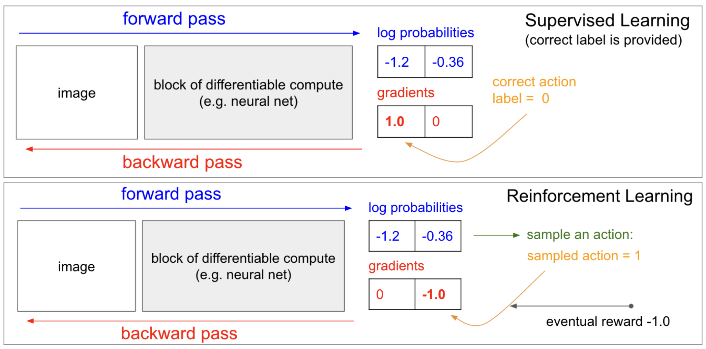

# S-2: Policy-Based Methods in Deep Reinforcement Learning

# C-1: Foundations of Policy-Based Reinforcement Learning

1. Introduction to Policy-Based Methods
    - Policy Definition and Representation
    - Stochastic vs Deterministic Policies
    - Advantages Over Value-Based Methods
    - Neural Network Policy Representations
2. Core Concepts in Policy Learning
    - The Policy Function
    - Expected Return Optimization
    - Policy Parameter Space
    - Exploration vs Exploitation Balance
3. Hill Climbing and Direct Policy Search
    - Hill Climbing Algorithm
    - Stochastic Policy Search
    - Beyond Hill Climbing
    - Limitations of Simple Search Methods

#### 1. Introduction to Policy-Based Methods

Policy-based methods represent a fundamental paradigm in reinforcement learning that directly optimizes the policy
function without requiring an intermediate value function. Unlike value-based methods such as Q-learning, policy-based
approaches directly parameterize and learn the optimal policy mapping from states to actions.

##### Policy Definition and Representation

At its core, a policy $\pi$ is a function that maps states to actions. We can distinguish between two primary types:

- **Deterministic Policy**: $\pi(s) \rightarrow a$, which directly maps a state to a specific action
- **Stochastic Policy**: $\pi(a|s) \rightarrow [0,1]$, which outputs a probability distribution over possible actions

For most policy-based methods, especially in complex environments, we employ stochastic policies as they naturally
balance exploration and exploitation through their probabilistic nature.

##### Stochastic vs Deterministic Policies

Stochastic policies offer several advantages:

- Better exploration capabilities through probability distributions
- Ability to handle partial observability
- More robust learning in many environments
- Natural handling of uncertainty

In deep reinforcement learning, these policies are typically represented using neural networks. For discrete action
spaces, the network takes the environment state as input and outputs action probabilities through a softmax activation
function in the output layer.

##### Advantages Over Value-Based Methods

Policy-based methods offer several distinct advantages:

1. **Better suited for continuous action spaces**: Directly outputs actions without discretization
2. **Can learn stochastic policies**: Naturally handles exploration-exploitation balance
3. **More stable learning in many cases**: Gradual improvement of policy parameters
4. **More effective in high-dimensional action spaces**: Avoids the curse of dimensionality
5. **Can naturally handle competing objectives**: Through policy gradient formulations

##### Neural Network Policy Representations

When implementing policy-based methods, the policy is typically represented by a neural network structure:

```python
class PolicyNetwork(nn.Module):
    def __init__(self, state_dim, hidden_dim, action_dim):
        super().__init__()
        self.fc1 = nn.Linear(state_dim, hidden_dim)
        self.fc2 = nn.Linear(hidden_dim, action_dim)

    def forward(self, x):
        x = F.relu(self.fc1(x))
        action_probs = F.softmax(self.fc2(x), dim=-1)
        return action_probs
```

The neural network that approximates the policy takes the environment state as input, and the output layer returns the
probability that the agent should select each possible action. The softmax activation function ensures outputs form a
valid probability distribution.

#### 2. Core Concepts in Policy Learning

##### The Policy Function

The policy function $\pi_\theta(a|s)$ represents the probability of taking action $a$ in state $s$, where $\theta$
represents the parameters (typically neural network weights) that define the policy. The goal of policy-based
reinforcement learning is to find the optimal parameter values $\theta^*$ that maximize expected return.

<div align="center">  <p style="color: #555;">Figure: Connection between supervised learning and policy gradients</p> </div>

This figure illustrates the connection between supervised learning and reinforcement learning through the policy
gradient approach. While supervised learning has immediate feedback through labeled data, reinforcement learning must
estimate gradients based on eventual rewards.

##### Expected Return Optimization

Our objective is to maximize the expected return:

$$U(\theta) = \sum_\tau P(\tau; \theta)R(\tau)$$

Where:

- $\tau$ represents a trajectory (sequence of states, actions, and rewards)
- $P(\tau; \theta)$ is the probability of trajectory $\tau$ under policy $\pi_\theta$
- $R(\tau)$ is the return (cumulative reward) received from trajectory $\tau$

The policy gradient methods aim to estimate the gradient $\nabla_\theta U(\theta)$ and use it to update the parameters
$\theta$ through gradient ascent.

##### Policy Parameter Space

The parameter space $\theta$ defines all possible policies. The optimization process can be visualized as navigating
this space to find parameters that maximize expected returns. The complexity of this space depends on the neural network
architecture used to represent the policy.

<div align="center">  <p style="color: #555;">Figure: Comparison between supervised learning and reinforcement learning</p> </div>

This image shows a critical difference between supervised learning and reinforcement learning. In supervised learning,
gradients are calculated based on known labels, while in RL, gradients are estimated based on sampled rewards that may
only arrive after many actions. This fundamental difference makes RL optimization more challenging.

##### Exploration vs Exploitation Balance

Policy-based methods naturally address the exploration-exploitation dilemma through stochastic policies. By outputting
probability distributions over actions, the policy maintains exploration through non-zero probabilities for sub-optimal
actions while gradually increasing probabilities for better actions.

This balance is crucial for discovering optimal policies, especially in environments with complex reward structures or
partial observability.

#### 3. Hill Climbing and Direct Policy Search

##### Hill Climbing Algorithm

Hill climbing represents one of the simplest approaches to policy optimization. The algorithm works as follows:

1. Initialize policy parameters $\theta$ randomly
2. Repeat: a. Slightly perturb $\theta$ to get $\theta'$ (add small random noise) b. Evaluate the perturbed policy by
   collecting an episode and calculating return c. If the new policy performs better, update $\theta \leftarrow \theta'$
   d. Otherwise, keep the current $\theta$

Despite its simplicity, hill climbing can be effective for simple problems but suffers from getting trapped in local
optima.

##### Stochastic Policy Search

Stochastic policy search extends beyond simple hill climbing by introducing more sophisticated exploration of the
parameter space. In stochastic policy search:

```python
class StochasticPolicy(nn.Module):
    def __init__(self, state_dim, action_dim):
        super().__init__()
        self.network = nn.Sequential(
            nn.Linear(state_dim, hidden_dim),
            nn.ReLU(),
            nn.Linear(hidden_dim, action_dim),
            nn.Softmax(dim=-1)  # Outputs action probabilities
        )
```

The stochastic nature allows for:

- Better exploration capabilities
- More robust learning in uncertain environments
- Ability to represent multiple good solutions
- Natural handling of environmental stochasticity

##### Beyond Hill Climbing

Several more advanced direct policy search methods exist:

1. **Steepest ascent hill climbing**: Evaluates multiple neighboring policies and selects the best
2. **Simulated annealing**: Uses a temperature parameter to control exploration, gradually reducing it over time
3. **Cross-entropy method**: Samples multiple candidates and uses a percentage of the best to update the policy
4. **Evolution strategies**: Uses population-based optimization with weighted averaging based on performance

##### Limitations of Simple Search Methods

While direct policy search methods are conceptually simple, they suffer from several limitations:

1. Sample inefficiency: Requires many environment interactions
2. Difficulty with high-dimensional parameter spaces
3. Susceptibility to local optima
4. Lack of theoretical guarantees
5. Poor credit assignment over trajectories

These limitations motivate the development of more sophisticated policy gradient methods that we'll explore in the next
chapter.
