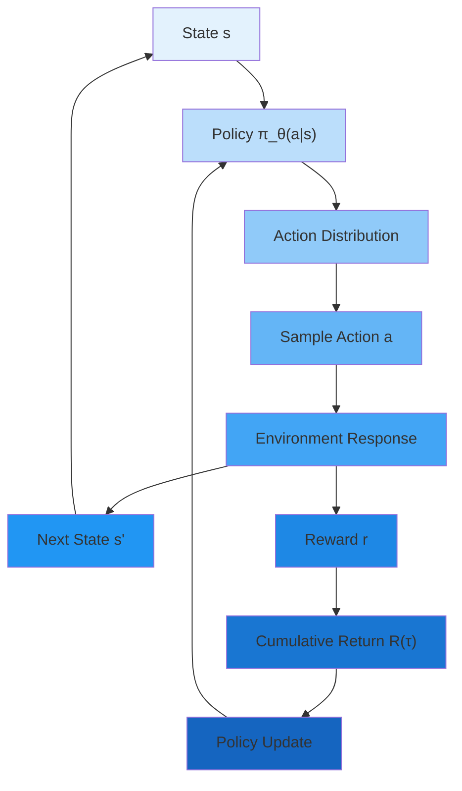
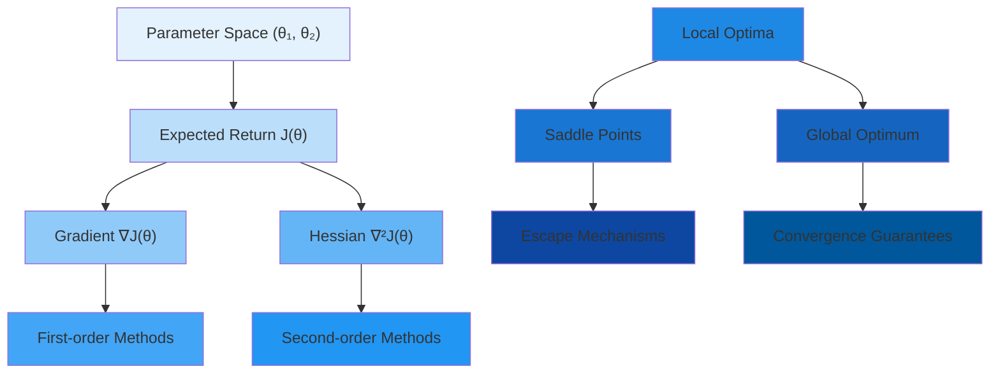
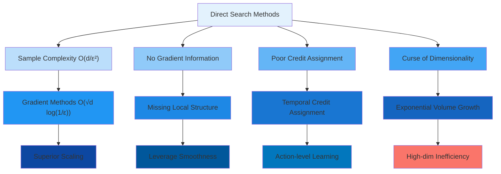

# S-2: Policy-Based Methods in Deep Reinforcement Learning

# C-1: Foundations of Policy-Based Reinforcement Learning

#### Introduction to Policy-Based Methods

Policy-based reinforcement learning represents a fundamental paradigm shift in how we approach sequential
decision-making problems. Rather than learning value functions and deriving policies indirectly, policy-based methods
directly optimize the mapping from states to actions. This direct approach emerges from profound theoretical insights
and practical necessities that we'll explore systematically.

To appreciate this paradigm shift, consider the fundamental question in reinforcement learning: how should an agent
behave to maximize long-term reward? Traditional value-based methods answer this by first asking "how good is each
state?" and then choosing actions that lead to better states. Policy-based methods instead ask directly "what should I
do in each situation?" This seemingly subtle difference has far-reaching implications for both theory and practice.

The mathematical foundation rests on the principle of expected utility maximization. Given a parameterized policy
$\pi_\theta$, we seek to maximize:

$$J(\theta) = \mathbb{E}*{\tau \sim \pi*\theta}[R(\tau)]$$

where $\tau$ represents a trajectory and $R(\tau)$ the associated return. This optimization problem, while conceptually
straightforward, presents unique challenges that drive the development of sophisticated algorithms.



##### Policy Definition and Representation

A policy $\pi$ fundamentally encodes an agent's decision-making strategy. Formally, a policy is a function that maps
from the state space to the action space, but this simple definition encompasses rich mathematical structures with
profound implications for learning and optimization.

**Deterministic Policies**

A deterministic policy provides a direct functional mapping: $$\pi: \mathcal{S} \rightarrow \mathcal{A}$$

For any state $s \in \mathcal{S}$, the policy deterministically selects action $a = \pi(s)$. While conceptually simple,
deterministic policies exhibit important mathematical properties:

1. **Unique Action Selection**: $|{a : \pi(s) = a}| = 1$ for all $s$
2. **Trajectory Determinism**: Given initial state and policy, the trajectory becomes deterministic (modulo environment
   stochasticity)
3. **Optimization Landscape**: The space of deterministic policies forms a discrete structure, making gradient-based
   optimization challenging

**Theoretical Example**: Consider a portfolio allocation problem with states representing market conditions and actions
representing asset allocations. A deterministic policy might specify: "In bull markets, allocate 80% to stocks; in bear
markets, allocate 20% to stocks." This policy is completely specified by a lookup table or function approximator.

**Stochastic Policies**

Stochastic policies define probability distributions over actions:
$$\pi: \mathcal{S} \times \mathcal{A} \rightarrow [0,1]$$

such that $\pi(a|s) = P(A_t = a | S_t = s)$ and $\sum_{a \in \mathcal{A}} \pi(a|s) = 1$ for all $s$.

The mathematical richness of stochastic policies becomes apparent when we consider their information-theoretic
properties. The entropy of a policy in state $s$ is:

$$H(\pi(\cdot|s)) = -\sum_{a} \pi(a|s) \log \pi(a|s)$$

This entropy measures the policy's uncertainty or "randomness" in state $s$, providing a natural regularization
mechanism.

**Advanced Example**: In algorithmic trading, consider a state representing current market volatility, order book depth,
and recent price movements. A sophisticated stochastic policy might output:

- Buy order (probability 0.35): $\pi(\text{buy}|s) = 0.35$
- Hold position (probability 0.45): $\pi(\text{hold}|s) = 0.45$
- Sell order (probability 0.20): $\pi(\text{sell}|s) = 0.20$

The specific probabilities depend on learned parameters and the current market state, encoding complex strategic
considerations.

##### Stochastic vs Deterministic Policies: A Theoretical Analysis

The choice between stochastic and deterministic policies involves fundamental trade-offs rooted in optimization theory,
game theory, and information theory.

**Optimization Perspective**

From an optimization standpoint, stochastic policies offer several advantages:

1. **Differentiability**: Stochastic policies parameterized by neural networks are typically differentiable almost
   everywhere, enabling gradient-based optimization. The log-likelihood $\log \pi_\theta(a|s)$ is differentiable with
   respect to $\theta$, allowing us to compute:

$$\nabla_\theta \log \pi_\theta(a|s) = \frac{\nabla_\theta \pi_\theta(a|s)}{\pi_\theta(a|s)}$$

1. **Smooth Optimization Landscape**: The expected return surface $J(\theta)$ is typically smoother for stochastic
   policies, reducing the likelihood of pathological optimization behavior.
2. **Natural Regularization**: The entropy term in stochastic policies provides implicit regularization, preventing
   premature convergence to poor local optima.

**Game-Theoretic Perspective**

In multi-agent environments, stochastic policies become essential for achieving equilibrium solutions:

**Nash Equilibrium Requirement**: Consider a two-player zero-sum game. The minimax theorem guarantees that optimal
strategies may be mixed (stochastic). A deterministic strategy can often be exploited by an adversary who learns to
predict the agent's behavior.

**Concrete Example**: In poker, a deterministic betting strategy (always bet with strong hands, always fold with weak
hands) becomes exploitable. Optimal play requires randomization—sometimes bluffing with weak hands and sometimes
checking with strong hands.

**Information-Theoretic Perspective**

Stochastic policies naturally handle uncertainty and partial observability:

1. **Entropy Maximization**: In the absence of strong preferences between actions, maximizing entropy ensures robust
   behavior. This principle, known as the maximum entropy principle, suggests choosing the policy with highest entropy
   among all policies achieving a given expected return.
2. **Exploration-Exploitation Balance**: Stochastic policies encode exploration naturally through their probability
   distributions, whereas deterministic policies require explicit exploration mechanisms.

**Convergence Analysis**

The convergence properties differ significantly:

- **Deterministic Policies**: May cycle or converge to suboptimal fixed points
- **Stochastic Policies**: Policy gradient methods with stochastic policies have proven convergence guarantees under
  appropriate conditions (we'll formalize this later)

**Numerical Comparison Example**

Consider a simple 2-state, 2-action MDP:

- States: ${s_1, s_2}$
- Actions: ${a_1, a_2}$
- Rewards: $R(s_1, a_1) = 1$, $R(s_1, a_2) = 0$, $R(s_2, a_1) = 0$, $R(s_2, a_2) = 1$

**Deterministic Policy Analysis**: Four possible deterministic policies exist. The optimal deterministic policy achieves
expected return 1.0 by always selecting the correct action in each state.

**Stochastic Policy Analysis**: A parameterized stochastic policy might use:
$$\pi_\theta(a_1|s_1) = \sigma(\theta_1), \quad \pi_\theta(a_1|s_2) = \sigma(\theta_2)$$

where $\sigma$ is the sigmoid function. The expected return becomes:
$$J(\theta) = \sigma(\theta_1) \cdot 1 + (1-\sigma(\theta_1)) \cdot 0 + \sigma(\theta_2) \cdot 0 + (1-\sigma(\theta_2)) \cdot 1$$
$$= \sigma(\theta_1) + 1 - \sigma(\theta_2)$$

The gradient is: $$\nabla J(\theta) = [\sigma(\theta_1)(1-\sigma(\theta_1)), -\sigma(\theta_2)(1-\sigma(\theta_2))]$$

Setting this to zero gives $\theta_1 \rightarrow +\infty$ and $\theta_2 \rightarrow -\infty$, recovering the optimal
deterministic policy asymptotically.

##### Advantages Over Value-Based Methods: A Comprehensive Analysis

Policy-based methods offer fundamental advantages over value-based approaches, rooted in computational complexity,
approximation theory, and optimization landscapes.

**Computational Complexity in Continuous Spaces**

Value-based methods face the **curse of dimensionality** in continuous action spaces. The action-value function $Q(s,a)$
must be optimized over the continuous action space at each decision step:

$$\pi(s) = \arg\max_{a \in \mathcal{A}} Q(s,a)$$

For $d$-dimensional continuous actions, this optimization problem has complexity that scales exponentially with $d$.
Policy-based methods circumvent this by directly parameterizing the policy, requiring only a forward pass through a
neural network.

**Approximation Theory Considerations**

The universal approximation theorem tells us that neural networks can approximate any continuous function arbitrarily
well. However, the **approximation complexity** differs significantly:

1. **Value Function Approximation**: Requires approximating $Q: \mathcal{S} \times \mathcal{A} \rightarrow \mathbb{R}$,
   which has input dimensionality $|\mathcal{S}| + |\mathcal{A}|$
2. **Policy Approximation**: Requires approximating $\pi: \mathcal{S} \rightarrow \Delta(\mathcal{A})$ (where
   $\Delta(\mathcal{A})$ is the probability simplex), which has input dimensionality $|\mathcal{S}|$

For high-dimensional action spaces, policy approximation requires significantly fewer parameters.

**Optimization Landscape Analysis**

The optimization landscapes differ fundamentally:

**Value-Based Landscape**:

- **Discontinuities**: Small changes in $Q$ can cause discrete policy changes
- **Plateau Problems**: Many $(s,a)$ pairs may have similar values, creating flat regions
- **Deadly Triad**: Function approximation + bootstrapping + off-policy learning can cause divergence

**Policy-Based Landscape**:

- **Smoothness**: Small parameter changes cause small policy changes
- **Natural Gradients**: The parameter space has a natural Riemannian structure
- **Stable Updates**: Direct policy optimization avoids bootstrapping-related instabilities

**Concrete Algorithmic Example**

Consider a robot arm control problem with 7 joints, where actions are joint torques $a \in \mathbb{R}^7$.

**Value-Based Approach**:

1. Discretize action space: $10^7$ discrete actions (if 10 torque levels per joint)
2. Learn $Q(s,a)$ for all $s$ and $10^7$ actions
3. At each step, solve $\max_a Q(s,a)$ over $10^7$ actions

**Policy-Based Approach**:

1. Parameterize policy as $\pi_\theta(a|s) = \mathcal{N}(\mu_\theta(s), \sigma_\theta(s))$
2. Learn parameters $\theta$ of mean and variance networks
3. At each step, sample $a \sim \mathcal{N}(\mu_\theta(s), \sigma_\theta(s))$

The policy-based approach is computationally tractable while the value-based approach becomes intractable.

**Sample Complexity Considerations**

Recent theoretical results show that policy-based methods can achieve better sample complexity bounds in certain
settings:

- **Linear Policies**: $O(\sqrt{d/T})$ regret bound where $d$ is parameter dimension and $T$ is time horizon
- **Neural Network Policies**: Under certain smoothness assumptions, polynomial sample complexity bounds exist

These bounds often improve upon value-based methods, particularly in continuous control settings.

##### Neural Network Policy Representations: Architecture and Theory

Modern policy-based methods leverage neural networks as universal function approximators, but the specific architectural
choices have profound implications for learning dynamics and performance.

**Discrete Action Spaces: Categorical Distributions**

For discrete action spaces $\mathcal{A} = {a_1, a_2, \ldots, a_K}$, policies are parameterized using the softmax
distribution:

$$\pi_\theta(a_k|s) = \frac{\exp(f_\theta(s)*k)}{\sum*{j=1}^K \exp(f_\theta(s)_j)}$$

where $f_\theta: \mathcal{S} \rightarrow \mathbb{R}^K$ is a neural network outputting logits.

**Gradient Analysis**: The gradient of the log-policy has a particularly elegant form:

$$\nabla_\theta \log \pi_\theta(a_k|s) = \nabla_\theta f_\theta(s)*k - \sum*{j=1}^K \pi_\theta(a_j|s) \nabla_\theta f_\theta(s)_j$$

This decomposition shows that the gradient moves parameters to increase the logit of the selected action while
decreasing a weighted average of all logits.

**Temperature Scaling**: The softmax can be modified with a temperature parameter $\tau$:

$$\pi_\theta(a_k|s) = \frac{\exp(f_\theta(s)*k/\tau)}{\sum*{j=1}^K \exp(f_\theta(s)_j/\tau)}$$

- $\tau \rightarrow 0$: Approaches deterministic policy (winner-take-all)
- $\tau \rightarrow \infty$: Approaches uniform policy (maximum exploration)
- $\tau = 1$: Standard softmax

**Numerical Example**: Consider a trading environment with 3 actions: Buy, Hold, Sell. Network outputs logits:
$f_\theta(s) = [2.1, 0.3, -1.2]$

Standard softmax ($\tau = 1$):
$$\pi_\theta(\text{Buy}|s) = \frac{e^{2.1}}{e^{2.1} + e^{0.3} + e^{-1.2}} = \frac{8.17}{8.17 + 1.35 + 0.30} = 0.82$$

Low temperature ($\tau = 0.5$): $$\pi_\theta(\text{Buy}|s) = \frac{e^{4.2}}{e^{4.2} + e^{0.6} + e^{-2.4}} = 0.95$$

High temperature ($\tau = 2.0$): $$\pi_\theta(\text{Buy}|s) = \frac{e^{1.05}}{e^{1.05} + e^{0.15} + e^{-0.6}} = 0.55$$

**Continuous Action Spaces: Gaussian Policies**

For continuous actions, Gaussian policies are the most common parameterization:

$$\pi_\theta(a|s) = \mathcal{N}(a; \mu_\theta(s), \sigma_\theta(s))$$

The log-likelihood becomes:
$$\log \pi_\theta(a|s) = -\frac{1}{2}\left[\log(2\pi) + \log(\sigma_\theta(s)^2) + \frac{(a - \mu_\theta(s))^2}{\sigma_\theta(s)^2}\right]$$

**Gradient Computation**:
$$\nabla_\theta \log \pi_\theta(a|s) = \frac{(a - \mu_\theta(s))}{\sigma_\theta(s)^2} \nabla_\theta \mu_\theta(s) - \frac{1}{\sigma_\theta(s)} \nabla_\theta \sigma_\theta(s) + \frac{(a - \mu_\theta(s))^2}{\sigma_\theta(s)^3} \nabla_\theta \sigma_\theta(s)$$

This gradient naturally encourages:

- Moving the mean toward actions that yield higher returns
- Adjusting variance based on the "surprise" of the action taken

**Architectural Considerations**:

1. **Shared vs. Separate Networks**:
    - Shared: $\mu_\theta(s)$ and $\sigma_\theta(s)$ share early layers
    - Separate: Independent networks for mean and variance
    - Trade-off: Parameter efficiency vs. flexibility
2. **Variance Parameterization**:
    - **Log-variance**: $\sigma_\theta(s) = \exp(\log\sigma_\theta(s))$ ensures positivity
    - **Softplus**: $\sigma_\theta(s) = \log(1 + \exp(\log\sigma_\theta(s)))$ for smoother gradients
    - **Diagonal vs. Full Covariance**: Computational vs. expressiveness trade-off

**Advanced Distributions**:

For specialized applications, other distributions may be appropriate:

1. **Beta Distributions**: For actions bounded in $[0,1]$
2. **Mixture Models**: For multi-modal action distributions
3. **Normalizing Flows**: For complex, learnable distributions

#### Core Concepts in Policy Learning

##### The Policy Function: Mathematical Foundations

The parameterized policy function $\pi_\theta(a|s)$ represents the core mathematical object in policy-based
reinforcement learning. Understanding its properties, gradients, and optimization landscape is crucial for developing
effective algorithms.

<div align="center">  <p style="color: #555;">Figure: Connection between supervised learning and policy gradients</p> </div>

This figure illuminates a profound connection: policy gradient methods can be understood as a form of weighted
supervised learning, where we increase the probability of actions proportional to their observed returns. This insight
bridges reinforcement learning and supervised learning, providing intuition for algorithm design.

**The Policy Gradient Theorem**

The fundamental result enabling policy-based optimization is the policy gradient theorem, which we'll derive carefully:

**Theorem (Policy Gradient)**: For any differentiable policy $\pi_\theta(a|s)$, the gradient of the expected return is:

$$\nabla_\theta J(\theta) = \mathbb{E}*{\tau \sim \pi*\theta}\left[\sum_{t=0}^T \nabla_\theta \log \pi_\theta(a_t|s_t) \cdot R_t(\tau)\right]$$

where $R_t(\tau) = \sum_{k=t}^T \gamma^{k-t} r_k$ is the return from timestep $t$.

**Proof Sketch**: Starting with the expected return:
$$J(\theta) = \mathbb{E}*{\tau \sim \pi*\theta}[R(\tau)] = \int_\tau P(\tau|\theta) R(\tau) d\tau$$

The key insight is that the trajectory probability can be decomposed:
$$P(\tau|\theta) = p(s_0) \prod_{t=0}^{T-1} \pi_\theta(a_t|s_t) p(s_{t+1}|s_t, a_t)$$

Taking the gradient: $$\nabla_\theta J(\theta) = \int_\tau \nabla_\theta P(\tau|\theta) R(\tau) d\tau$$

Using the log-derivative trick: $\nabla_\theta P(\tau|\theta) = P(\tau|\theta) \nabla_\theta \log P(\tau|\theta)$

Since environment dynamics don't depend on $\theta$:
$$\nabla_\theta \log P(\tau|\theta) = \sum_{t=0}^{T-1} \nabla_\theta \log \pi_\theta(a_t|s_t)$$

This gives us the policy gradient theorem. The beauty of this result is that it eliminates dependence on unknown
environment dynamics while providing an unbiased gradient estimator.

**Score Function Interpretation**

The term $\nabla_\theta \log \pi_\theta(a_t|s_t)$ is called the **score function** in statistics. It points in the
direction of steepest increase in the log-likelihood of action $a_t$ in state $s_t$. The policy gradient weights this
direction by the subsequent return, creating a natural learning signal:

- **Positive Returns**: Increase probability of actions leading to good outcomes
- **Negative Returns**: Decrease probability of actions leading to poor outcomes

**Variance Analysis**

A critical practical consideration is the variance of the gradient estimator. The empirical gradient estimator:

$$\hat{g} = \frac{1}{N} \sum_{i=1}^N \sum_{t=0}^T \nabla_\theta \log \pi_\theta(a_t^{(i)}|s_t^{(i)}) \cdot R_t^{(i)}$$

has variance that scales with the variance of returns. High variance leads to slow learning and requires variance
reduction techniques (which we'll explore later).

##### Expected Return Optimization: The Central Objective

The optimization of expected return represents the fundamental challenge in policy-based reinforcement learning. This
section provides a rigorous treatment of the mathematical foundations and computational challenges.

**Formal Problem Statement**

Given:

- State space $\mathcal{S}$ and action space $\mathcal{A}$
- Transition dynamics $P(s'|s,a)$ (unknown)
- Reward function $R(s,a)$ (may be unknown)
- Discount factor $\gamma \in [0,1]$
- Policy class $\Pi = {\pi_\theta : \theta \in \Theta}$

Find: $\theta^* = \arg\max_{\theta \in \Theta} J(\theta)$ where

$$J(\theta) = \mathbb{E}*{s_0 \sim \rho_0} \left[ \mathbb{E}*{\tau \sim \pi_\theta} \left[ \sum_{t=0}^{\infty} \gamma^t r(s_t, a_t) \mid s_0 \right] \right]$$

**Trajectory Probability Decomposition**

Understanding trajectory probabilities is crucial for deriving learning algorithms. The probability of trajectory
$\tau = (s_0, a_0, r_0, s_1, a_1, r_1, \ldots)$ under policy $\pi_\theta$ is:

$$P(\tau|\theta) = \rho_0(s_0) \prod_{t=0}^{\infty} \pi_\theta(a_t|s_t) P(s_{t+1}|s_t, a_t)$$

This decomposition reveals that we control only the policy terms $\pi_\theta(a_t|s_t)$, while environment terms
$P(s_{t+1}|s_t, a_t)$ are given.

**Return Formulations and Their Implications**

Different return formulations lead to different optimization problems:

1. **Infinite Horizon Discounted Return**: $$R(\tau) = \sum_{t=0}^{\infty} \gamma^t r_t$$
    - Convergence: Requires $\gamma < 1$ for bounded rewards
    - Interpretation: Exponentially decaying importance of future rewards
    - Mathematical convenience: Enables dynamic programming principles
2. **Finite Horizon Undiscounted Return**: $$R(\tau) = \sum_{t=0}^{T} r_t$$
    - Natural for episodic tasks
    - Avoids arbitrary discounting decisions
    - Requires careful horizon selection
3. **Average Reward**:
   $$J(\theta) = \lim_{T \rightarrow \infty} \frac{1}{T} \mathbb{E}\left[\sum_{t=0}^{T-1} r_t\right]$$
    - Appropriate for continuing tasks
    - Scale-invariant (adding constants to all rewards doesn't change optimum)
    - More complex theoretical analysis

**Detailed Numerical Example: Portfolio Optimization**

Consider a simplified portfolio optimization problem:

**Environment Setup**:

- States: Market volatility levels $s \in {0.1, 0.2, 0.3}$ (low, medium, high)
- Actions: Stock allocation $a \in [0, 1]$ (fraction invested in stocks)
- Transition probabilities: $P(s'|s,a)$ independent of action
- Rewards: $r(s,a) = a \cdot \text{stock\_return}(s) + (1-a) \cdot \text{bond\_return}$

**Market Model**:

- Low volatility ($s=0.1$): stock return = 8%, bond return = 3%
- Medium volatility ($s=0.2$): stock return = 6%, bond return = 3%
- High volatility ($s=0.3$): stock return = 4%, bond return = 3%

**Policy Parameterization**: Gaussian policy $$\pi_\theta(a|s) = \mathcal{N}(a; \mu_\theta(s), \sigma^2)$$

where $\mu_\theta(s) = \sigma(\theta_1 + \theta_2 \cdot s)$ and $\sigma = 0.1$ is fixed.

**Expected Return Calculation**: Assuming stationary distribution over states: $p(s=0.1) = 0.3$, $p(s=0.2) = 0.5$,
$p(s=0.3) = 0.2$

$$J(\theta) = 0.3 \mathbb{E}[r(0.1, a)] + 0.5 \mathbb{E}[r(0.2, a)] + 0.2 \mathbb{E}[r(0.3, a)]$$

where $a \sim \pi_\theta(\cdot|s)$ for each state.

For state $s=0.1$:
$$\mathbb{E}[r(0.1, a)] = \mathbb{E}[a \cdot 0.08 + (1-a) \cdot 0.03] = 0.08 \mu_\theta(0.1) + 0.03(1-\mu_\theta(0.1)) = 0.03 + 0.05 \mu_\theta(0.1)$$

Similarly for other states. The optimal policy would set high allocation in low volatility states and lower allocation
in high volatility states.

##### Policy Parameter Space: Geometric and Topological Considerations

The policy parameter space $\Theta$ possesses rich geometric structure that profoundly influences optimization
algorithms and convergence properties.

<div align="center">  <p style="color: #555;">Figure: Comparison between supervised learning and reinforcement learning</p> </div>

This comparison highlights the fundamental challenge in policy optimization: the delayed, noisy, and sparse nature of
feedback in reinforcement learning compared to immediate, clean supervision in supervised learning.

**Riemannian Structure of Policy Space**

The space of probability distributions has a natural Riemannian structure given by the Fisher Information Metric:

$$G_{ij}(\theta) = \mathbb{E}*{s \sim d^{\pi*\theta}} \mathbb{E}*{a \sim \pi*\theta(\cdot|s)} \left[ \frac{\partial \log \pi_\theta(a|s)}{\partial \theta_i} \frac{\partial \log \pi_\theta(a|s)}{\partial \theta_j} \right]$$

This metric measures the sensitivity of the policy distribution to parameter changes and provides the foundation for
natural policy gradient methods.

**Properties of the Fisher Information Metric**:

1. **Invariance**: The metric is invariant to reparameterization of the policy
2. **Positive Definiteness**: $G(\theta) \succ 0$ when the policy is sufficiently stochastic
3. **Connection to KL Divergence**: The metric arises naturally from second-order approximations to KL divergence

**Natural Gradients**: The natural gradient direction is given by:
$$\tilde{\nabla}*\theta J(\theta) = G(\theta)^{-1} \nabla*\theta J(\theta)$$

This direction minimizes the KL divergence between successive policy updates, leading to more stable learning.

**Optimization Landscape Analysis**

The expected return surface $J(\theta)$ exhibits several challenging properties:

1. **Non-Convexity**: Multiple local optima exist in general
2. **Plateau Regions**: Large areas with near-zero gradients
3. **Saddle Points**: Exponentially many saddle points in high dimensions
4. **Noise**: Gradient estimates are stochastic due to environment randomness

**Convergence Theory**: Despite non-convexity, policy gradient methods enjoy convergence guarantees under certain
conditions:

**Theorem (Convergence to Critical Points)**: Under smoothness and bounded variance assumptions, policy gradient ascent
converges to a stationary point with probability 1.

**Practical Implications**:

- Local optima may correspond to reasonable policies
- Initialization and exploration are crucial
- Multiple random restarts can help find better solutions

**Numerical Analysis of Landscape Properties**

Consider a simple 2-parameter policy for a bandit problem: $$\pi_\theta(a=1|s) = \sigma(\theta_1 + \theta_2 \cdot s)$$

The expected return landscape can be visualized as:



##### Exploration vs Exploitation: Information-Theoretic Framework

The exploration-exploitation dilemma in policy-based methods can be formalized using information theory and optimal
control principles.

**Information Gain Perspective**

Exploration can be viewed as gathering information about the environment. The information gain from taking action $a$ in
state $s$ can be quantified using mutual information:

$$I(R; A|S=s) = H(R|S=s) - H(R|A=a, S=s)$$

where $R$ represents future returns. Policies that maximize information gain will naturally explore uncertain regions of
the state-action space.

**Entropy Regularization Framework**

A principled approach to balancing exploration and exploitation uses entropy regularization:

$$J_{\text{reg}}(\theta) = J(\theta) + \alpha H(\pi_\theta)$$

where the entropy term is:
$$H(\pi_\theta) = \mathbb{E}*{s \sim d^{\pi*\theta}} \left[ -\sum_a \pi_\theta(a|s) \log \pi_\theta(a|s) \right]$$

**Optimal Trade-off Analysis**: The regularization parameter $\alpha$ controls the trade-off:

- $\alpha = 0$: Pure exploitation (may converge to suboptimal deterministic policy)
- $\alpha \rightarrow \infty$: Pure exploration (uniform random policy)
- Optimal $\alpha$: Balances immediate return with long-term learning

**Thompson Sampling Connection**: For linear policies in bandit settings, entropy regularization is equivalent to
Thompson sampling with appropriate prior distributions, providing a Bayesian interpretation of exploration.

**Temporal Evolution of Exploration**

Effective exploration strategies should adapt over time:

**Temporal Evolution of Exploration**

Effective exploration strategies should adapt over time:


**Quantitative Analysis of Exploration Decay**

Consider an exploration schedule where entropy decreases over time:

$$\alpha_t = \alpha_0 \exp(-\lambda t)$$

where $\alpha_0$ is initial exploration weight and $\lambda$ controls decay rate.

**Policy Entropy Evolution**: For a discrete action policy with $K$ actions, maximum entropy is $\log K$. The entropy
evolution under this schedule can be approximated as:

$$H_t \approx \log K - \frac{(\alpha_0 \exp(-\lambda t))^{-1}}{K-1}$$

**Numerical Example**: For $K=4$ actions, $\alpha_0 = 1.0$, $\lambda = 0.1$:

- $t=0$: $H_0 \approx 1.39$ (high exploration)
- $t=20$: $H_{20} \approx 0.69$ (moderate exploration)
- $t=50$: $H_{50} \approx 0.10$ (low exploration)

This demonstrates the gradual transition from exploration to exploitation.

**Contextual Exploration**

Advanced exploration strategies adapt based on state information:

$$\alpha(s) = \alpha_{\text{base}} + \beta \cdot \text{uncertainty}(s)$$

where $\text{uncertainty}(s)$ measures the agent's confidence about optimal actions in state $s$. This can be estimated
using:

1. **Epistemic Uncertainty**: Variance in policy parameters
2. **Value Uncertainty**: Confidence intervals on state values
3. **Visit Counts**: Frequency of state visitation

#### Hill Climbing and Direct Policy Search: Foundations and Limitations

Before examining sophisticated gradient-based methods, we must understand simpler direct search approaches. These
methods provide crucial intuition and remain practical for certain problem classes, while their limitations motivate
advanced techniques.

##### Hill Climbing Algorithm: Mathematical Analysis and Implementation

Hill climbing represents the simplest policy search algorithm, embodying pure local search in parameter space. Despite
its simplicity, a rigorous analysis reveals both its power and fundamental limitations.

**Algorithm Specification**

**Input**: Environment $E$, policy class $\Pi_\theta$, step size $\sigma$, evaluation budget $N$ **Output**: Policy
parameters $\theta^*$

```
Algorithm: Basic Hill Climbing
1: Initialize θ₀ randomly from appropriate distribution
2: Set θ_best ← θ₀, J_best ← Evaluate(θ₀)
3: for iteration i = 1 to N do
4:    θ' ← θ_best + ε where ε ~ N(0, σ²I)
5:    J' ← Evaluate(θ')
6:    if J' > J_best then
7:       θ_best ← θ', J_best ← J'
8:    end if
9: end for
10: return θ_best
```

**Convergence Analysis**

The convergence properties depend critically on the optimization landscape and step size selection.

**Theorem (Hill Climbing Convergence)**: Under Lipschitz continuity assumptions on $J(\theta)$, hill climbing with
appropriately decreasing step sizes converges to a local optimum with probability 1.

**Proof Sketch**: The key insight is that hill climbing implements a form of random search with acceptance criterion.
Under appropriate conditions:

1. **Progress Lemma**: If the current point is not at a local optimum, there exists a positive probability of
   improvement
2. **Convergence**: The sequence ${J(\theta_t)}$ is monotonically increasing and bounded above
3. **Limiting Behavior**: The algorithm converges to a point where no local improvements exist

**Step Size Analysis**

The choice of step size $\sigma$ critically affects performance:

**Too Large**: $\sigma >> \text{optimal}$

- May overshoot optimal regions
- Poor local search behavior
- High probability of accepting poor moves

**Too Small**: $\sigma << \text{optimal}$

- Slow convergence
- May get trapped in local optima
- Insufficient exploration

**Adaptive Step Size**: A principled approach uses:
$$\sigma_t = \sigma_0 \cdot \left(\frac{\text{success\_rate}_t}{\text{target\_rate}}\right)^{\alpha}$$

where $\text{success\_rate}_t$ is the fraction of accepted moves in recent iterations.

**Detailed Numerical Example: Quadratic Optimization**

Consider optimizing a noisy quadratic function representing expected return:
$$J(\theta) = -(\theta_1 - 3)^2 - 2(\theta_2 + 1)^2 + 10 + \eta$$

where $\eta \sim \mathcal{N}(0, 0.5^2)$ represents evaluation noise.

**True optimum**: $\theta^* = (3, -1)$ with $J(\theta^*) = 10$

**Hill Climbing Trajectory**: Starting from $\theta_0 = (0, 0)$:

_Iteration 1_:

- Current: $\theta_0 = (0, 0)$, $J_0 = -9 - 2 + 10 + \eta_0 = 1 + \eta_0$
- Perturbation: $\epsilon = (0.5, -0.3)$ (with $\sigma = 0.5$)
- Candidate: $\theta_1' = (0.5, -0.3)$
- Evaluation: $J_1' = -(0.5-3)^2 - 2(-0.3+1)^2 + 10 + \eta_1 = -6.25 - 0.98 + 10 + \eta_1 = 2.77 + \eta_1$
- Decision: Accept if $2.77 + \eta_1 > 1 + \eta_0$ (likely yes)

_Iteration 10_:

- Current: $\theta_{10} = (2.1, -0.7)$ (after several improvements)
- Distance to optimum: $||\theta_{10} - \theta^*|| = \sqrt{(2.1-3)^2 + (-0.7+1)^2} = \sqrt{0.81 + 0.09} = 0.95$

The algorithm gradually approaches the optimum, with convergence rate depending on step size and noise level.

**Computational Complexity Analysis**

Hill climbing has the following complexity characteristics:

- **Time per iteration**: $O(d + E)$ where $d$ is parameter dimension and $E$ is evaluation cost
- **Space complexity**: $O(d)$ for storing current best parameters
- **Sample complexity**: $O(1/\epsilon^2)$ to reach $\epsilon$-neighborhood of local optimum (under smoothness
  assumptions)

**Limitations Revealed Through Analysis**

1. **Local Optima Trapping**:
    - Probability of escaping local optimum: $P_{\text{escape}} \approx \exp(-\Delta J / \sigma^2)$
    - For deep local optima, escape probability becomes negligible
2. **Curse of Dimensionality**:
    - In $d$ dimensions, random perturbations have norm $\approx \sigma\sqrt{d}$
    - Probability of improvement decreases exponentially with dimension
3. **No Gradient Information**:
    - Ignores local gradient structure
    - Each perturbation is independent of previous gradients

##### Stochastic Policy Search: Population-Based Methods

Stochastic policy search extends hill climbing by maintaining and evolving populations of candidate solutions, providing
better exploration and escape mechanisms.

**Cross-Entropy Method (CEM): Rigorous Treatment**

CEM represents a principled approach to policy search based on importance sampling and cross-entropy minimization.

**Mathematical Foundation**: The goal is to solve: $\gamma^* = \max_\theta J(\theta)$ where $\gamma^*$ is the optimal
return.

CEM approximates this by solving a sequence of easier problems:
$$\mathbb{P}(J(\theta) \geq \gamma_t) = \int_{{J(\theta) \geq \gamma_t}} f(\theta; v_t) d\theta$$

where $f(\theta; v_t)$ is a parameterized sampling distribution.

**Algorithm Details**:

```
Algorithm: Cross-Entropy Method
1: Initialize distribution parameters v₀ (e.g., μ₀, Σ₀ for Gaussian)
2: for iteration t = 1 to T do
3:    Sample population: θ₁,...,θₙ ~ f(·; vₜ₋₁)
4:    Evaluate: Jᵢ = Evaluate(θᵢ) for i = 1,...,N
5:    Select elite set: S_elite = {θᵢ : Jᵢ ≥ γₜ}
6:    Update distribution: vₜ = argmax_v Σ_{θ∈S_elite} log f(θ; v)
7:    Update threshold: γₜ₊₁ = (1-α)γₜ + α · percentile(J, ρ)
8: end for
9: return θ with highest J value
```

**Statistical Properties**:

The CEM update is the maximum likelihood estimate:
$$\hat{v}*t = \arg\max_v \sum*{i \in \text{elite}} \log f(\theta_i; v)$$

For Gaussian distributions: $$\hat{\mu}*t = \frac{1}{|S*{\text{elite}}|} \sum_{i \in S_{\text{elite}}} \theta_i$$
$$\hat{\Sigma}*t = \frac{1}{|S*{\text{elite}}|} \sum_{i \in S_{\text{elite}}} (\theta_i - \hat{\mu}_t)(\theta_i - \hat{\mu}_t)^T$$

**Convergence Theory**: Under regularity conditions, CEM converges to a neighborhood of the global optimum with high
probability.

**Comprehensive Numerical Example: Portfolio Optimization**

Consider the portfolio problem from earlier with 2 parameters:

- $\theta_1$: overall risk preference
- $\theta_2$: volatility sensitivity

**True optimal policy**: $\theta^* = [0.7, -1.2]$ (moderately aggressive, reduces allocation in high volatility)

**CEM Application**:

_Initialization_:

- $\mu_0 = [0, 0]$, $\Sigma_0 = I$
- Population size: $N = 20$
- Elite fraction: $\rho = 0.3$ (top 6 performers)

_Iteration 1_: Sample 20 candidates from $\mathcal{N}([0,0], I)$:

```
θ₁ = [-0.5, 1.2], J₁ = 2.1
θ₂ = [0.8, -0.3], J₂ = 5.4
...
θ₂₀ = [-1.1, 0.9], J₂₀ = 1.8
```

Elite set (top 6): ${[0.8, -0.3], [0.2, -0.8], [1.1, -0.5], [0.6, -1.0], [0.4, -0.7], [0.9, -0.2]}$

Updated distribution:

- $\mu_1 = [0.67, -0.58]$ (moving toward optimum)
- $\Sigma_1$ = covariance of elite set (typically smaller than $I$)

_Iteration 5_:

- $\mu_5 = [0.69, -1.15]$ (very close to optimum)
- $\Sigma_5$ has small eigenvalues (distribution concentrating)

**Evolution Strategies (ES): Theoretical Foundation**

Evolution strategies provide a biological-inspired approach to policy optimization with strong theoretical foundations.

**($\mu, \lambda$)-ES Algorithm**:

- $\mu$: number of parents
- $\lambda$: number of offspring ($\lambda > \mu$)

```
Algorithm: (μ,λ)-Evolution Strategy
1: Initialize parent population P₀ = {θ₁,...,θₘ}
2: for generation t = 1 to T do
3:    Generate λ offspring through recombination and mutation
4:    Evaluate all offspring
5:    Select μ best offspring as new parents
6:    Adapt strategy parameters (step sizes, covariances)
7: end for
```

**Mutation Operator**: The most sophisticated form uses adaptive covariance:
$$\theta_{\text{offspring}} = \theta_{\text{parent}} + \sigma \mathcal{N}(0, C)$$

where $\sigma$ is the step size and $C$ is the covariance matrix, both adapted during evolution.

**Covariance Matrix Adaptation (CMA-ES)**: CMA-ES adapts the full covariance matrix based on successful search
directions:

$$C_{t+1} = (1-c_{\text{cov}}) C_t + c_{\text{cov}} \frac{1}{\mu_w} \sum_{i=1}^{\mu} w_i y_i y_i^T$$

where $y_i$ are the successful search steps and $w_i$ are weights.

**Theoretical Properties**:

- **Linear Convergence**: On quadratic functions, CMA-ES achieves linear convergence
- **Scale Invariance**: Performance independent of coordinate system
- **Rotation Invariance**: Adapts to arbitrary orientations of the optimization landscape

##### Beyond Hill Climbing: Advanced Direct Search Methods

**Simulated Annealing: Escaping Local Optima**

Simulated annealing addresses the local optima problem by introducing controlled randomness in the acceptance criterion.

**Temperature Schedule**: The acceptance probability for a worse solution is:
$$P(\text{accept}) = \exp\left(\frac{\Delta J}{T_t}\right)$$

where $\Delta J < 0$ is the performance decrease and $T_t$ is the current temperature.

**Cooling Schedules**:

1. **Exponential**: $T_t = T_0 \alpha^t$ where $0 < \alpha < 1$
2. **Logarithmic**: $T_t = \frac{T_0}{\log(1 + t)}$
3. **Linear**: $T_t = T_0 - \beta t$

**Convergence Guarantee**: **Theorem**: With logarithmic cooling, simulated annealing converges to the global optimum
with probability 1.

**Proof Intuition**: The logarithmic schedule cools slowly enough to allow sufficient exploration of the state space
while eventually converging to purely greedy behavior.

**Practical Considerations**:

- Exponential cooling is more practical but loses convergence guarantees
- Temperature schedule must balance exploration time with computational budget
- Initial temperature should be set so that $\approx 80%$ of worse moves are initially accepted

**Multi-start Methods**: To improve global optimization performance, run multiple independent searches:

```
Algorithm: Multi-start Hill Climbing
1: for restart r = 1 to R do
2:    θᵣ ← HillClimbing(random_initialization())
3:    Jᵣ ← Evaluate(θᵣ)
4: end for
5: return θᵣ with highest Jᵣ
```

**Optimal Resource Allocation**: Given computational budget $B$, the trade-off between number of restarts $R$ and
iterations per restart $I$ should satisfy: $R \cdot I = B$

Theoretical analysis suggests: $R^* \propto B^{2/3}$ and $I^* \propto B^{1/3}$ for certain problem classes.

##### Limitations of Simple Search Methods: Comprehensive Analysis

**Sample Complexity Limitations**

Direct search methods suffer from poor sample complexity that scales poorly with problem dimension and complexity.

**Theoretical Lower Bounds**: For $d$-dimensional optimization with $L$-Lipschitz objective:

- **Random Search**: $O(d/\epsilon^2)$ samples to reach $\epsilon$-accuracy
- **Hill Climbing**: $O(d \log(1/\epsilon))$ samples (under strong convexity)
- **Gradient-based**: $O(\sqrt{d} \log(1/\epsilon))$ samples

This reveals the fundamental advantage of gradient-based methods in high dimensions.

**Empirical Sample Complexity**: Experimental studies show that direct search methods require:

- **Simple problems** (quadratic): $\sim 10d$ function evaluations
- **Complex problems** (neural networks): $\sim 10^3 d$ to $10^6 d$ function evaluations

For modern neural networks with $d \sim 10^6$ parameters, this becomes intractable.

**Credit Assignment Failure**

Direct search methods treat entire trajectories as atomic units, failing to distinguish between crucial and irrelevant
actions.

**Mathematical Formalization**: Consider a trajectory $\tau = (s_0, a_0, r_0, \ldots, s_T, a_T, r_T)$ with return
$R(\tau)$.

**Direct Search Update**: All actions receive equal "credit":
$$\Delta\theta \propto R(\tau) \cdot \mathbf{1}_{\text{all actions}}$$

**Ideal Update**: Actions should receive credit proportional to their actual contribution:
$$\Delta\theta \propto \sum_{t=0}^T Q^{\pi}(s_t, a_t) \cdot \nabla_\theta \log \pi_\theta(a_t|s_t)$$

The mismatch between these updates explains the slow learning of direct search methods in environments with delayed
rewards.

**Curse of Dimensionality Analysis**

In high-dimensional spaces, random perturbations become increasingly ineffective.

**Geometric Analysis**: In $d$ dimensions, the volume of a ball of radius $r$ is proportional to $r^d$. For small
improvements $\epsilon$, the volume of the "improvement region" scales as $\epsilon^d$, making improvements
exponentially rare.

**Concentration of Measure**: For Gaussian perturbations in high dimensions:
$$||\epsilon||_2 \approx \sigma\sqrt{d} \text{ with high probability}$$

This means perturbations naturally move far from the current point, making fine-tuned optimization difficult.

**Convergence Rate Analysis**

**Linear Convergence** (best case): $||x_k - x^*|| \leq \rho^k ||x_0 - x^*||$ where $\rho < 1$

**Sublinear Convergence** (typical): $||x_k - x^*|| \leq \frac{C}{\sqrt{k}}$

Direct search methods typically achieve sublinear convergence, while gradient-based methods can achieve linear or even
superlinear convergence under appropriate conditions.

**Robustness Analysis**

Direct search methods exhibit different robustness properties:

**Advantages**:

- Robust to discontinuities in objective function
- No assumptions about differentiability
- Can handle discrete parameter spaces

**Disadvantages**:

- Sensitive to noise in function evaluations
- Poor performance on ill-conditioned problems
- No leverage of local structure



These fundamental limitations motivate the development of policy gradient methods, which we'll explore in subsequent
chapters. Policy gradients address these issues through:

1. **Gradient Information**: Leveraging local structure for efficient optimization
2. **Temporal Credit Assignment**: Using value functions to assign credit appropriately
3. **Sample Efficiency**: Reusing experience through off-policy learning
4. **Theoretical Guarantees**: Provable convergence properties under appropriate conditions

The journey from simple hill climbing to sophisticated policy gradient algorithms represents a progression from
intuitive but limited methods to theoretically grounded and practically effective approaches. Understanding these
limitations provides crucial motivation for the advanced techniques that form the core of modern policy-based
reinforcement learning.
