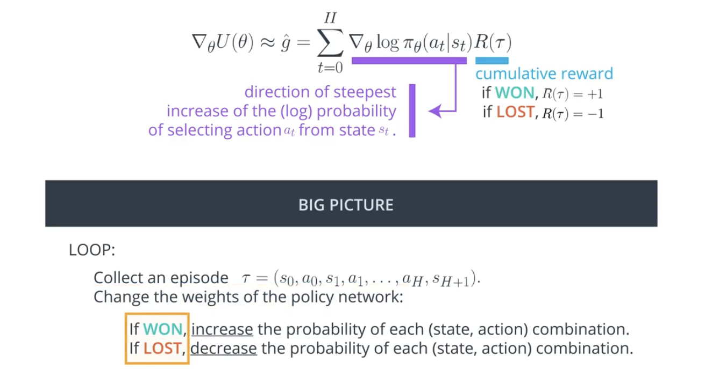
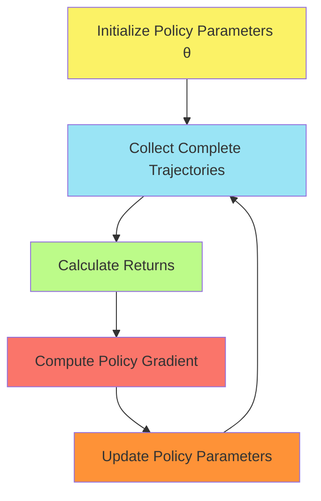
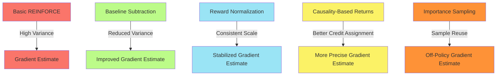
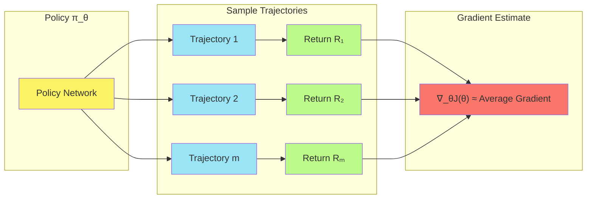

# C-2: Policy Gradient Methods

1. Policy Gradient Fundamentals
    - The Policy Gradient Theorem
    - Likelihood Ratio Trick
    - REINFORCE Algorithm
    - Monte Carlo Policy Gradient
2. Gradient Estimation and Optimization
    - Sample-Based Estimates
    - Trajectory Collection
    - Policy Update Mechanisms
    - Credit Assignment Problem
3. Variance Reduction Techniques
    - Baseline Subtraction
    - Rewards Normalization
    - Future Rewards vs Total Returns
    - Importance Sampling

# S-2: Policy-Based Methods in Deep Reinforcement Learning

# C-2: Policy Gradient Methods

#### 1. Policy Gradient Fundamentals

Policy gradient methods represent a significant leap forward from the simpler policy search techniques we explored in
Chapter 1. While methods like hill climbing rely on random perturbations and empirical evaluations, policy gradient
methods leverage calculus to directly compute the direction of steepest ascent in the policy parameter space, allowing
for more efficient and principled optimization.

##### The Policy Gradient Theorem

The policy gradient theorem provides a powerful mathematical foundation for calculating the gradient of expected return
with respect to policy parameters. This theorem is the cornerstone of virtually all modern policy gradient methods.

The fundamental objective in reinforcement learning is to maximize the expected return:

$$J(\theta) = \mathbb{E}*{\tau \sim \pi*\theta} [R(\tau)]$$

Where:

- $J(\theta)$ represents the expected return under policy $\pi_\theta$
- $\tau$ is a trajectory (sequence of states, actions, and rewards)
- $R(\tau)$ is the return (cumulative reward) for trajectory $\tau$

The policy gradient theorem gives us a way to compute the gradient of this objective:

$$\nabla_\theta J(\theta) = \mathbb{E}*{\tau \sim \pi*\theta}[\nabla_\theta \log \pi_\theta(a|s) \cdot Q^{\pi}(s,a)]$$

Where:

- $\nabla_\theta J(\theta)$ is the gradient of the expected return with respect to policy parameters $\theta$
- $\nabla_\theta \log \pi_\theta(a|s)$ is the score function (gradient of log probability of taking action $a$ in state
  $s$)
- $Q^{\pi}(s,a)$ is the action-value function, representing the expected return starting from state $s$, taking action
  $a$, and following policy $\pi$ thereafter

This theorem reveals a remarkably intuitive update rule: increase the probability of actions that lead to
higher-than-expected returns, and decrease the probability of actions that lead to lower-than-expected returns.

<div align="center">  <p style="color: #555;">Figure: Policy gradient intuition showing how action probabilities are adjusted based on outcomes</p> </div>

The image illustrates this fundamental intuition behind policy gradients. When an action leads to winning (positive
reward), we increase its probability in similar situations. Conversely, when an action leads to losing (negative
reward), we decrease its probability.

##### Likelihood Ratio Trick

The derivation of the policy gradient theorem relies heavily on a mathematical technique known as the "likelihood ratio
trick" (sometimes called the REINFORCE trick or log-derivative trick). This technique transforms the gradient of a
probability into a more tractable form involving the log probability:

$$\nabla_\theta P(\tau; \theta) = P(\tau; \theta) \cdot \nabla_\theta \log P(\tau; \theta)$$

Let's see how this trick enables the derivation of the policy gradient:

Starting with our objective function:

$$J(\theta) = \mathbb{E}*{\tau \sim \pi*\theta} [R(\tau)] = \sum_\tau P(\tau; \theta)R(\tau)$$

We want to find its gradient:

$$\nabla_\theta J(\theta) = \nabla_\theta \sum_\tau P(\tau; \theta)R(\tau) = \sum_\tau \nabla_\theta P(\tau; \theta)R(\tau)$$

Now we apply the likelihood ratio trick:

$$\sum_\tau \nabla_\theta P(\tau; \theta)R(\tau) = \sum_\tau P(\tau; \theta) \cdot \nabla_\theta \log P(\tau; \theta) \cdot R(\tau)$$

This gives us:

$$\nabla_\theta J(\theta) = \mathbb{E}*{\tau \sim \pi*\theta}[\nabla_\theta \log P(\tau; \theta)R(\tau)]$$

The probability of a trajectory $\tau = (s_0, a_0, s_1, a_1, ..., s_H, a_H, s_{H+1})$ can be decomposed as:

$$P(\tau; \theta) = p(s_0) \prod_{t=0}^H \pi_\theta(a_t|s_t)p(s_{t+1}|s_t,a_t)$$

Where:

- $p(s_0)$ is the initial state distribution
- $\pi_\theta(a_t|s_t)$ is the probability of taking action $a_t$ in state $s_t$ under policy $\pi_\theta$
- $p(s_{t+1}|s_t,a_t)$ is the transition probability determined by the environment dynamics

Taking the gradient of the log of this expression:

$$\nabla_\theta \log P(\tau; \theta) = \nabla_\theta \log \left( p(s_0) \prod_{t=0}^H \pi_\theta(a_t|s_t)p(s_{t+1}|s_t,a_t) \right)$$

$$= \nabla_\theta \left( \log p(s_0) + \sum_{t=0}^H \log \pi_\theta(a_t|s_t) + \sum_{t=0}^H \log p(s_{t+1}|s_t,a_t) \right)$$

Since only the policy terms depend on $\theta$, this simplifies to:

$$\nabla_\theta \log P(\tau; \theta) = \sum_{t=0}^H \nabla_\theta \log \pi_\theta(a_t|s_t)$$

Substituting back into our gradient expression:

$$\nabla_\theta J(\theta) = \mathbb{E}*{\tau \sim \pi*\theta}\left[\sum_{t=0}^H \nabla_\theta \log \pi_\theta(a_t|s_t) \cdot R(\tau)\right]$$

This form of the policy gradient is remarkably elegant: it tells us to adjust the probability of each action in
proportion to the return that followed that action.

##### REINFORCE Algorithm

REINFORCE, introduced by Ronald Williams in 1992, is the canonical implementation of the policy gradient theorem. It's a
Monte Carlo policy gradient method that uses complete trajectory returns to update the policy parameters.

The algorithm is straightforward:

1. Use the current policy $\pi_\theta$ to collect $m$ trajectories ${\tau^{(1)}, \tau^{(2)}, ..., \tau^{(m)}}$
2. For each trajectory $\tau^{(i)} = (s_0^{(i)}, a_0^{(i)}, ..., s_H^{(i)}, a_H^{(i)}, s_{H+1}^{(i)})$, compute the
   return $R(\tau^{(i)})$
3. Estimate the policy gradient using:
   $$\nabla_\theta J(\theta) \approx \hat{g} = \frac{1}{m}\sum_{i=1}^m\sum_{t=0}^H \nabla_\theta \log \pi_\theta(a_t^{(i)}|s_t^{(i)})R(\tau^{(i)})$$
4. Update the policy parameters: $\theta \leftarrow \theta + \alpha\hat{g}$
5. Repeat steps 1-4 until convergence

Here's a simplified implementation of REINFORCE:

```python
def reinforce(env, policy_network, num_episodes=1000, gamma=0.99, lr=0.01):
    optimizer = torch.optim.Adam(policy_network.parameters(), lr=lr)

    for episode in range(num_episodes):
        # Collect a trajectory
        states, actions, rewards = [], [], []
        state = env.reset()
        done = False

        while not done:
            # Get action probabilities from policy network
            state_tensor = torch.FloatTensor(state).unsqueeze(0)
            action_probs = policy_network(state_tensor)

            # Sample action from the distribution
            action_dist = torch.distributions.Categorical(action_probs)
            action = action_dist.sample()

            # Take action in environment
            next_state, reward, done, _ = env.step(action.item())

            # Store step information
            states.append(state)
            actions.append(action)
            rewards.append(reward)

            state = next_state

        # Calculate returns (discounted cumulative rewards)
        returns = []
        G = 0
        for r in reversed(rewards):
            G = r + gamma * G
            returns.insert(0, G)
        returns = torch.FloatTensor(returns)

        # Standardize returns (reduce variance)
        returns = (returns - returns.mean()) / (returns.std() + 1e-8)

        # Calculate loss
        loss = 0
        for t in range(len(states)):
            state_t = torch.FloatTensor(states[t]).unsqueeze(0)
            action_probs = policy_network(state_t)
            action_dist = torch.distributions.Categorical(action_probs)
            log_prob = action_dist.log_prob(actions[t])
            loss += -log_prob * returns[t]  # Negative for gradient ascent

        # Update policy parameters
        optimizer.zero_grad()
        loss.backward()
        optimizer.step()

    return policy_network
```

This implementation follows the core principles of REINFORCE:

1. Generate complete trajectories using the current policy
2. Calculate returns for each time step
3. Update policy to increase probability of actions that led to high returns

##### Monte Carlo Policy Gradient

The "Monte Carlo" in REINFORCE refers to the method of estimating expected returns by sampling complete trajectories
from the environment. This approach contrasts with temporal difference methods that use bootstrapped estimates.

Key characteristics of Monte Carlo policy gradients include:

###### Unbiased Gradient Estimates

Monte Carlo methods provide unbiased estimates of the policy gradient because they use the true returns from complete
trajectories. This unbiasedness is a significant advantage, though it comes at the cost of higher variance.

###### Delayed Learning

Since Monte Carlo methods require complete trajectories before updating the policy, learning can be slow in episodic
tasks with long horizons. The policy is only updated after collecting full episodes, rather than after each step.

###### Model-Free Learning

Monte Carlo policy gradients don't require a model of the environment dynamics, making them applicable to a wide range
of problems where transition probabilities are unknown.

###### On-Policy Learning

REINFORCE is an on-policy algorithm, meaning it uses trajectories collected from the current policy for updates. This
can limit sample efficiency compared to off-policy methods that reuse experience.

The Monte Carlo policy gradient approach can be visualized as follows:



#### 2. Gradient Estimation and Optimization

While the policy gradient theorem provides a theoretical foundation, practical implementation requires careful
consideration of gradient estimation and optimization techniques.

##### Sample-Based Estimates

In reinforcement learning, we rarely have access to the true distribution of trajectories, so we must rely on
sample-based estimates of the policy gradient. The basic form of this estimate is:

$$\nabla_\theta J(\theta) \approx \frac{1}{m}\sum_{i=1}^m\sum_{t=0}^H \nabla_\theta \log \pi_\theta(a_t^{(i)}|s_t^{(i)})R(\tau^{(i)})$$

Where:

- $m$ is the number of sampled trajectories
- $H$ is the horizon (length of each trajectory)
- $R(\tau^{(i)})$ is the return from trajectory $i$

The quality of this estimate depends critically on:

###### Number of Trajectories

More trajectories generally lead to better gradient estimates. The variance of the estimate scales with $\frac{1}{m}$,
so doubling the number of trajectories reduces variance by half.

###### Trajectory Length

Longer trajectories can capture more long-term dependencies but introduce more variance into the gradient estimate.

###### Return Estimation

Different ways of calculating the return (e.g., total return, discounted return, or advantage) affect both the bias and
variance of the gradient estimate.

Here's a visualization of how sample-based estimation works:

```mermaid
graph LR
    subgraph "Policy π_θ"
        P[Policy Network]
        style P fill:#FBF266
    end

    subgraph "Sample Trajectories"
        T1[Trajectory 1] --> R1[Return R₁]
        T2[Trajectory 2] --> R2[Return R₂]
        T3[Trajectory m] --> R3[Return Rₘ]
        style T1 fill:#9AE4F5
        style T2 fill:#9AE4F5
        style T3 fill:#9AE4F5
        style R1 fill:#BCFB89
        style R2 fill:#BCFB89
        style R3 fill:#BCFB89
    end

    subgraph "Gradient Estimate"
        G[∇_θJ(θ) ≈ Average Gradient]
        style G fill:#FA756A
    end

    P --> T1
    P --> T2
    P --> T3
    R1 --> G
    R2 --> G
    R3 --> G
```

##### Trajectory Collection

Collecting high-quality trajectories is critical for effective policy gradient estimation. This process involves:

###### Sampling Actions

Actions are sampled from the current policy distribution:

- For discrete actions: $a_t \sim \pi_\theta(\cdot|s_t)$, often using categorical sampling
- For continuous actions: $a_t \sim \mathcal{N}(\mu_\theta(s_t), \sigma_\theta(s_t))$, using Gaussian sampling

###### Recording Transitions

Each transition $(s_t, a_t, r_t, s_{t+1})$ is recorded for later processing.

###### Parallel Collection

To improve efficiency, trajectories can be collected in parallel across multiple environments.

Here's a more detailed implementation of trajectory collection:

```python
def collect_trajectories(env, policy_network, num_trajectories=10):
    """Collect multiple trajectories using the current policy."""
    all_trajectories = []

    for _ in range(num_trajectories):
        states, actions, rewards, log_probs = [], [], [], []
        state = env.reset()
        done = False

        while not done:
            # Convert state to tensor
            state_tensor = torch.FloatTensor(state).unsqueeze(0)

            # Get action probabilities
            action_probs = policy_network(state_tensor)

            # Create distribution and sample action
            action_dist = torch.distributions.Categorical(action_probs)
            action = action_dist.sample()
            log_prob = action_dist.log_prob(action)

            # Take action in environment
            next_state, reward, done, _ = env.step(action.item())

            # Store transition
            states.append(state)
            actions.append(action)
            rewards.append(reward)
            log_probs.append(log_prob)

            state = next_state

        # Compute discounted returns
        returns = compute_returns(rewards, gamma=0.99)

        trajectory = {
            'states': states,
            'actions': actions,
            'rewards': rewards,
            'returns': returns,
            'log_probs': log_probs
        }

        all_trajectories.append(trajectory)

    return all_trajectories

def compute_returns(rewards, gamma=0.99):
    """Compute discounted returns for a sequence of rewards."""
    returns = []
    G = 0
    for r in reversed(rewards):
        G = r + gamma * G
        returns.insert(0, G)
    return returns
```

##### Policy Update Mechanisms

Once we have estimated the policy gradient, we need to update the policy parameters effectively. Several update
mechanisms are commonly used:

###### Vanilla Gradient Ascent

The simplest approach updates parameters using: $$\theta \leftarrow \theta + \alpha \nabla_\theta J(\theta)$$

Where $\alpha$ is the learning rate.

###### Adam Optimizer

Most modern implementations use adaptive optimization algorithms like Adam, which adjust learning rates for each
parameter based on historical gradient information:

```python
def update_policy(policy_network, trajectories, optimizer):
    """Update policy parameters using collected trajectories."""
    # Calculate loss
    policy_loss = 0

    for traj in trajectories:
        for t in range(len(traj['states'])):
            policy_loss += -traj['log_probs'][t] * traj['returns'][t]

    # Normalize loss by number of steps
    policy_loss /= sum(len(traj['states']) for traj in trajectories)

    # Perform update
    optimizer.zero_grad()
    policy_loss.backward()
    optimizer.step()

    return policy_loss.item()
```

###### Trust Region Methods

More advanced algorithms like Trust Region Policy Optimization (TRPO) and Proximal Policy Optimization (PPO) constrain
the size of policy updates to improve stability:

- TRPO uses a constraint on the KL divergence between old and new policies
- PPO uses a clipped surrogate objective to limit policy changes

###### Natural Gradient Ascent

Natural policy gradients use the Fisher information matrix to account for the curvature of the parameter space:
$$\theta \leftarrow \theta + \alpha F^{-1} \nabla_\theta J(\theta)$$

Where $F$ is the Fisher information matrix.

The choice of update mechanism significantly impacts learning stability and efficiency. The following diagram
illustrates the differences between these approaches:


##### Credit Assignment Problem

The credit assignment problem is a fundamental challenge in reinforcement learning: how do we determine which actions in
a trajectory contributed to the observed return?

###### Temporal Credit Assignment

In basic REINFORCE, all actions in a trajectory receive credit proportional to the total return:
$$\nabla_\theta J(\theta) \approx \sum_{t=0}^H \nabla_\theta \log \pi_\theta(a_t|s_t)R(\tau)$$

This approach can be inefficient because:

- Early actions receive credit for later rewards they didn't influence
- The variance of gradient estimates increases with trajectory length

###### Causality Principle

A key insight is that actions cannot influence past rewards. This leads to a simple improvement:
$$\nabla_\theta J(\theta) \approx \sum_{t=0}^H \nabla_\theta \log \pi_\theta(a_t|s_t)R_t^{\text{future}}$$

Where $R_t^{\text{future}}$ only includes rewards from time $t$ onward.

###### Advantage Functions

More sophisticated approaches use advantage functions to address credit assignment:
$$A(s_t, a_t) = Q(s_t, a_t) - V(s_t)$$

The advantage represents how much better an action is than the average action in that state, providing a more precise
credit assignment mechanism.

Here's how we might implement causality-aware returns:

```python
def compute_future_returns(rewards, gamma=0.99):
    """Compute future returns for each time step."""
    future_returns = []
    for t in range(len(rewards)):
        G = 0
        for k, r in enumerate(rewards[t:]):
            G += gamma**k * r
        future_returns.append(G)
    return future_returns
```

#### 3. Variance Reduction Techniques

Policy gradient methods, while theoretically elegant, often suffer from high variance in gradient estimates. Several
techniques have been developed to address this challenge.

##### Baseline Subtraction

One of the most effective variance reduction techniques is baseline subtraction. Instead of using raw returns, we
subtract a state-dependent baseline:

$$\nabla_\theta J(\theta) \approx \sum_{t=0}^H \nabla_\theta \log \pi_\theta(a_t|s_t)(R_t - b(s_t))$$

Where $b(s_t)$ is a baseline function.

###### State Value Function as Baseline

A common choice for the baseline is the state value function $V(s_t)$, which estimates the expected return from state
$s_t$: $$b(s_t) = V(s_t)$$

This choice leads to the advantage function formulation: $$A(s_t, a_t) = R_t - V(s_t)$$

###### Unbiased Gradient Estimation

Importantly, baseline subtraction doesn't introduce bias into the gradient estimate. To see why, consider:

$$\mathbb{E}*{a \sim \pi*\theta}[\nabla_\theta \log \pi_\theta(a|s)b(s)]$$

Since $\nabla_\theta \log \pi_\theta(a|s)$ sums to zero over all actions (a property of log-derivatives), this
expectation equals zero:

$$\mathbb{E}*{a \sim \pi*\theta}[\nabla_\theta \log \pi_\theta(a|s)] = \sum_a \pi_\theta(a|s) \nabla_\theta \log \pi_\theta(a|s) = \sum_a \nabla_\theta \pi_\theta(a|s) = \nabla_\theta \sum_a \pi_\theta(a|s) = \nabla_\theta 1 = 0$$

Therefore: $$\mathbb{E}*{a \sim \pi*\theta}[\nabla_\theta \log \pi_\theta(a|s)b(s)] = b(s) \cdot 0 = 0$$

This means that baseline subtraction reduces variance without changing the expected gradient.

###### Implementation

Here's how we might implement a value function baseline:

```python
class ValueNetwork(nn.Module):
    def __init__(self, state_dim, hidden_dim=64):
        super().__init__()
        self.network = nn.Sequential(
            nn.Linear(state_dim, hidden_dim),
            nn.ReLU(),
            nn.Linear(hidden_dim, 1)
        )

    def forward(self, state):
        return self.network(state).squeeze()

def update_with_baseline(policy_network, value_network, trajectories, policy_optimizer, value_optimizer):
    # Calculate value loss
    value_loss = 0
    for traj in trajectories:
        states = torch.FloatTensor(traj['states'])
        returns = torch.FloatTensor(traj['returns'])
        predicted_values = value_network(states)
        value_loss += F.mse_loss(predicted_values, returns)

    # Update value network
    value_optimizer.zero_grad()
    value_loss.backward()
    value_optimizer.step()

    # Calculate policy loss with baseline
    policy_loss = 0
    for traj in trajectories:
        states = torch.FloatTensor(traj['states'])
        baseline_values = value_network(states).detach()

        for t in range(len(traj['states'])):
            advantage = traj['returns'][t] - baseline_values[t]
            policy_loss += -traj['log_probs'][t] * advantage

    # Update policy network
    policy_optimizer.zero_grad()
    policy_loss.backward()
    policy_optimizer.step()

    return policy_loss.item(), value_loss.item()
```

##### Rewards Normalization

Another simple yet effective variance reduction technique is to normalize rewards across trajectories:

$$\hat{R}_i = \frac{R_i - \mu}{\sigma}$$

Where:

- $\mu = \frac{1}{N}\sum_i R_i$ is the mean return
- $\sigma = \sqrt{\frac{1}{N}\sum_i(R_i - \mu)^2}$ is the standard deviation

###### Benefits of Normalization

Rewards normalization offers several advantages:

1. Makes the scale of updates more consistent throughout training
2. Reduces the impact of reward scale variations across environments
3. Helps stabilize learning by preventing very large or small gradient steps

###### Implementation

A simple implementation of rewards normalization:

```python
def normalize_rewards(all_returns):
    """Normalize returns across trajectories."""
    all_returns_flat = np.concatenate(all_returns)
    mean = np.mean(all_returns_flat)
    std = np.std(all_returns_flat) + 1e-8  # Add small constant to prevent division by zero

    normalized_returns = []
    for returns in all_returns:
        normalized_returns.append((returns - mean) / std)

    return normalized_returns
```

##### Future Rewards vs Total Returns

A significant insight for variance reduction comes from the observation that actions at time $t$ can only influence
future rewards, not past ones.

###### Causality Principle

For any time step $t$, we can decompose the return into:
$$R(\tau) = \sum_{k=0}^{t-1} r_k + \sum_{k=t}^{H} r_k = R_t^{\text{past}} + R_t^{\text{future}}$$

Since actions at time $t$ cannot affect rewards that have already occurred, we can use only future rewards in our
update: $$\nabla_\theta J(\theta) \approx \sum_{t=0}^H \nabla_\theta \log \pi_\theta(a_t|s_t)R_t^{\text{future}}$$

###### Discounted Future Returns

In practice, we often use discounted future returns: $$R_t^{\text{future}} = \sum_{k=0}^{H-t} \gamma^k r_{t+k}$$

Where $\gamma \in [0,1]$ is a discount factor that gives less weight to rewards further in the future.

###### Implementation

Here's how to implement future returns:

```python
def compute_future_returns(rewards, gamma=0.99):
    """Compute future returns for each time step."""
    T = len(rewards)
    future_returns = np.zeros(T)

    # Start with the last reward
    future_returns[T-1] = rewards[T-1]

    # Work backwards
    for t in range(T-2, -1, -1):
        future_returns[t] = rewards[t] + gamma * future_returns[t+1]

    return future_returns
```

##### Importance Sampling

Importance sampling is a technique that allows us to estimate expectations under one distribution using samples from
another. In the context of policy gradients, it enables off-policy learning: updating a target policy using trajectories
collected from a different behavior policy.

###### The Importance Sampling Formula

For two policies $\pi_\theta$ (target) and $\pi_{\theta_{\text{old}}}$ (behavior), the importance weight for a
trajectory is:

$$\frac{P(\tau;\theta)}{P(\tau;\theta_{\text{old}})} = \frac{p(s_0) \prod_{t=0}^H \pi_{\theta}(a_t|s_t)p(s_{t+1}|s_t,a_t)}{p(s_0) \prod_{t=0}^H \pi_{\theta_{\text{old}}}(a_t|s_t)p(s_{t+1}|s_t,a_t)} = \prod_{t=0}^H \frac{\pi_{\theta}(a_t|s_t)}{\pi_{\theta_{\text{old}}}(a_t|s_t)}$$

Where the environment dynamics terms cancel out.

###### Per-Decision Importance Sampling

In practice, we often use per-decision importance sampling, which applies importance weights to individual time steps:

$$\nabla_\theta J(\theta) \approx \sum_{t=0}^H \prod_{k=0}^t \frac{\pi_{\theta}(a_k|s_k)}{\pi_{\theta_{\text{old}}}(a_k|s_k)} \nabla_\theta \log \pi_{\theta}(a_t|s_t)R_t^{\text{future}}$$

###### Challenges with Importance Sampling

While importance sampling enables off-policy learning, it introduces several challenges:

1. **High variance**: The product of importance ratios can have extremely high variance, especially for long
   trajectories
2. **Distribution shift**: If the behavior and target policies differ significantly, the importance weights can become
   very large or very small
3. **Effective sample size**: Many samples may contribute very little to the estimate due to small importance weights

###### Variance Reduction for Importance Sampling

Several techniques can reduce the variance of importance sampling:

1. **Truncated importance sampling**: Cap the importance weights to prevent extreme values
2. **Per-decision importance sampling**: Apply importance weights only to the specific time steps they affect
3. **Self-normalized importance sampling**: Normalize the weights to sum to 1

###### Implementation

Here's a simplified implementation of importance sampling:

```python
def update_with_importance_sampling(policy_network, trajectories, old_policy_network, optimizer):
    # Calculate policy loss with importance sampling
    policy_loss = 0

    for traj in trajectories:
        states = torch.FloatTensor(traj['states'])
        actions = torch.LongTensor(traj['actions'])
        returns = torch.FloatTensor(traj['returns'])

        # Compute current policy probabilities
        current_probs = policy_network(states)
        current_action_probs = current_probs.gather(1, actions.unsqueeze(1)).squeeze()

        # Compute old policy probabilities
        with torch.no_grad():
            old_probs = old_policy_network(states)
            old_action_probs = old_probs.gather(1, actions.unsqueeze(1)).squeeze()

        # Compute importance weights
        importance_weights = current_action_probs / old_action_probs

        # Clip weights to prevent extreme values
        importance_weights = torch.clamp(importance_weights, 0.8, 1.2)

        for t in range(len(traj['states'])):
            # Apply importance weight to the update
            policy_loss += -torch.log(current_action_probs[t]) * importance_weights[t] * returns[t]

    # Update policy network
    optimizer.zero_grad()
    policy_loss.backward()
    optimizer.step()

    return policy_loss.item()
```

The various variance reduction techniques can be visualized in their effect on gradient estimates:



By combining these variance reduction techniques, policy gradient methods can achieve much more stable and efficient
learning. Modern algorithms like PPO, A2C, and SAC incorporate multiple variance reduction strategies to achieve
state-of-the-art performance across a wide range of reinforcement learning tasks.

In conclusion, policy gradient methods provide a principled approach to directly optimizing policy parameters using
gradient-based techniques. The policy gradient theorem establishes the mathematical foundation, while various practical
techniques address the challenges of gradient estimation, policy updates, and variance reduction. These methods form the
backbone of modern deep reinforcement learning, enabling the solution of increasingly complex sequential decision-making
problems.

#### Policy Gradient Fundamentals

Policy gradient methods represent a significant leap forward from the simpler policy search techniques we explored in
Chapter 1. While methods like hill climbing rely on random perturbations and empirical evaluations, policy gradient
methods leverage calculus to directly compute the direction of steepest ascent in the policy parameter space, allowing
for more efficient and principled optimization.

##### The Policy Gradient Theorem

The policy gradient theorem provides a powerful mathematical foundation for calculating the gradient of expected return
with respect to policy parameters. This theorem is the cornerstone of virtually all modern policy gradient methods.

The fundamental objective in reinforcement learning is to maximize the expected return:

$$J(\theta) = \mathbb{E}*{\tau \sim \pi*\theta} [R(\tau)]$$

Where:

- $J(\theta)$ represents the expected return under policy $\pi_\theta$
- $\tau$ is a trajectory (sequence of states, actions, and rewards)
- $R(\tau)$ is the return (cumulative reward) for trajectory $\tau$

The policy gradient theorem gives us a way to compute the gradient of this objective:

$$\nabla_\theta J(\theta) = \mathbb{E}*{\tau \sim \pi*\theta}[\nabla_\theta \log \pi_\theta(a|s) \cdot Q^{\pi}(s,a)]$$

Where:

- $\nabla_\theta J(\theta)$ is the gradient of the expected return with respect to policy parameters $\theta$
- $\nabla_\theta \log \pi_\theta(a|s)$ is the score function (gradient of log probability of taking action $a$ in state
  $s$)
- $Q^{\pi}(s,a)$ is the action-value function, representing the expected return starting from state $s$, taking action
  $a$, and following policy $\pi$ thereafter

This theorem reveals a remarkably intuitive update rule: increase the probability of actions that lead to
higher-than-expected returns, and decrease the probability of actions that lead to lower-than-expected returns.

<div align="center">  <p style="color: #555;">Figure: Policy gradient intuition showing how action probabilities are adjusted based on outcomes</p> </div>

The image illustrates this fundamental intuition behind policy gradients. When an action leads to winning (positive
reward), we increase its probability in similar situations. Conversely, when an action leads to losing (negative
reward), we decrease its probability.

##### Likelihood Ratio Trick

The derivation of the policy gradient theorem relies heavily on a mathematical technique known as the "likelihood ratio
trick" (sometimes called the REINFORCE trick or log-derivative trick). This technique transforms the gradient of a
probability into a more tractable form involving the log probability:

$$\nabla_\theta P(\tau; \theta) = P(\tau; \theta) \cdot \nabla_\theta \log P(\tau; \theta)$$

Let's see how this trick enables the derivation of the policy gradient:

Starting with our objective function:

$$J(\theta) = \mathbb{E}*{\tau \sim \pi*\theta} [R(\tau)] = \sum_\tau P(\tau; \theta)R(\tau)$$

We want to find its gradient:

$$\nabla_\theta J(\theta) = \nabla_\theta \sum_\tau P(\tau; \theta)R(\tau) = \sum_\tau \nabla_\theta P(\tau; \theta)R(\tau)$$

Now we apply the likelihood ratio trick:

$$\sum_\tau \nabla_\theta P(\tau; \theta)R(\tau) = \sum_\tau P(\tau; \theta) \cdot \nabla_\theta \log P(\tau; \theta) \cdot R(\tau)$$

This gives us:

$$\nabla_\theta J(\theta) = \mathbb{E}*{\tau \sim \pi*\theta}[\nabla_\theta \log P(\tau; \theta)R(\tau)]$$

The probability of a trajectory $\tau = (s_0, a_0, s_1, a_1, ..., s_H, a_H, s_{H+1})$ can be decomposed as:

$$P(\tau; \theta) = p(s_0) \prod_{t=0}^H \pi_\theta(a_t|s_t)p(s_{t+1}|s_t,a_t)$$

Where:

- $p(s_0)$ is the initial state distribution
- $\pi_\theta(a_t|s_t)$ is the probability of taking action $a_t$ in state $s_t$ under policy $\pi_\theta$
- $p(s_{t+1}|s_t,a_t)$ is the transition probability determined by the environment dynamics

Taking the gradient of the log of this expression:

$$\nabla_\theta \log P(\tau; \theta) = \nabla_\theta \log \left( p(s_0) \prod_{t=0}^H \pi_\theta(a_t|s_t)p(s_{t+1}|s_t,a_t) \right)$$

$$= \nabla_\theta \left( \log p(s_0) + \sum_{t=0}^H \log \pi_\theta(a_t|s_t) + \sum_{t=0}^H \log p(s_{t+1}|s_t,a_t) \right)$$

Since only the policy terms depend on $\theta$, this simplifies to:

$$\nabla_\theta \log P(\tau; \theta) = \sum_{t=0}^H \nabla_\theta \log \pi_\theta(a_t|s_t)$$

Substituting back into our gradient expression:

$$\nabla_\theta J(\theta) = \mathbb{E}*{\tau \sim \pi*\theta}\left[\sum_{t=0}^H \nabla_\theta \log \pi_\theta(a_t|s_t) \cdot R(\tau)\right]$$

This form of the policy gradient is remarkably elegant: it tells us to adjust the probability of each action in
proportion to the return that followed that action.

##### REINFORCE Algorithm

REINFORCE, introduced by Ronald Williams in 1992, is the canonical implementation of the policy gradient theorem. It's a
Monte Carlo policy gradient method that uses complete trajectory returns to update the policy parameters.

The algorithm is straightforward:

1. Use the current policy $\pi_\theta$ to collect $m$ trajectories ${\tau^{(1)}, \tau^{(2)}, ..., \tau^{(m)}}$
2. For each trajectory $\tau^{(i)} = (s_0^{(i)}, a_0^{(i)}, ..., s_H^{(i)}, a_H^{(i)}, s_{H+1}^{(i)})$, compute the
   return $R(\tau^{(i)})$
3. Estimate the policy gradient using:
   $$\nabla_\theta J(\theta) \approx \hat{g} = \frac{1}{m}\sum_{i=1}^m\sum_{t=0}^H \nabla_\theta \log \pi_\theta(a_t^{(i)}|s_t^{(i)})R(\tau^{(i)})$$
4. Update the policy parameters: $\theta \leftarrow \theta + \alpha\hat{g}$
5. Repeat steps 1-4 until convergence

Here's a simplified implementation of REINFORCE:

```python
def reinforce(env, policy_network, num_episodes=1000, gamma=0.99, lr=0.01):
    optimizer = torch.optim.Adam(policy_network.parameters(), lr=lr)

    for episode in range(num_episodes):
        # Collect a trajectory
        states, actions, rewards = [], [], []
        state = env.reset()
        done = False

        while not done:
            # Get action probabilities from policy network
            state_tensor = torch.FloatTensor(state).unsqueeze(0)
            action_probs = policy_network(state_tensor)

            # Sample action from the distribution
            action_dist = torch.distributions.Categorical(action_probs)
            action = action_dist.sample()

            # Take action in environment
            next_state, reward, done, _ = env.step(action.item())

            # Store step information
            states.append(state)
            actions.append(action)
            rewards.append(reward)

            state = next_state

        # Calculate returns (discounted cumulative rewards)
        returns = []
        G = 0
        for r in reversed(rewards):
            G = r + gamma * G
            returns.insert(0, G)
        returns = torch.FloatTensor(returns)

        # Standardize returns (reduce variance)
        returns = (returns - returns.mean()) / (returns.std() + 1e-8)

        # Calculate loss
        loss = 0
        for t in range(len(states)):
            state_t = torch.FloatTensor(states[t]).unsqueeze(0)
            action_probs = policy_network(state_t)
            action_dist = torch.distributions.Categorical(action_probs)
            log_prob = action_dist.log_prob(actions[t])
            loss += -log_prob * returns[t]  # Negative for gradient ascent

        # Update policy parameters
        optimizer.zero_grad()
        loss.backward()
        optimizer.step()

    return policy_network
```

This implementation follows the core principles of REINFORCE:

1. Generate complete trajectories using the current policy
2. Calculate returns for each time step
3. Update policy to increase probability of actions that led to high returns

##### Monte Carlo Policy Gradient

The "Monte Carlo" in REINFORCE refers to the method of estimating expected returns by sampling complete trajectories
from the environment. This approach contrasts with temporal difference methods that use bootstrapped estimates.

Key characteristics of Monte Carlo policy gradients include:

###### Unbiased Gradient Estimates

Monte Carlo methods provide unbiased estimates of the policy gradient because they use the true returns from complete
trajectories. This unbiasedness is a significant advantage, though it comes at the cost of higher variance.

###### Delayed Learning

Since Monte Carlo methods require complete trajectories before updating the policy, learning can be slow in episodic
tasks with long horizons. The policy is only updated after collecting full episodes, rather than after each step.

###### Model-Free Learning

Monte Carlo policy gradients don't require a model of the environment dynamics, making them applicable to a wide range
of problems where transition probabilities are unknown.

###### On-Policy Learning

REINFORCE is an on-policy algorithm, meaning it uses trajectories collected from the current policy for updates. This
can limit sample efficiency compared to off-policy methods that reuse experience.

The Monte Carlo policy gradient approach can be visualized as follows:


#### 2. Gradient Estimation and Optimization

While the policy gradient theorem provides a theoretical foundation, practical implementation requires careful
consideration of gradient estimation and optimization techniques.

##### Sample-Based Estimates

In reinforcement learning, we rarely have access to the true distribution of trajectories, so we must rely on
sample-based estimates of the policy gradient. The basic form of this estimate is:

$$\nabla_\theta J(\theta) \approx \frac{1}{m}\sum_{i=1}^m\sum_{t=0}^H \nabla_\theta \log \pi_\theta(a_t^{(i)}|s_t^{(i)})R(\tau^{(i)})$$

Where:

- $m$ is the number of sampled trajectories
- $H$ is the horizon (length of each trajectory)
- $R(\tau^{(i)})$ is the return from trajectory $i$

The quality of this estimate depends critically on:

###### Number of Trajectories

More trajectories generally lead to better gradient estimates. The variance of the estimate scales with $\frac{1}{m}$,
so doubling the number of trajectories reduces variance by half.

###### Trajectory Length

Longer trajectories can capture more long-term dependencies but introduce more variance into the gradient estimate.

###### Return Estimation

Different ways of calculating the return (e.g., total return, discounted return, or advantage) affect both the bias and
variance of the gradient estimate.

Here's a visualization of how sample-based estimation works:



##### Trajectory Collection

Collecting high-quality trajectories is critical for effective policy gradient estimation. This process involves:

###### Sampling Actions

Actions are sampled from the current policy distribution:

- For discrete actions: $a_t \sim \pi_\theta(\cdot|s_t)$, often using categorical sampling
- For continuous actions: $a_t \sim \mathcal{N}(\mu_\theta(s_t), \sigma_\theta(s_t))$, using Gaussian sampling

###### Recording Transitions

Each transition $(s_t, a_t, r_t, s_{t+1})$ is recorded for later processing.

###### Parallel Collection

To improve efficiency, trajectories can be collected in parallel across multiple environments.

Here's a more detailed implementation of trajectory collection:

```python
def collect_trajectories(env, policy_network, num_trajectories=10):
    """Collect multiple trajectories using the current policy."""
    all_trajectories = []

    for _ in range(num_trajectories):
        states, actions, rewards, log_probs = [], [], [], []
        state = env.reset()
        done = False

        while not done:
            # Convert state to tensor
            state_tensor = torch.FloatTensor(state).unsqueeze(0)

            # Get action probabilities
            action_probs = policy_network(state_tensor)

            # Create distribution and sample action
            action_dist = torch.distributions.Categorical(action_probs)
            action = action_dist.sample()
            log_prob = action_dist.log_prob(action)

            # Take action in environment
            next_state, reward, done, _ = env.step(action.item())

            # Store transition
            states.append(state)
            actions.append(action)
            rewards.append(reward)
            log_probs.append(log_prob)

            state = next_state

        # Compute discounted returns
        returns = compute_returns(rewards, gamma=0.99)

        trajectory = {
            'states': states,
            'actions': actions,
            'rewards': rewards,
            'returns': returns,
            'log_probs': log_probs
        }

        all_trajectories.append(trajectory)

    return all_trajectories

def compute_returns(rewards, gamma=0.99):
    """Compute discounted returns for a sequence of rewards."""
    returns = []
    G = 0
    for r in reversed(rewards):
        G = r + gamma * G
        returns.insert(0, G)
    return returns
```

##### Policy Update Mechanisms

Once we have estimated the policy gradient, we need to update the policy parameters effectively. Several update
mechanisms are commonly used:

###### Vanilla Gradient Ascent

The simplest approach updates parameters using: $$\theta \leftarrow \theta + \alpha \nabla_\theta J(\theta)$$

Where $\alpha$ is the learning rate.

###### Adam Optimizer

Most modern implementations use adaptive optimization algorithms like Adam, which adjust learning rates for each
parameter based on historical gradient information:

```python
def update_policy(policy_network, trajectories, optimizer):
    """Update policy parameters using collected trajectories."""
    # Calculate loss
    policy_loss = 0

    for traj in trajectories:
        for t in range(len(traj['states'])):
            policy_loss += -traj['log_probs'][t] * traj['returns'][t]

    # Normalize loss by number of steps
    policy_loss /= sum(len(traj['states']) for traj in trajectories)

    # Perform update
    optimizer.zero_grad()
    policy_loss.backward()
    optimizer.step()

    return policy_loss.item()
```

###### Trust Region Methods

More advanced algorithms like Trust Region Policy Optimization (TRPO) and Proximal Policy Optimization (PPO) constrain
the size of policy updates to improve stability:

- TRPO uses a constraint on the KL divergence between old and new policies
- PPO uses a clipped surrogate objective to limit policy changes

###### Natural Gradient Ascent

Natural policy gradients use the Fisher information matrix to account for the curvature of the parameter space:
$$\theta \leftarrow \theta + \alpha F^{-1} \nabla_\theta J(\theta)$$

Where $F$ is the Fisher information matrix.

The choice of update mechanism significantly impacts learning stability and efficiency. The following diagram
illustrates the differences between these approaches:


##### Credit Assignment Problem

The credit assignment problem is a fundamental challenge in reinforcement learning: how do we determine which actions in
a trajectory contributed to the observed return?

###### Temporal Credit Assignment

In basic REINFORCE, all actions in a trajectory receive credit proportional to the total return:
$$\nabla_\theta J(\theta) \approx \sum_{t=0}^H \nabla_\theta \log \pi_\theta(a_t|s_t)R(\tau)$$

This approach can be inefficient because:

- Early actions receive credit for later rewards they didn't influence
- The variance of gradient estimates increases with trajectory length

###### Causality Principle

A key insight is that actions cannot influence past rewards. This leads to a simple improvement:
$$\nabla_\theta J(\theta) \approx \sum_{t=0}^H \nabla_\theta \log \pi_\theta(a_t|s_t)R_t^{\text{future}}$$

Where $R_t^{\text{future}}$ only includes rewards from time $t$ onward.

###### Advantage Functions

More sophisticated approaches use advantage functions to address credit assignment:
$$A(s_t, a_t) = Q(s_t, a_t) - V(s_t)$$

The advantage represents how much better an action is than the average action in that state, providing a more precise
credit assignment mechanism.

Here's how we might implement causality-aware returns:

```python
def compute_future_returns(rewards, gamma=0.99):
    """Compute future returns for each time step."""
    future_returns = []
    for t in range(len(rewards)):
        G = 0
        for k, r in enumerate(rewards[t:]):
            G += gamma**k * r
        future_returns.append(G)
    return future_returns
```

#### 3. Variance Reduction Techniques

Policy gradient methods, while theoretically elegant, often suffer from high variance in gradient estimates. Several
techniques have been developed to address this challenge.

##### Baseline Subtraction

One of the most effective variance reduction techniques is baseline subtraction. Instead of using raw returns, we
subtract a state-dependent baseline:

$$\nabla_\theta J(\theta) \approx \sum_{t=0}^H \nabla_\theta \log \pi_\theta(a_t|s_t)(R_t - b(s_t))$$

Where $b(s_t)$ is a baseline function.

###### State Value Function as Baseline

A common choice for the baseline is the state value function $V(s_t)$, which estimates the expected return from state
$s_t$: $$b(s_t) = V(s_t)$$

This choice leads to the advantage function formulation: $$A(s_t, a_t) = R_t - V(s_t)$$

###### Unbiased Gradient Estimation

Importantly, baseline subtraction doesn't introduce bias into the gradient estimate. To see why, consider:

$$\mathbb{E}*{a \sim \pi*\theta}[\nabla_\theta \log \pi_\theta(a|s)b(s)]$$

Since $\nabla_\theta \log \pi_\theta(a|s)$ sums to zero over all actions (a property of log-derivatives), this
expectation equals zero:

$$\mathbb{E}*{a \sim \pi*\theta}[\nabla_\theta \log \pi_\theta(a|s)] = \sum_a \pi_\theta(a|s) \nabla_\theta \log \pi_\theta(a|s) = \sum_a \nabla_\theta \pi_\theta(a|s) = \nabla_\theta \sum_a \pi_\theta(a|s) = \nabla_\theta 1 = 0$$

Therefore: $$\mathbb{E}*{a \sim \pi*\theta}[\nabla_\theta \log \pi_\theta(a|s)b(s)] = b(s) \cdot 0 = 0$$

This means that baseline subtraction reduces variance without changing the expected gradient.

###### Implementation

Here's how we might implement a value function baseline:

```python
class ValueNetwork(nn.Module):
    def __init__(self, state_dim, hidden_dim=64):
        super().__init__()
        self.network = nn.Sequential(
            nn.Linear(state_dim, hidden_dim),
            nn.ReLU(),
            nn.Linear(hidden_dim, 1)
        )

    def forward(self, state):
        return self.network(state).squeeze()

def update_with_baseline(policy_network, value_network, trajectories, policy_optimizer, value_optimizer):
    # Calculate value loss
    value_loss = 0
    for traj in trajectories:
        states = torch.FloatTensor(traj['states'])
        returns = torch.FloatTensor(traj['returns'])
        predicted_values = value_network(states)
        value_loss += F.mse_loss(predicted_values, returns)

    # Update value network
    value_optimizer.zero_grad()
    value_loss.backward()
    value_optimizer.step()

    # Calculate policy loss with baseline
    policy_loss = 0
    for traj in trajectories:
        states = torch.FloatTensor(traj['states'])
        baseline_values = value_network(states).detach()

        for t in range(len(traj['states'])):
            advantage = traj['returns'][t] - baseline_values[t]
            policy_loss += -traj['log_probs'][t] * advantage

    # Update policy network
    policy_optimizer.zero_grad()
    policy_loss.backward()
    policy_optimizer.step()

    return policy_loss.item(), value_loss.item()
```

##### Rewards Normalization

Another simple yet effective variance reduction technique is to normalize rewards across trajectories:

$$\hat{R}_i = \frac{R_i - \mu}{\sigma}$$

Where:

- $\mu = \frac{1}{N}\sum_i R_i$ is the mean return
- $\sigma = \sqrt{\frac{1}{N}\sum_i(R_i - \mu)^2}$ is the standard deviation

###### Benefits of Normalization

Rewards normalization offers several advantages:

1. Makes the scale of updates more consistent throughout training
2. Reduces the impact of reward scale variations across environments
3. Helps stabilize learning by preventing very large or small gradient steps

###### Implementation

A simple implementation of rewards normalization:

```python
def normalize_rewards(all_returns):
    """Normalize returns across trajectories."""
    all_returns_flat = np.concatenate(all_returns)
    mean = np.mean(all_returns_flat)
    std = np.std(all_returns_flat) + 1e-8  # Add small constant to prevent division by zero

    normalized_returns = []
    for returns in all_returns:
        normalized_returns.append((returns - mean) / std)

    return normalized_returns
```

##### Future Rewards vs Total Returns

A significant insight for variance reduction comes from the observation that actions at time $t$ can only influence
future rewards, not past ones.

###### Causality Principle

For any time step $t$, we can decompose the return into:
$$R(\tau) = \sum_{k=0}^{t-1} r_k + \sum_{k=t}^{H} r_k = R_t^{\text{past}} + R_t^{\text{future}}$$

Since actions at time $t$ cannot affect rewards that have already occurred, we can use only future rewards in our
update: $$\nabla_\theta J(\theta) \approx \sum_{t=0}^H \nabla_\theta \log \pi_\theta(a_t|s_t)R_t^{\text{future}}$$

###### Discounted Future Returns

In practice, we often use discounted future returns: $$R_t^{\text{future}} = \sum_{k=0}^{H-t} \gamma^k r_{t+k}$$

Where $\gamma \in [0,1]$ is a discount factor that gives less weight to rewards further in the future.

###### Implementation

Here's how to implement future returns:

```python
def compute_future_returns(rewards, gamma=0.99):
    """Compute future returns for each time step."""
    T = len(rewards)
    future_returns = np.zeros(T)

    # Start with the last reward
    future_returns[T-1] = rewards[T-1]

    # Work backwards
    for t in range(T-2, -1, -1):
        future_returns[t] = rewards[t] + gamma * future_returns[t+1]

    return future_returns
```

##### Importance Sampling

Importance sampling is a technique that allows us to estimate expectations under one distribution using samples from
another. In the context of policy gradients, it enables off-policy learning: updating a target policy using trajectories
collected from a different behavior policy.

###### The Importance Sampling Formula

For two policies $\pi_\theta$ (target) and $\pi_{\theta_{\text{old}}}$ (behavior), the importance weight for a
trajectory is:

$$\frac{P(\tau;\theta)}{P(\tau;\theta_{\text{old}})} = \frac{p(s_0) \prod_{t=0}^H \pi_{\theta}(a_t|s_t)p(s_{t+1}|s_t,a_t)}{p(s_0) \prod_{t=0}^H \pi_{\theta_{\text{old}}}(a_t|s_t)p(s_{t+1}|s_t,a_t)} = \prod_{t=0}^H \frac{\pi_{\theta}(a_t|s_t)}{\pi_{\theta_{\text{old}}}(a_t|s_t)}$$

Where the environment dynamics terms cancel out.

###### Per-Decision Importance Sampling

In practice, we often use per-decision importance sampling, which applies importance weights to individual time steps:

$$\nabla_\theta J(\theta) \approx \sum_{t=0}^H \prod_{k=0}^t \frac{\pi_{\theta}(a_k|s_k)}{\pi_{\theta_{\text{old}}}(a_k|s_k)} \nabla_\theta \log \pi_{\theta}(a_t|s_t)R_t^{\text{future}}$$

###### Challenges with Importance Sampling

While importance sampling enables off-policy learning, it introduces several challenges:

1. **High variance**: The product of importance ratios can have extremely high variance, especially for long
   trajectories
2. **Distribution shift**: If the behavior and target policies differ significantly, the importance weights can become
   very large or very small
3. **Effective sample size**: Many samples may contribute very little to the estimate due to small importance weights

###### Variance Reduction for Importance Sampling

Several techniques can reduce the variance of importance sampling:

1. **Truncated importance sampling**: Cap the importance weights to prevent extreme values
2. **Per-decision importance sampling**: Apply importance weights only to the specific time steps they affect
3. **Self-normalized importance sampling**: Normalize the weights to sum to 1

###### Implementation

Here's a simplified implementation of importance sampling:

```python
def update_with_importance_sampling(policy_network, trajectories, old_policy_network, optimizer):
    # Calculate policy loss with importance sampling
    policy_loss = 0

    for traj in trajectories:
        states = torch.FloatTensor(traj['states'])
        actions = torch.LongTensor(traj['actions'])
        returns = torch.FloatTensor(traj['returns'])

        # Compute current policy probabilities
        current_probs = policy_network(states)
        current_action_probs = current_probs.gather(1, actions.unsqueeze(1)).squeeze()

        # Compute old policy probabilities
        with torch.no_grad():
            old_probs = old_policy_network(states)
            old_action_probs = old_probs.gather(1, actions.unsqueeze(1)).squeeze()

        # Compute importance weights
        importance_weights = current_action_probs / old_action_probs

        # Clip weights to prevent extreme values
        importance_weights = torch.clamp(importance_weights, 0.8, 1.2)

        for t in range(len(traj['states'])):
            # Apply importance weight to the update
            policy_loss += -torch.log(current_action_probs[t]) * importance_weights[t] * returns[t]

    # Update policy network
    optimizer.zero_grad()
    policy_loss.backward()
    optimizer.step()

    return policy_loss.item()
```

The various variance reduction techniques can be visualized in their effect on gradient estimates:


By combining these variance reduction techniques, policy gradient methods can achieve much more stable and efficient
learning. Modern algorithms like PPO, A2C, and SAC incorporate multiple variance reduction strategies to achieve
state-of-the-art performance across a wide range of reinforcement learning tasks.

In conclusion, policy gradient methods provide a principled approach to directly optimizing policy parameters using
gradient-based techniques. The policy gradient theorem establishes the mathematical foundation, while various practical
techniques address the challenges of gradient estimation, policy updates, and variance reduction. These methods form the
backbone of modern deep reinforcement learning, enabling the solution of increasingly complex sequential decision-making
problems.
