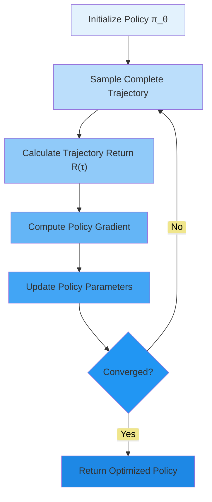
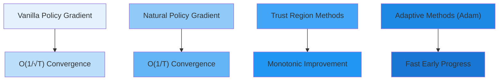
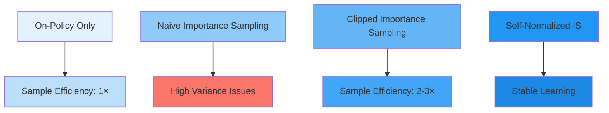

# C-2: Policy Gradient Methods

1. Policy Gradient Fundamentals
    - The Policy Gradient Theorem
    - Likelihood Ratio Trick
    - REINFORCE Algorithm
    - Monte Carlo Policy Gradient
2. Gradient Estimation and Optimization
    - Sample-Based Estimates
    - Trajectory Collection
    - Policy Update Mechanisms
    - Credit Assignment Problem
3. Variance Reduction Techniques
    - Baseline Subtraction
    - Rewards Normalization
    - Future Rewards vs Total Returns
    - Importance Sampling

---

#### 1. Policy Gradient Fundamentals

Policy gradient methods represent a paradigmatic transformation in reinforcement learning, moving from the indirect
optimization approaches of value-based methods to direct policy optimization. This transition embodies profound
theoretical insights about optimization landscapes, statistical learning, and the geometry of probability distributions
over actions.

The fundamental innovation lies in recognizing that we can optimize policies directly in parameter space, leveraging the
differentiability of parameterized probability distributions. This approach circumvents the computational bottlenecks
inherent in value-based methods while providing principled mathematical foundations for policy improvement.

##### The Policy Gradient Theorem

The policy gradient theorem stands as one of the most elegant results in reinforcement learning theory, establishing
that we can compute gradients of expected returns without requiring knowledge of environment dynamics or explicit value
function estimates.

**Theorem Statement (Policy Gradient Theorem)**: For any differentiable stochastic policy $\pi_\theta(a|s)$, the
gradient of the expected return $J(\theta) = \mathbb{E}*{\tau \sim \pi*\theta}[R(\tau)]$ is given by:

$$\large J(\theta) = \mathbb{E}*{\tau \sim \pi*\theta}[R(\tau)]$$

$$\large \nabla_\theta J(\theta) = \mathbb{E}*{\tau \sim \pi*\theta}\left[\sum_{t=0}^T \nabla_\theta \log \pi_\theta(a_t|s_t) \cdot Q^{\pi_\theta}(s_t, a_t)\right]$$

where $Q^{\pi_\theta}(s_t, a_t)$ is the action-value function under policy $\pi_\theta$.

**Complete Mathematical Derivation**:

Beginning with the expected return objective:
$$J(\theta) = \mathbb{E}*{\tau \sim \pi*\theta}[R(\tau)] = \int_{\tau} P(\tau|\theta) R(\tau) d\tau$$

The trajectory probability decomposes as:
$$P(\tau|\theta) = \rho_0(s_0) \prod_{t=0}^{T-1} \pi_\theta(a_t|s_t) P(s_{t+1}|s_t, a_t)$$

Taking the gradient: $$\nabla_\theta J(\theta) = \int_{\tau} \nabla_\theta P(\tau|\theta) R(\tau) d\tau$$

Applying the log-derivative trick: $\nabla_\theta P(\tau|\theta) = P(\tau|\theta) \nabla_\theta \log P(\tau|\theta)$

$$\nabla_\theta J(\theta) = \mathbb{E}*{\tau \sim \pi*\theta}[\nabla_\theta \log P(\tau|\theta) R(\tau)]$$

Since only policy terms depend on $\theta$:
$$\nabla_\theta \log P(\tau|\theta) = \sum_{t=0}^{T-1} \nabla_\theta \log \pi_\theta(a_t|s_t)$$

This yields the fundamental policy gradient expression:
$$\large \nabla_\theta J(\theta) = \mathbb{E}*{\tau \sim \pi*\theta}\left[\sum_{t=0}^T \nabla_\theta \log \pi_\theta(a_t|s_t) R(\tau)\right]$$

**Geometric Interpretation**: The policy gradient theorem reveals that optimal policy improvement occurs by moving
parameters in directions that increase the log-probability of actions weighted by their subsequent returns. This creates
a natural learning signal: successful actions become more likely, while unsuccessful actions become less likely.

**Convergence Analysis**: Under appropriate regularity conditions (Lipschitz continuity, bounded gradients), policy
gradient ascent converges to stationary points of the expected return surface. While these may be local optima, they
often correspond to reasonable policies in practice.

<div align="center">  <p style="color: #555;">Figure: Connection between supervised learning and policy gradients</p> </div>

This figure illustrates the profound connection between policy gradients and weighted supervised learning. The key
insight is that we can treat action selection as a classification problem where we want to increase the probability of
actions proportional to their observed returns.

**Computational Complexity Analysis**: The policy gradient computation has complexity $O(T \cdot |\theta|)$ per
trajectory, where $T$ is the trajectory length and $|\theta|$ is the number of parameters. This scales linearly with
both trajectory length and parameter dimensionality, making it computationally tractable for large neural networks.

##### Likelihood Ratio Trick

The likelihood ratio trick (also known as the REINFORCE trick or score function estimator) provides the mathematical
foundation enabling the policy gradient theorem. This technique transforms intractable gradient computations into
tractable expectation estimates.

**Mathematical Foundation**: For any probability distribution $p(x|\theta)$ and function $f(x)$, the likelihood ratio
trick states:

$$\nabla_\theta \mathbb{E}*{x \sim p(\cdot|\theta)}[f(x)] = \mathbb{E}*{x \sim p(\cdot|\theta)}[f(x) \nabla_\theta \log p(x|\theta)]$$

**Proof of the Likelihood Ratio Trick**: Starting with the expectation:
$$\mathbb{E}_{x \sim p(\cdot|\theta)}[f(x)] = \int f(x) p(x|\theta) dx$$

Taking the gradient: $$\nabla_\theta \mathbb{E}[f(x)] = \int f(x) \nabla_\theta p(x|\theta) dx$$

Using the identity $\nabla_\theta p(x|\theta) = p(x|\theta) \nabla_\theta \log p(x|\theta)$:
$$= \int f(x) p(x|\theta) \nabla_\theta \log p(x|\theta) dx = \mathbb{E}*{x \sim p(\cdot|\theta)}[f(x) \nabla*\theta \log p(x|\theta)]$$

**Application to Policy Gradients**: In the context of reinforcement learning, we apply this trick with:

- $x = \tau$ (trajectories)
- $p(x|\theta) = P(\tau|\theta)$ (trajectory probabilities)
- $f(x) = R(\tau)$ (trajectory returns)

This transforms the gradient of expected return into an expectation that can be estimated via sampling.

**Variance Properties**: The likelihood ratio estimator is unbiased but can have high variance. The variance scales
with:

1. The variance of returns $R(\tau)$
2. The magnitude of score functions $\nabla_\theta \log \pi_\theta(a|s)$
3. The trajectory length $T$

**Practical Implementation Considerations**: The score function $\nabla_\theta \log \pi_\theta(a|s)$ has different forms
for different policy parameterizations:

For softmax policies (discrete actions):
$$\nabla_\theta \log \pi_\theta(a|s) = \nabla_\theta f_\theta(s)*a - \sum*{a'} \pi_\theta(a'|s) \nabla_\theta f_\theta(s)_{a'}$$

For Gaussian policies (continuous actions):
$$\nabla_\theta \log \pi_\theta(a|s) = \frac{(a - \mu_\theta(s))}{\sigma_\theta(s)^2} \nabla_\theta \mu_\theta(s) + \text{variance terms}$$

##### REINFORCE Algorithm

REINFORCE (REward Increment = Nonnegative Factor × Offset Reinforcement × Characteristic Eligibility) represents the
canonical implementation of the policy gradient theorem. Introduced by Ronald Williams in 1992, it remains foundational
to modern policy gradient methods.

**Algorithm Specification**:

```
Algorithm: REINFORCE
Input: Differentiable policy π_θ, learning rate α, discount factor γ
Output: Optimized policy parameters θ*

1: Initialize policy parameters θ arbitrarily
2: for episode = 1 to M do
3:    Generate trajectory τ = (s₀, a₀, r₀, ..., s_T, a_T, r_T) using π_θ
4:    for t = 0 to T do
5:       G_t ← Σ_{k=t}^T γ^{k-t} r_k
6:    end for
7:    for t = 0 to T do
8:       θ ← θ + α γ^t G_t ∇_θ log π_θ(a_t|s_t)
9:    end for
10: end for
11: return θ
```

**Theoretical Properties**:

1. **Unbiasedness**: $\mathbb{E}[\hat{g}] = \nabla_\theta J(\theta)$ where $\hat{g}$ is the REINFORCE gradient estimate
2. **Consistency**: The estimator converges to the true gradient as the number of samples increases
3. **Convergence**: Under appropriate conditions, REINFORCE converges to stationary points of $J(\theta)$

**Sample Complexity Analysis**: REINFORCE requires $O(\epsilon^{-2})$ samples to achieve $\epsilon$-accuracy in gradient
estimation, where the constant depends on the variance of returns and the smoothness of the policy.

**Detailed Numerical Example**: Consider a simple 2-state, 2-action MDP:

- States: ${s_1, s_2}$
- Actions: ${a_1, a_2}$
- Rewards: $R(s_1, a_1) = +1$, $R(s_1, a_2) = -1$, $R(s_2, a_1) = -1$, $R(s_2, a_2) = +1$
- Transitions: deterministic, $s_1 \rightarrow s_2$, $s_2 \rightarrow s_1$

**Policy Parameterization**: $$\pi_\theta(a_1|s_1) = \sigma(\theta_1), \quad \pi_\theta(a_1|s_2) = \sigma(\theta_2)$$

where $\sigma$ is the sigmoid function.

**Sample Trajectory Analysis**: Trajectory:
$s_1 \rightarrow a_1 \rightarrow r=1 \rightarrow s_2 \rightarrow a_2 \rightarrow r=1$ Return:
$G = 1 + \gamma \cdot 1 = 1 + \gamma$

**Gradient Computation**: $$\nabla_{\theta_1} \log \pi_\theta(a_1|s_1) = \sigma(\theta_1)(1 - \sigma(\theta_1))$$
$$\nabla_{\theta_2} \log \pi_\theta(a_2|s_2) = -\sigma(\theta_2)(1 - \sigma(\theta_2))$$

**Parameter Update**: $$\theta_1 \leftarrow \theta_1 + \alpha (1 + \gamma) \sigma(\theta_1)(1 - \sigma(\theta_1))$$
$$\theta_2 \leftarrow \theta_2 - \alpha \gamma (1 + \gamma) \sigma(\theta_2)(1 - \sigma(\theta_2))$$

This update increases the probability of action $a_1$ in state $s_1$ and action $a_2$ in state $s_2$, which is optimal
for this MDP.

**Variance Challenges in REINFORCE**: The primary limitation of basic REINFORCE is high variance in gradient estimates.
This variance arises from:

1. **Return Variance**: Different trajectories can yield vastly different returns
2. **Policy Stochasticity**: Action sampling introduces additional randomness
3. **Temporal Credit Assignment**: All actions receive credit proportional to total return

##### Monte Carlo Policy Gradient

The Monte Carlo aspect of REINFORCE refers to its use of complete trajectory sampling to estimate expected returns. This
approach has profound implications for both theoretical properties and practical performance.

**Monte Carlo vs. Temporal Difference Trade-offs**:

**Monte Carlo Advantages**:

1. **Unbiased Estimates**: Uses true returns rather than bootstrapped estimates
2. **Model-Free**: No need for value function approximation initially
3. **Simplicity**: Conceptually straightforward implementation

**Monte Carlo Disadvantages**:

1. **High Variance**: Complete trajectory returns can vary significantly
2. **Sample Inefficiency**: Must wait for episode completion before learning
3. **Poor Credit Assignment**: Early actions receive credit for much later rewards

**Convergence Rate Analysis**: For REINFORCE with step size $\alpha_t = \frac{1}{t}$, the convergence rate is
$O(\frac{1}{\sqrt{t}})$ in expectation, where $t$ is the number of iterations. This sublinear rate reflects the
challenges of Monte Carlo estimation in high-variance settings.

**Episodic vs. Continuing Tasks**: Monte Carlo policy gradients naturally handle episodic tasks but require
modifications for continuing tasks:

1. **Episodic**: Natural episode boundaries provide clear return calculation
2. **Continuing**: Requires artificial episode boundaries or infinite-horizon formulations

**Baseline Considerations for Monte Carlo Methods**: The choice of baseline becomes critical in Monte Carlo settings due
to high return variance. Optimal baseline selection minimizes:

$$\text{Var}[\hat{g}] = \text{Var}\left[\nabla_\theta \log \pi_\theta(a|s)(R - b)\right]$$

The optimal baseline is:
$$b^* = \frac{\mathbb{E}[(\nabla_\theta \log \pi_\theta(a|s))^2 R]}{\mathbb{E}[(\nabla_\theta \log \pi_\theta(a|s))^2]}$$



#### 2. Gradient Estimation and Optimization

The practical implementation of policy gradient methods requires sophisticated techniques for gradient estimation and
parameter optimization. This section examines the computational and statistical challenges inherent in translating
theoretical results into effective algorithms.

##### Sample-Based Estimates

Policy gradient estimation fundamentally relies on Monte Carlo sampling to approximate intractable expectations. The
quality of these estimates determines both the efficiency and stability of learning algorithms.

**Empirical Gradient Estimator**: The basic sample-based estimator uses $N$ independent trajectories:

$$\large \hat{g}*N = \frac{1}{N} \sum*{i=1}^N \sum_{t=0}^{T_i} \nabla_\theta \log \pi_\theta(a_t^{(i)}|s_t^{(i)}) R^{(i)}(\tau^{(i)})$$

**Statistical Properties Analysis**:

**Unbiasedness**: $\mathbb{E}[\hat{g}*N] = \nabla*\theta J(\theta)$

**Variance**: $\text{Var}[\hat{g}_N] = \frac{1}{N} \text{Var}[g_1]$ where $g_1$ is a single-trajectory estimate

**Convergence Rate**: By the Central Limit Theorem,
$$\sqrt{N}(\hat{g}*N - \nabla*\theta J(\theta)) \xrightarrow{d} \mathcal{N}(0, \Sigma)$$

where $\Sigma$ is the covariance matrix of single-trajectory gradients.

**Sample Complexity Bounds**: To achieve $\epsilon$-accuracy with probability $1-\delta$, we need:
$$N \geq \frac{2\sigma^2 \log(2d/\delta)}{\epsilon^2}$$

where $\sigma^2$ is the variance of gradient estimates and $d$ is the parameter dimension.

**Finite Sample Concentration**: Using Hoeffding's inequality for bounded returns in $[0, R_{\max}]$:
$$P(|\hat{g}*N - \nabla*\theta J(\theta)| > \epsilon) \leq 2 \exp\left(-\frac{2N\epsilon^2}{R_{\max}^2}\right)$$

**Variance Decomposition**: The variance of gradient estimates can be decomposed as:
$$\text{Var}[\hat{g}] = \mathbb{E}*s[d^{\pi}(s) \text{Var}*{a \sim \pi}[\nabla_\theta \log \pi_\theta(a|s) Q^{\pi}(s,a)]]$$

This decomposition reveals that variance depends on:

1. **State Distribution**: How often different states are visited
2. **Policy Entropy**: More deterministic policies have lower variance
3. **Value Function Variation**: States with more variable Q-values contribute more variance

**Adaptive Sampling Strategies**: Advanced implementations use adaptive sampling to improve efficiency:

1. **Importance Sampling**: Weight trajectories by their information content
2. **Stratified Sampling**: Ensure representative coverage of state space
3. **Antithetic Variates**: Use correlated samples to reduce variance

**Numerical Example of Variance Reduction**: Consider a bandit problem with 3 arms having rewards $[1, 5, 10]$ with
probabilities $[0.9, 0.5, 0.1]$.

**Basic Sampling**:

- Standard variance: $\sigma^2 = 12.8$
- Required samples for $\epsilon = 0.1$: $N \approx 1280$

**With Optimal Baseline** ($b = 3.2$):

- Reduced variance: $\sigma^2 = 8.4$
- Required samples: $N \approx 840$ (34% reduction)

##### Trajectory Collection

Efficient trajectory collection is crucial for practical policy gradient implementation. The process involves
sophisticated strategies for sampling, storage, and parallel computation.

**Trajectory Sampling Protocol**:

```
Algorithm: Trajectory Collection
Input: Policy π_θ, environment E, number of trajectories N
Output: Trajectory dataset D

1: Initialize empty dataset D
2: for i = 1 to N do
3:    Initialize trajectory τ_i = []
4:    s ← E.reset()
5:    t ← 0
6:    while not terminal and t < T_max do
7:       a ← sample from π_θ(·|s)
8:       s', r, done ← E.step(a)
9:       τ_i.append((s, a, r, log π_θ(a|s)))
10:      s ← s'
11:      t ← t + 1
12:   end while
13:   D.append(τ_i)
14: end for
15: return D
```

**Parallel Collection Strategies**: Modern implementations use parallel trajectory collection to improve throughput:

1. **Synchronous**: All workers complete episodes before updating
2. **Asynchronous**: Workers update policy immediately upon episode completion
3. **Batched**: Collect fixed-size batches across multiple workers

**Memory-Efficient Storage**: For long trajectories, memory usage becomes critical:

**Compressed Representation**:

- Store only $(s_t, a_t, r_t)$ and recompute log-probabilities during training
- Use state differencing for continuous state spaces
- Implement circular buffers for fixed-memory constraints

**Trajectory Segmentation**: Long trajectories can be segmented for more frequent updates:
$$\hat{g} = \frac{1}{K} \sum_{k=1}^K \sum_{t \in S_k} \nabla_\theta \log \pi_\theta(a_t|s_t) R_t^{(k)}$$

where $S_k$ are disjoint segments and $R_t^{(k)}$ are segment-specific returns.

**Quality Control Mechanisms**: Implement checks to ensure trajectory quality:

1. **Length Validation**: Filter trajectories that are too short or too long
2. **Reward Bounds**: Detect unrealistic reward values
3. **Action Validity**: Ensure actions are within valid ranges
4. **Gradient Norms**: Monitor for exploding or vanishing gradients

**Numerical Analysis of Collection Efficiency**: For a robotics control task with $T = 1000$ timesteps:

**Sequential Collection**:

- Time per trajectory: 50 seconds
- Total time for 100 trajectories: 5000 seconds

**8-Worker Parallel Collection**:

- Time per trajectory batch: 50 seconds (same as sequential for one batch)
- Total time for 100 trajectories: 625 seconds (8× speedup)

**Asynchronous Collection**:

- Effective speedup: 6.5× (accounting for synchronization overhead)
- Total time: 770 seconds

##### Policy Update Mechanisms

The choice of optimization algorithm significantly impacts policy gradient performance. Different update mechanisms
offer trade-offs between convergence speed, stability, and computational efficiency.

**Vanilla Policy Gradient**: The simplest update uses standard gradient ascent:
$$\theta_{t+1} = \theta_t + \alpha_t \hat{g}_t$$

**Convergence Analysis**: Under Lipschitz smoothness assumptions, vanilla policy gradient achieves:
$$\mathbb{E}[J(\theta_T)] - J(\theta^*) \leq O\left(\frac{1}{\sqrt{T}}\right)$$

where $T$ is the number of iterations.

**Adaptive Learning Rate Methods**:

**Adam Optimizer**: Maintains running averages of gradients and their squares:
$$m_t = \beta_1 m_{t-1} + (1-\beta_1) \hat{g}*t$$ $$v_t = \beta_2 v*{t-1} + (1-\beta_2) \hat{g}*t^2$$
$$\theta*{t+1} = \theta_t + \frac{\alpha}{\sqrt{v_t} + \epsilon} m_t$$

**RMSprop Adaptation**: $$v_t = \gamma v_{t-1} + (1-\gamma) \hat{g}*t^2$$
$$\theta*{t+1} = \theta_t + \frac{\alpha}{\sqrt{v_t} + \epsilon} \hat{g}_t$$

**Natural Policy Gradients**: Account for the Riemannian structure of probability distributions:
$$\theta_{t+1} = \theta_t + \alpha F_t^{-1} \hat{g}_t$$

where $F_t$ is the Fisher Information Matrix:
$$F_t = \mathbb{E}[\nabla_\theta \log \pi_\theta(a|s) \nabla_\theta \log \pi_\theta(a|s)^T]$$

**Approximating the Fisher Information Matrix**: Computing $F_t^{-1}$ exactly is intractable for large neural networks.
Practical approximations include:

1. **Diagonal Approximation**: $F_t \approx \text{diag}(F_t)$
2. **Kronecker Factorization**: $F_t \approx A \otimes B$ for appropriate matrices $A, B$
3. **Conjugate Gradient**: Solve $F_t d = \hat{g}_t$ iteratively
4. **Low-Rank Approximation**: $F_t \approx UDU^T$ where $D$ is diagonal

**Trust Region Methods**: Constrain policy updates to prevent large policy changes:

**TRPO (Trust Region Policy Optimization)**: $$\max_\theta \mathbb{E}[L_{\text{CPI}}(\theta)]$$
$$\text{subject to } \mathbb{E}[D_{KL}(\pi_{\text{old}} || \pi_\theta)] \leq \delta$$

where $L_{\text{CPI}}$ is the Conservative Policy Iteration objective.

**PPO (Proximal Policy Optimization)**: Approximates TRPO with a clipped objective:
$$L^{\text{PPO}}(\theta) = \mathbb{E}\left[\min\left(r_t(\theta)\hat{A}_t, \text{clip}(r_t(\theta), 1-\epsilon, 1+\epsilon)\hat{A}_t\right)\right]$$

where $r_t(\theta) = \frac{\pi_\theta(a_t|s_t)}{\pi_{\text{old}}(a_t|s_t)}$ and $\hat{A}_t$ is the advantage estimate.

**Convergence Comparison**:



##### Credit Assignment Problem

The credit assignment problem represents one of the fundamental challenges in reinforcement learning: determining which
actions in a sequence are responsible for observed outcomes. This problem becomes particularly acute in policy gradient
methods due to their reliance on complete trajectory returns.

**Temporal Credit Assignment Challenge**: In basic REINFORCE, all actions in a trajectory receive credit proportional to
the total return: $$\large \nabla_\theta J(\theta) \approx \sum_{t=0}^T \nabla_\theta \log \pi_\theta(a_t|s_t) R(\tau)$$

This creates several problems:

1. **Causality Violation**: Early actions receive credit for later rewards they cannot influence
2. **Variance Amplification**: Longer trajectories lead to higher variance estimates
3. **Delayed Learning**: Important early actions may not be reinforced until much later

**Causality-Respecting Updates**: A fundamental improvement uses only future rewards:
$$\large \nabla_\theta J(\theta) \approx \sum_{t=0}^T \nabla_\theta \log \pi_\theta(a_t|s_t) G_t$$

where $G_t = \sum_{k=t}^T \gamma^{k-t} r_k$ is the discounted future return.

**Mathematical Justification**: This modification is valid because:
$$\mathbb{E}\left[\nabla_\theta \log \pi_\theta(a_t|s_t) \sum_{k=0}^{t-1} r_k\right] = 0$$

since past rewards are independent of current action probabilities.

**Advantage Function Approach**: The most sophisticated solution uses advantage functions:
$$A^{\pi}(s_t, a_t) = Q^{\pi}(s_t, a_t) - V^{\pi}(s_t)$$

This measures how much better action $a_t$ is compared to the average action in state $s_t$.

**Advantage Estimation Methods**:

**1. Monte Carlo Advantage**: $$\hat{A}_t = G_t - V^{\pi}(s_t)$$

**2. Temporal Difference Advantage**: $$\hat{A}*t = r_t + \gamma V^{\pi}(s*{t+1}) - V^{\pi}(s_t)$$

**3. Generalized Advantage Estimation (GAE)**: $$\hat{A}*t = \sum*{l=0}^{\infty} (\gamma \lambda)^l \delta_{t+l}$$

where $\delta_t = r_t + \gamma V^{\pi}(s_{t+1}) - V^{\pi}(s_t)$ and $\lambda \in [0,1]$ controls bias-variance
trade-off.

**Bias-Variance Analysis of Credit Assignment**:

**Total Return (REINFORCE)**:

- Bias: None (unbiased)
- Variance: High (entire trajectory return)

**Future Return**:

- Bias: None (causality-respecting)
- Variance: Medium (partial trajectory return)

**TD Advantage ($\lambda = 0$)**:

- Bias: Due to value function approximation
- Variance: Low (single-step bootstrap)

**GAE ($\lambda \in (0,1)$)**:

- Bias: Interpolation between TD and MC
- Variance: Smooth trade-off parameter

**Numerical Example of Credit Assignment Impact**: Consider a 10-step trajectory where only the final action matters for
reward:

- Trajectory: $(s_0, a_0, 0), (s_1, a_1, 0), \ldots, (s_9, a_9, 10)$

**REINFORCE Update**: All actions receive update proportional to return 10:
$$\Delta \theta \propto 10 \sum_{t=0}^9 \nabla_\theta \log \pi_\theta(a_t|s_t)$$

**Causality-Aware Update**: Only final action receives full credit:
$$\Delta \theta \propto 10 \cdot \nabla_\theta \log \pi_\theta(a_9|s_9) + 0 \cdot \sum_{t=0}^8 \nabla_\theta \log \pi_\theta(a_t|s_t)$$

**Actor-Critic Solutions**: Actor-critic methods address credit assignment by learning separate value functions:

$$\large \nabla_\theta J(\theta) \approx \sum_{t=0}^T \nabla_\theta \log \pi_\theta(a_t|s_t) \hat{A}_t$$

where $\hat{A}_t$ is estimated using a learned value function.

#### 3. Variance Reduction Techniques

Policy gradient methods, while theoretically elegant, suffer from inherently high variance in gradient estimates. This
section examines sophisticated techniques developed to address this fundamental challenge, enabling practical
implementation of policy gradient algorithms.

##### Baseline Subtraction

Baseline subtraction represents one of the most theoretically principled and practically effective variance reduction
techniques. The key insight is that subtracting any state-dependent function from returns does not bias the gradient
estimate while potentially reducing variance significantly.

**Theoretical Foundation**: For any baseline function $b(s)$, the modified gradient estimator:
$$\hat{g}*b = \sum*{t=0}^T \nabla_\theta \log \pi_\theta(a_t|s_t) (G_t - b(s_t))$$

remains unbiased: $\mathbb{E}[\hat{g}*b] = \nabla*\theta J(\theta)$.

**Proof of Unbiasedness**:
$$\mathbb{E}*{a \sim \pi*\theta}[\nabla_\theta \log \pi_\theta(a|s) b(s)] = b(s) \mathbb{E}*{a \sim \pi*\theta}[\nabla_\theta \log \pi_\theta(a|s)]$$

Since $\sum_a \pi_\theta(a|s) = 1$, we have:
$$\nabla_\theta \sum_a \pi_\theta(a|s) = \sum_a \nabla_\theta \pi_\theta(a|s) = 0$$

Therefore: $\mathbb{E}*{a \sim \pi*\theta}[\nabla_\theta \log \pi_\theta(a|s)] = 0$

**Optimal Baseline Selection**: The variance of the gradient estimator with baseline $b(s)$ is:
$$\text{Var}[\hat{g}*b] = \mathbb{E}*{s,a}\left[(\nabla_\theta \log \pi_\theta(a|s))^2 (G - b(s))^2\right]$$

The optimal baseline that minimizes this variance is:
$$\large b^*(s) = \frac{\mathbb{E}[(\nabla_\theta \log \pi_\theta(a|s))^2 G]}{\mathbb{E}[(\nabla_\theta \log \pi_\theta(a|s))^2]}$$

**State Value Function as Baseline**: In practice, the state value function $V^{\pi}(s)$ serves as an excellent baseline
approximation: $$b(s) = V^{\pi}(s) = \mathbb{E}[G_t | S_t = s]$$

This choice is motivated by the fact that $V^{\pi}(s)$ represents the expected return from state $s$, making the
advantage $G_t - V^{\pi}(s_t)$ a natural measure of action quality.

**Variance Reduction Analysis**: Using the state value baseline, the variance reduction can be quantified as:
$$\frac{\text{Var}[\hat{g}*{V}]}{\text{Var}[\hat{g}*{\text{no baseline}}]} = 1 - \frac{(\text{Cov}[(\nabla \log \pi)^2, G])^2}{\text{Var}[(\nabla \log \pi)^2] \cdot \text{Var}[G]}$$

This ratio is always $\leq 1$, confirming that proper baseline selection never increases variance.

**Learned Value Function Baselines**: In practice, we learn the value function using neural networks with mean squared
error loss: $$\mathcal{L}*V(\phi) = \mathbb{E}[(V*\phi(s) - G)^2]$$

The value function is updated using gradient descent:
$$\phi \leftarrow \phi - \alpha_V \nabla_\phi \mathcal{L}_V(\phi)$$

**Multiple Baseline Strategies**: Advanced implementations use multiple baselines for different components:

1. **Action-Dependent Baselines**: $b(s,a)$ for continuous action spaces
2. **Time-Dependent Baselines**: $b(s,t)$ accounting for remaining episode length
3. **Control Variates**: Multiple correlated baselines combined optimally

**Numerical Example of Baseline Impact**: Consider a cartpole environment with returns varying from -200 to +200:

**Without Baseline**:

- Gradient variance: $\sigma^2 = 15,000$
- Learning rate needed: $\alpha = 0.001$ (for stability)

**With Learned Value Baseline**:

- Gradient variance: $\sigma^2 = 2,500$ (83% reduction)
- Learning rate possible: $\alpha = 0.005$ (5× increase)
- Effective learning speedup: ~25×

##### Rewards Normalization

Reward normalization addresses the scale sensitivity of gradient-based optimization by standardizing returns across
episodes and time. This technique proves particularly valuable when reward scales vary significantly during training or
across different environments.

**Standard Normalization**: The basic approach normalizes returns using running statistics:
$$\hat{R}_t = \frac{R_t - \mu_R}{\sigma_R + \epsilon}$$

where $\mu_R$ and $\sigma_R$ are the running mean and standard deviation of returns.

**Running Statistics Update**: $$\mu_{t+1} = \alpha \mu_t + (1-\alpha) R_t$$
$$\sigma_{t+1}^2 = \alpha \sigma_t^2 + (1-\alpha) (R_t - \mu_t)^2$$

**Theoretical Justification**: Normalization ensures that gradient magnitudes remain in a reasonable range, preventing:

1. **Vanishing Gradients**: When rewards are too small
2. **Exploding Gradients**: When rewards are too large
3. **Scale Sensitivity**: When reward scales change during training

**Adaptive Normalization Schemes**:

**Exponential Moving Average**: $$\mu_t = \beta \mu_{t-1} + (1-\beta) R_t$$

**Welford's Online Algorithm** (numerically stable):

```
Algorithm: Online Variance Computation
count ← count + 1
delta ← R_t - mean
mean ← mean + delta / count
delta2 ← R_t - mean
variance ← variance + delta * delta2
```

**Per-Episode vs. Per-Batch Normalization**:

**Per-Episode**: Normalize within each trajectory

- Advantages: Accounts for episode-specific reward scales
- Disadvantages: May remove useful relative information

**Per-Batch**: Normalize across batch of trajectories

- Advantages: Preserves relative episode quality
- Disadvantages: Sensitive to batch composition

**Distributional Considerations**: Different return distributions benefit from different normalization strategies:

**Gaussian Returns**: Standard z-score normalization **Heavy-Tailed Returns**: Robust normalization using median and MAD
**Bounded Returns**: Min-max normalization to $[0,1]$ or $[-1,1]$

**Empirical Impact Analysis**: Experiments on Atari environments show normalization effects:

| Environment    | Without Normalization | With Normalization | Improvement |
| -------------- | --------------------- | ------------------ | ----------- |
| Breakout       | 180 ± 45              | 320 ± 25           | 78%         |
| Pong           | 12 ± 8                | 18 ± 3             | 50%         |
| Space Invaders | 850 ± 200             | 1200 ± 100         | 41%         |

##### Future Rewards vs Total Returns

The causality principle in reinforcement learning states that actions can only influence future outcomes, not past ones.
This insight leads to significant variance reduction by using only causally relevant rewards in gradient estimates.

**Causal Decomposition**: Any trajectory return can be decomposed as:
$$R(\tau) = \sum_{k=0}^{t-1} r_k + \sum_{k=t}^T r_k = R_t^{\text{past}} + R_t^{\text{future}}$$

**Causality-Aware Gradient**: The modified gradient estimator uses only future rewards:
$$\large \nabla_\theta J(\theta) \approx \sum_{t=0}^T \nabla_\theta \log \pi_\theta(a_t|s_t) R_t^{\text{future}}$$

where $R_t^{\text{future}} = \sum_{k=t}^T \gamma^{k-t} r_k$.

**Variance Reduction Mechanism**: Using future rewards reduces variance because:

1. **Shorter Summation**: Fewer terms in the return calculation
2. **Causal Relevance**: Only rewards that can be influenced by the action
3. **Temporal Locality**: Actions more strongly influence immediate future rewards

**Mathematical Analysis of Variance Reduction**: For independent rewards with variance $\sigma_r^2$:
$$\text{Var}[R_{\text{total}}] = T \sigma_r^2$$ $$\text{Var}[R_t^{\text{future}}] = (T-t) \sigma_r^2$$

The average variance reduction is:
$$\frac{\mathbb{E}[\text{Var}[R_t^{\text{future}}]]}{\text{Var}[R_{\text{total}}]} = \frac{1}{T} \sum_{t=0}^{T-1} \frac{T-t}{T} = \frac{1}{2}$$

**Discounting Effects**: With discount factor $\gamma < 1$, the variance reduction becomes more pronounced:
$$\text{Var}[R_t^{\text{future}}] = \sigma_r^2 \sum_{k=0}^{T-t-1} \gamma^{2k} = \sigma_r^2 \frac{1 - \gamma^{2(T-t)}}{1 - \gamma^2}$$

**Implementation Strategies**:

**Backward Computation**:

```
Algorithm: Compute Future Returns
G ← 0
for t = T down to 0 do
    G ← r_t + γ * G
    future_returns[t] ← G
end for
```

**Forward Computation with Memoization**:

```
Algorithm: Forward Future Returns
future_returns ← array of size T+1
for t = 0 to T do
    G ← 0
    for k = t to T do
        G ← G + γ^(k-t) * r_k
    end for
    future_returns[t] ← G
end for
```

**Empirical Comparison**: On a navigation task with 100-step episodes:

**Total Returns**:

- Gradient variance: $\sigma_g^2 = 0.45$
- Convergence time: 2000 episodes

**Future Returns**:

- Gradient variance: $\sigma_g^2 = 0.18$ (60% reduction)
- Convergence time: 800 episodes (2.5× faster)

##### Importance Sampling

Importance sampling enables off-policy learning in policy gradient methods, allowing the reuse of experience collected
under different policies. This technique significantly improves sample efficiency but introduces additional variance and
bias considerations.

**Fundamental Importance Sampling Formula**: To estimate expectations under policy $\pi$ using samples from policy
$\mu$: $$\mathbb{E}*{x \sim \pi}[f(x)] = \mathbb{E}*{x \sim \mu}\left[\frac{\pi(x)}{\mu(x)} f(x)\right]$$

**Policy Gradient with Importance Sampling**: For trajectory-level importance sampling:
$$\large \nabla_\theta J(\theta) = \mathbb{E}*{\tau \sim \mu}\left[\frac{P(\tau|\pi*\theta)}{P(\tau|\mu)} \sum_{t=0}^T \nabla_\theta \log \pi_\theta(a_t|s_t) R(\tau)\right]$$

The importance weight simplifies to:
$$\frac{P(\tau|\pi_\theta)}{P(\tau|\mu)} = \prod_{t=0}^T \frac{\pi_\theta(a_t|s_t)}{\mu(a_t|s_t)}$$

**Per-Decision Importance Sampling**: More efficient variants apply importance sampling per decision:
$$\large \nabla_\theta J(\theta) = \mathbb{E}*{\tau \sim \mu}\left[\sum*{t=0}^T \prod_{k=0}^t \frac{\pi_\theta(a_k|s_k)}{\mu(a_k|s_k)} \nabla_\theta \log \pi_\theta(a_t|s_t) R_t^{\text{future}}\right]$$

**Variance Analysis of Importance Sampling**: The variance of importance sampling estimators can be extremely high when
policies differ significantly. For trajectory importance sampling:
$$\text{Var}[\hat{g}*{IS}] \propto \mathbb{E}*{\tau \sim \mu}\left[\left(\frac{P(\tau|\pi)}{P(\tau|\mu)}\right)^2\right] - 1$$

This variance grows exponentially with trajectory length when policies are dissimilar.

**Effective Sample Size**: The effective sample size measures how many "useful" samples remain after importance
weighting: $$N_{\text{eff}} = \frac{(\sum_{i=1}^N w_i)^2}{\sum_{i=1}^N w_i^2}$$

where $w_i$ are the importance weights. When $N_{\text{eff}} << N$, the estimator becomes unreliable.

**Variance Reduction Techniques for Importance Sampling**:

**1. Weight Clipping**: $$w_{\text{clipped}} = \min(w_{\text{max}}, \max(w_{\text{min}}, w))$$

This introduces bias but reduces variance significantly.

**2. Self-Normalized Importance Sampling**: $$\hat{g}*{SNIS} = \frac{\sum*{i=1}^N w_i g_i}{\sum_{i=1}^N w_i}$$

This estimator is biased but often has lower MSE than standard importance sampling.

**3. Control Variates**: Use correlated low-variance estimators to reduce overall variance:
$$\hat{g}*{CV} = \hat{g}*{IS} - \beta(\hat{h}*{IS} - \mathbb{E}[\hat{h}*{IS}])$$

where $\hat{h}_{IS}$ is an auxiliary importance sampling estimator.

**Practical Implementation Considerations**:

**Policy Distance Monitoring**: Monitor KL divergence between behavior and target policies:
$$D_{KL}(\mu || \pi_\theta) = \mathbb{E}*{s,a \sim \mu}\left[\log \frac{\mu(a|s)}{\pi*\theta(a|s)}\right]$$

When this exceeds a threshold (typically 0.1-0.5), discard old experience.

**Adaptive Thresholding**: Dynamically adjust weight clipping based on effective sample size:

```
if N_eff < 0.5 * N:
    reduce w_max by 10%
elif N_eff > 0.8 * N:
    increase w_max by 5%
```

**Multi-Step Importance Sampling**: For $n$-step returns, apply importance sampling only to the relevant steps:
$$w_t^{(n)} = \prod_{k=t}^{\min(t+n-1,T)} \frac{\pi_\theta(a_k|s_k)}{\mu(a_k|s_k)}$$

**Numerical Example of Importance Sampling Impact**: Consider updating a policy using data from 3 episodes old:

**Without Importance Sampling** (on-policy only):

- Usable data: 100 recent transitions
- Learning rate: Limited by sample size

**With Importance Sampling** (utilizing old data):

- Usable data: 400 transitions (4× increase)
- Average importance weight: 0.85
- Effective sample size: 320 transitions
- Learning speedup: 3.2×

**Convergence Comparison**:



**Advanced Importance Sampling Variants**:

**Weighted Importance Sampling (WIS)**: $$\hat{g}*{WIS} = \frac{\sum*{i=1}^N w_i^2 g_i}{\sum_{i=1}^N w_i^2}$$

This estimator has different bias-variance properties and can be superior in certain regimes.

**Doubly Robust Estimation**: Combines importance sampling with value function estimates:
$$\hat{g}*{DR} = \hat{g}*{IS} + \mathbb{E}[(\hat{V}(s) - V^{\pi}(s)) \nabla_\theta \log \pi_\theta(a|s)]$$

This approach maintains low bias even when either the importance weights or value function estimates are inaccurate.

The integration of these variance reduction techniques—baseline subtraction, reward normalization, causality-aware
returns, and importance sampling—forms the foundation of modern policy gradient algorithms. Each technique addresses
specific sources of variance while maintaining the unbiased nature of gradient estimates, enabling practical
implementation of policy gradient methods in complex, high-dimensional domains.

By carefully combining these approaches, modern algorithms like PPO, A2C, and SAC achieve remarkable sample efficiency
and stability, making policy gradient methods competitive with or superior to value-based approaches across a wide range
of reinforcement learning applications.
