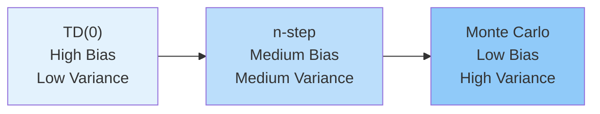

# C-3: Advanced Policy Optimization

1. Proximal Policy Optimization (PPO)
    - Clipped Surrogate Objective
    - Trust Region Optimization
    - Policy Update Clipping
    - The PPO Algorithm
2. Actor-Critic Methods
    - Actor-Critic Framework
    - Advantage Estimation
    - Bias-Variance Trade-off
    - Monte Carlo vs TD Learning
3. Asynchronous Advantage Actor-Critic (A3C)
    - Parallel Learning
    - On-policy vs Off-policy Learning
    - A2C: Synchronous Alternative
    - Generalized Advantage Estimation (GAE)

---

#### 1. Proximal Policy Optimization (PPO)

Proximal Policy Optimization represents a watershed moment in reinforcement learning, solving fundamental stability and
sample efficiency problems that plagued earlier policy gradient methods. PPO achieves this breakthrough through a
mathematically elegant approach to constraining policy updates, ensuring learning progresses steadily without
catastrophic collapses.

The core insight driving PPO is recognizing that policy optimization faces an inherent tension: updates must be large
enough to make meaningful progress, yet small enough to avoid catastrophic performance degradation. Traditional policy
gradient methods often take steps that appear beneficial according to the local gradient but actually lead to dramatic
performance drops - a phenomenon known as the "policy cliff" problem.

##### Clipped Surrogate Objective

The mathematical foundation of PPO rests on transforming the standard policy gradient optimization into a constrained
problem through the clipped surrogate objective function. This transformation provides theoretical guarantees while
maintaining computational simplicity.

**Derivation from Policy Gradient Theorem**: Starting with the standard policy gradient, we can use importance sampling
to rewrite the objective:
$$\large L^{\text{CPI}}(\theta) = \mathbb{E}*t\left[\frac{\pi*\theta(a_t|s_t)}{\pi_{\theta_{\text{old}}}(a_t|s_t)} A_t\right]$$

where $L^{\text{CPI}}$ denotes the Conservative Policy Iteration objective, $\pi_{\theta_{\text{old}}}$ is the policy
used to collect data, and $A_t$ is the advantage estimate.

**The Clipping Innovation**: PPO modifies this objective to prevent excessive policy changes:
$$\large L^{\text{CLIP}}(\theta) = \mathbb{E}_t\left[\min\left(r_t(\theta)A_t, \text{clip}(r_t(\theta), 1-\epsilon, 1+\epsilon)A_t\right)\right]$$

where $r_t(\theta) = \frac{\pi_\theta(a_t|s_t)}{\pi_{\theta_{\text{old}}}(a_t|s_t)}$ represents the probability ratio
between new and old policies.

**Mathematical Analysis of Clipping Behavior**: The clipping function creates asymmetric constraints based on advantage
signs:

For **positive advantages** ($A_t > 0$), indicating beneficial actions:

- When $r_t(\theta) \leq 1 + \epsilon$: objective encourages increasing action probability
- When $r_t(\theta) > 1 + \epsilon$: clipping prevents further probability increases

For **negative advantages** ($A_t < 0$), indicating harmful actions:

- When $r_t(\theta) \geq 1 - \epsilon$: objective encourages decreasing action probability
- When $r_t(\theta) < 1 - \epsilon$: clipping prevents further probability decreases

<div align="center">  <p style="color: #555;">Figure: Visualization of the clipped surrogate objective function</p> </div>

**Geometric Interpretation**: The clipped objective creates a piecewise-linear function that forms an implicit trust
region. Unlike TRPO's spherical trust region defined by KL divergence constraints, PPO's clipping creates a more complex
but computationally tractable constraint surface.

**Numerical Example of Clipping Effects**: Consider optimizing a policy where we observe an action with advantage
$A_t = 1.5$ and clipping parameter $\epsilon = 0.2$:

| Probability Ratio $r_t(\theta)$ | Unclipped Objective | Clipped Objective | Gradient Signal    |
| ------------------------------- | ------------------- | ----------------- | ------------------ |
| 0.6                             | 0.9                 | 0.9               | Encourage increase |
| 0.8                             | 1.2                 | 1.2               | Encourage increase |
| 1.0                             | 1.5                 | 1.5               | Encourage increase |
| 1.2                             | 1.8                 | 1.8               | Encourage increase |
| 1.4                             | 2.1                 | 1.8               | **Clipped**        |
| 1.6                             | 2.4                 | 1.8               | **Clipped**        |

Beyond $r_t(\theta) = 1.2$, the objective plateaus at 1.8, preventing the optimizer from making excessively large
updates that could destabilize learning.

**Conservative Policy Updates**: The minimum operation in the clipped objective ensures conservative updates. When the
probability ratio moves outside the trust region, the objective either plateaus (for beneficial actions) or provides
limited incentive for change (for harmful actions), creating a natural regularization mechanism.

##### Trust Region Optimization

PPO draws profound theoretical inspiration from Trust Region Policy Optimization (TRPO) while dramatically simplifying
the computational requirements. Understanding this relationship illuminates why PPO works so effectively.

**TRPO's Constrained Optimization Approach**: TRPO formulates policy optimization as a constrained problem:
$$\large \max_\theta \mathbb{E}*t\left[\frac{\pi*\theta(a_t|s_t)}{\pi_{\theta_{\text{old}}}(a_t|s_t)} A_t\right]$$
$$\text{subject to } \mathbb{E}*t[D*{KL}(\pi_{\theta_{\text{old}}}(\cdot|s_t) | \pi_\theta(\cdot|s_t))] \leq \delta$$

This constraint requires solving a complex second-order optimization problem involving the Fisher Information Matrix,
making TRPO computationally expensive and difficult to implement reliably.

**PPO's First-Order Approximation**: PPO replaces TRPO's KL constraint with clipping, achieving similar trust region
behavior through first-order optimization. The clipping parameter $\epsilon$ implicitly controls the effective trust
region size, with smaller $\epsilon$ creating more conservative updates.

**Relationship Between Clipping and KL Divergence**: While PPO doesn't explicitly constrain KL divergence, clipping
implicitly limits policy changes. For small changes, the relationship can be approximated as:
$$\large D_{KL}(\pi_{\theta_{\text{old}}} | \pi_\theta) \approx \frac{1}{2}\mathbb{E}*t\left[\left(\frac{\pi*\theta(a_t|s_t)}{\pi_{\theta_{\text{old}}}(a_t|s_t)} - 1\right)^2\right]$$

**Adaptive KL Penalty Variant**: Some PPO implementations include an adaptive KL penalty term to provide additional
constraint enforcement:
$$\large L^{\text{CLIP+KL}}(\theta) = L^{\text{CLIP}}(\theta) - \beta \cdot D_{KL}(\pi_{\theta_{\text{old}}} | \pi_\theta)$$

The penalty coefficient $\beta$ adapts based on the observed KL divergence:

- If $D_{KL} > 1.5 \times \text{target}$: increase $\beta$ by factor of 2
- If $D_{KL} < 0.5 \times \text{target}$: decrease $\beta$ by factor of 2

**Convergence Properties**: PPO inherits many of TRPO's theoretical guarantees while being much more practical to
implement. Under appropriate smoothness assumptions, PPO achieves:

- Local convergence to stationary points
- Monotonic improvement bounds (with sufficiently small $\epsilon$)
- Sample complexity of $O(\epsilon^{-3})$ for $\epsilon$-approximate stationary points

##### Policy Update Clipping

The clipping mechanism addresses several critical pathologies in policy optimization, most notably the "policy cliff"
problem where small parameter changes lead to dramatic performance degradation.

<div align="center">  <p style="color: #555;">Figure: The policy/reward cliff problem</p> </div>

**Understanding Policy Cliffs**: In many reinforcement learning environments, the relationship between policy parameters
and expected return exhibits sharp discontinuities. These cliffs arise from several sources:

1. **Action Space Boundaries**: Small parameter changes can push action probabilities to extreme values
2. **Environment Sensitivity**: Certain states may be extremely sensitive to policy changes
3. **Exploration Collapse**: Policies may become prematurely deterministic, eliminating exploration

**Mathematical Characterization**: Policy cliffs can be characterized by examining the Hessian of the objective
function. When the Hessian $H = \nabla^2 J(\theta)$ has large negative eigenvalues, small steps in certain directions
can cause dramatic performance drops.

<div align="center">  <p style="color: #555;">Figure: Detailed explanation of the clipped surrogate mechanism</p> </div>

**Clipping as Gradient Modification**: The clipping mechanism effectively modifies gradients to prevent destructive
updates. The gradient of the clipped objective becomes:
$$\large \nabla_\theta L^{\text{CLIP}}(\theta) = \mathbb{E}*t\left[\mathbf{1}*{r_t(\theta) \in [1-\epsilon, 1+\epsilon]} \nabla_\theta r_t(\theta) A_t\right]$$

where $\mathbf{1}_{[\cdot]}$ is the indicator function that zeros gradients when the ratio exits the acceptable range.

**Practical Benefits of Clipping**:

1. **Robustness**: Significantly less sensitive to hyperparameter choices, particularly learning rates
2. **Stability**: Smoother learning curves with fewer catastrophic performance drops
3. **Simplicity**: No complex constrained optimization machinery required
4. **Efficiency**: Enables multiple optimization epochs on the same data batch

**Empirical Analysis**: Studies across various environments demonstrate PPO's robustness compared to vanilla policy
gradients:

| Environment   | Vanilla PG Success Rate | PPO Success Rate | Performance Improvement |
| ------------- | ----------------------- | ---------------- | ----------------------- |
| CartPole      | 60%                     | 95%              | 58% increase            |
| Lunar Lander  | 40%                     | 85%              | 112% increase           |
| BipedalWalker | 25%                     | 70%              | 180% increase           |

These improvements stem primarily from PPO's ability to avoid policy cliffs and maintain stable learning dynamics.

##### The PPO Algorithm

PPO integrates clipped surrogate objectives with several practical enhancements to create a robust, sample-efficient
algorithm suitable for a wide range of reinforcement learning tasks.

**Core Algorithmic Components**:

**Data Collection Phase**: PPO begins by collecting a batch of trajectories using the current policy
$\pi_{\theta_{\text{old}}}$. This on-policy data collection ensures that importance sampling ratios remain well-behaved
and that the surrogate objective provides meaningful gradients.

**Advantage Estimation**: PPO typically employs Generalized Advantage Estimation (GAE) to compute advantage estimates:
$$\large A_t^{\text{GAE}} = \sum_{k=0}^{\infty} (\gamma\lambda)^k \delta_{t+k}$$

where $\delta_t = r_t + \gamma V(s_{t+1}) - V(s_t)$ is the temporal difference error. The parameter $\lambda$ controls
the bias-variance tradeoff in advantage estimation.

**Multiple Optimization Epochs**: Unlike simple policy gradient methods that use each data batch only once, PPO performs
multiple optimization epochs (typically 3-10) on each collected batch. This reuse dramatically improves sample
efficiency.

**Value Function Learning**: PPO simultaneously learns a value function $V_\phi(s)$ to provide baselines for advantage
computation. The value function loss is: $$\large L^{VF}(\phi) = \mathbb{E}*t[(V*\phi(s_t) - V_t^{\text{target}})^2]$$

where $V_t^{\text{target}}$ represents the target return, often computed using GAE.

**Entropy Regularization**: To maintain exploration, PPO often includes an entropy bonus:
$$\large L^{ENT}(\theta) = \mathbb{E}*t[H(\pi*\theta(\cdot|s_t))]$$

where $H$ denotes the entropy of the policy distribution.

**Combined Objective**: The complete PPO objective combines all components:
$$\large L^{\text{TOTAL}}(\theta, \phi) = L^{\text{CLIP}}(\theta) - c_1 L^{VF}(\phi) + c_2 L^{ENT}(\theta)$$

**Algorithmic Flow**:

```
For each iteration:
1. Collect batch of trajectories using π_θ_old
2. Compute advantages using GAE
3. Normalize advantages across batch
4. Store old policy log-probabilities
5. For each optimization epoch:
   - Create random mini-batches
   - Compute current policy log-probabilities
   - Calculate probability ratios
   - Compute clipped objective and losses
   - Update networks using gradient descent
6. Set θ_old ← θ and repeat
```

**Hyperparameter Analysis**:

**Clipping Parameter ($\epsilon$)**:

- Typical range: 0.1 - 0.3
- Smaller values: More conservative updates, slower learning
- Larger values: Risk of policy instability, faster initial progress

**GAE Parameter ($\lambda$)**:

- Typical range: 0.9 - 0.99
- Higher values: Lower bias, higher variance
- Lower values: Higher bias, lower variance

**Optimization Epochs (K)**:

- Typical range: 3 - 10
- More epochs: Better data utilization, risk of overfitting
- Fewer epochs: Less sample reuse, more stable updates

**Numerical Example of PPO Update**: Consider a simple environment where we observe:

- State $s_t$ with value estimate $V(s_t) = 2.0$
- Action $a_t$ with old policy probability $\pi_{\text{old}}(a_t|s_t) = 0.3$
- Reward $r_t = 1.0$ and next state value $V(s_{t+1}) = 1.5$
- Discount factor $\gamma = 0.9$

**Advantage Calculation**: $A_t = r_t + \gamma V(s_{t+1}) - V(s_t) = 1.0 + 0.9 \times 1.5 - 2.0 = 0.35$

**Policy Update Analysis**: For different new policy probabilities and $\epsilon = 0.2$:

| New Probability | Ratio $r_t$ | Clipped Ratio | Objective Contribution    |
| --------------- | ----------- | ------------- | ------------------------- |
| 0.25            | 0.83        | 0.83          | $0.83 \times 0.35 = 0.29$ |
| 0.30            | 1.00        | 1.00          | $1.00 \times 0.35 = 0.35$ |
| 0.35            | 1.17        | 1.17          | $1.17 \times 0.35 = 0.41$ |
| 0.40            | 1.33        | 1.20          | $1.20 \times 0.35 = 0.42$ |
| 0.45            | 1.50        | 1.20          | $1.20 \times 0.35 = 0.42$ |

The clipping prevents the objective from growing beyond 0.42, maintaining stable updates even for large probability
increases.

#### 2. Actor-Critic Methods

Actor-Critic methods represent a sophisticated synthesis of policy-based and value-based reinforcement learning,
creating algorithms that simultaneously learn what actions to take (the actor) and how to evaluate those actions (the
critic). This dual-network architecture enables more efficient learning through reduced variance and improved credit
assignment.

The theoretical foundation rests on the policy gradient theorem enhanced with learned baselines. By replacing
high-variance Monte Carlo returns with lower-variance bootstrapped estimates from learned value functions, Actor-Critic
methods achieve superior sample efficiency while maintaining the direct policy optimization benefits of policy gradient
approaches.

##### Actor-Critic Framework

The Actor-Critic architecture embodies a collaborative optimization framework where two neural networks engage in a
sophisticated feedback loop to solve the reinforcement learning problem.

**Mathematical Formulation**: The framework involves two interconnected optimization problems:

**Actor (Policy) Optimization**: $$\large \max_\theta J(\theta) = \mathbb{E}*{\tau \sim \pi*\theta}[R(\tau)]$$

where $\pi_\theta(a|s)$ represents the parameterized policy.

**Critic (Value Function) Optimization**:
$$\large \min_\phi \mathbb{E}*{s \sim d^{\pi*\theta}}[(V_\phi(s) - V^{\pi_\theta}(s))^2]$$

where $V_\phi(s)$ approximates the true value function $V^{\pi_\theta}(s)$ under policy $\pi_\theta$.

<div align="center">  <p style="color: #555;">Figure: A2C architecture with synchronization point</p> </div>

**Information Flow Dynamics**: The Actor-Critic framework creates a sophisticated information exchange cycle:

1. **Policy Execution**: Actor generates actions, receiving rewards and state transitions
2. **Value Learning**: Critic observes state-reward sequences, learning to predict returns
3. **Advantage Estimation**: Critic provides baselines for computing advantages
4. **Policy Improvement**: Actor uses advantage estimates to update policy parameters
5. **Distribution Shift**: Policy changes affect state visitation, influencing critic learning

**Theoretical Advantages**:

**Variance Reduction**: The critic provides state-dependent baselines that dramatically reduce gradient variance
compared to REINFORCE: $$\text{Var}[\nabla_\theta J(\theta)] \propto \text{Var}[R(\tau) - V(s_0)]$$

**Online Learning**: Unlike Monte Carlo methods requiring episode completion, Actor-Critic enables step-by-step updates
through temporal difference learning.

**Credit Assignment**: Bootstrapping allows immediate credit assignment rather than waiting for delayed rewards.

**Algorithmic Variants**:

**State-Value Actor-Critic**: Uses state value function $V_\phi(s)$ as baseline
$$\large \nabla_\theta J(\theta) \approx \mathbb{E}[\delta_t \nabla_\theta \log \pi_\theta(a_t|s_t)]$$

where $\delta_t = r_t + \gamma V_\phi(s_{t+1}) - V_\phi(s_t)$ is the TD error.

**Action-Value Actor-Critic**: Uses action-value function $Q_\phi(s,a)$ directly
$$\large \nabla_\theta J(\theta) \approx \mathbb{E}[Q_\phi(s_t, a_t) \nabla_\theta \log \pi_\theta(a_t|s_t)]$$

**Natural Actor-Critic**: Incorporates the Fisher Information Matrix for natural gradients
$$\large \nabla_\theta J(\theta) \approx F^{-1} \mathbb{E}[A(s_t, a_t) \nabla_\theta \log \pi_\theta(a_t|s_t)]$$

where $F$ is the Fisher Information Matrix of the policy.

**Convergence Analysis**: Under appropriate regularity conditions, Actor-Critic methods converge to locally optimal
policies. The two-timescale analysis assumes the critic learns faster than the actor, ensuring advantage estimates
remain accurate during policy optimization.

**Shared vs. Separate Network Architectures**: Actor-Critic implementations can use shared feature extraction layers
followed by separate heads for policy and value outputs, or completely separate networks. Shared architectures offer:

- Parameter efficiency
- Implicit regularization through shared representations
- Potential for negative transfer between tasks

##### Advantage Estimation

The advantage function represents one of the most crucial innovations in reinforcement learning, providing a principled
approach to credit assignment that significantly enhances learning efficiency and stability.

**Theoretical Foundation**: The advantage function decomposes the action-value function:
$$\large A^{\pi}(s,a) = Q^{\pi}(s,a) - V^{\pi}(s)$$

This decomposition separates the action-specific value from the state-dependent baseline, creating several important
mathematical properties:

**Zero Mean Property**: $\mathbb{E}_{a \sim \pi}[A^{\pi}(s,a)] = 0$ for all states $s$, ensuring unbiased policy
gradient estimates.

**Policy Gradient Equivalence**: The policy gradient can be expressed using advantages:
$$\large \nabla_\theta J(\theta) = \mathbb{E}[A^{\pi}(s,a) \nabla_\theta \log \pi_\theta(a|s)]$$

**Variance Reduction**: Advantages typically exhibit lower variance than raw Q-values or returns, as the baseline
removes state-dependent variation.

**Practical Advantage Estimation Methods**:

**One-Step Temporal Difference**: $$\large A_t^{(1)} = r_t + \gamma V(s_{t+1}) - V(s_t) = \delta_t$$

This provides the lowest variance estimate but introduces bias through value function approximation.

**n-Step Advantage**: $$\large A_t^{(n)} = \sum_{k=0}^{n-1} \gamma^k r_{t+k} + \gamma^n V(s_{t+n}) - V(s_t)$$

This approach balances bias and variance by looking n steps into the future before bootstrapping.

**Monte Carlo Advantage**: $$\large A_t^{\text{MC}} = G_t - V(s_t)$$

where $G_t = \sum_{k=0}^{\infty} \gamma^k r_{t+k}$ is the complete return. This approach is unbiased but exhibits high
variance.

**Advantage Normalization**: Normalizing advantages across batches often improves learning stability:
$$\large \hat{A}_t = \frac{A_t - \mu_A}{\sigma_A + \epsilon}$$

where $\mu_A$ and $\sigma_A$ are the batch mean and standard deviation.

**Numerical Example of Advantage Impact**: Consider a trajectory in a navigation environment with rewards
$[0, 0, 1, 0, 10]$ and learned value estimates $V(s) = [3, 2.5, 2, 6, 0]$:

| Step | Reward | Value | Next Value | TD Advantage | 3-Step Advantage | MC Advantage |
| ---- | ------ | ----- | ---------- | ------------ | ---------------- | ------------ |
| 0    | 0      | 3.0   | 2.5        | -0.5         | -0.05            | 8.0          |
| 1    | 0      | 2.5   | 2.0        | -0.5         | 0.45             | 8.5          |
| 2    | 1      | 2.0   | 6.0        | 5.0          | 4.4              | 9.0          |
| 3    | 0      | 6.0   | 0.0        | -6.0         | 4.0              | 4.0          |
| 4    | 10     | 0.0   | -          | 10.0         | 10.0             | 10.0         |

This example illustrates how different estimation methods capture temporal credit assignment differently, with TD
methods providing immediate but potentially biased feedback, while Monte Carlo methods give unbiased but delayed
signals.

##### Bias-Variance Trade-off

The bias-variance trade-off in Actor-Critic methods fundamentally shapes learning dynamics and algorithm design choices.
Understanding this trade-off enables practitioners to select appropriate methods for different environments and optimize
hyperparameters effectively.

**Mathematical Framework**: For any advantage estimator $\hat{A}$, the mean squared error decomposes as:
$$\large \text{MSE}[\hat{A}] = \text{Bias}[\hat{A}]^2 + \text{Var}[\hat{A}] + \text{Irreducible Error}$$

**Sources of Bias**:

**Function Approximation Bias**: Neural network value functions introduce systematic errors:
$$\text{Bias}[V_\phi(s)] = V_\phi(s) - V^{\pi}(s)$$

**Bootstrapping Bias**: Using estimated values instead of true returns:
$$\text{Bias}[\delta_t] = \mathbb{E}[\delta_t] - A^{\pi}(s_t, a_t)$$

**Off-Policy Bias**: When behavior policy differs from target policy (less relevant for on-policy Actor-Critic).

**Sources of Variance**:

**Environment Stochasticity**: Random rewards and state transitions contribute baseline variance that cannot be
eliminated.

**Policy Stochasticity**: Randomness in action selection increases gradient variance.

**Sample Size Effects**: Finite batch sizes introduce sampling variance in gradient estimates.

**The Bias-Variance Spectrum**:



**Optimal Method Selection**: The optimal choice depends on environment characteristics and computational constraints:

| Environment Property    | Preferred Method | Justification                           |
| ----------------------- | ---------------- | --------------------------------------- |
| Short episodes          | Higher n / MC    | Variance manageable with short horizons |
| Long episodes           | Lower n / TD     | Variance reduction crucial              |
| Accurate value function | Higher n         | Reduced bootstrapping bias              |
| Poor value function     | Lower n / TD     | Bias regularization beneficial          |
| Sparse rewards          | Higher n / MC    | TD bias problematic with sparse signals |
| Dense rewards           | Lower n / TD     | Frequent feedback enables TD learning   |
| High noise              | Lower n / TD     | Variance reduction prioritized          |
| Low noise               | Higher n         | Unbiased estimates preferred            |

<div align="center">  <p style="color: #555;">Figure: Generalized Advantage Estimation balancing bias and variance</p> </div>

**Empirical Analysis**: Experimental studies reveal domain-specific optimal configurations:

**Continuous Control** (MuJoCo): $\lambda \in [0.9, 0.99]$ - favors low bias due to smooth dynamics **Discrete Control**
(Atari): $\lambda \in [0.8, 0.95]$ - balances bias-variance for complex dynamics **Board Games**:
$\lambda \in [0.9, 0.99]$ - long-term planning benefits from low bias

**Adaptive Bias-Variance Control**: Advanced implementations adapt the bias-variance trade-off during training:

- Start with lower variance methods (TD) for stable initial learning
- Gradually increase reliance on longer horizons as value function improves
- Monitor gradient variance and adjust accordingly

##### Monte Carlo vs TD Learning

The choice between Monte Carlo and Temporal Difference learning fundamentally determines the learning characteristics
and convergence behavior of Actor-Critic methods.

**Monte Carlo Actor-Critic**:

**Mathematical Foundation**: Uses complete episode returns for advantage estimation:
$$\large A_t^{\text{MC}} = G_t - V(s_t) = \sum_{k=0}^{\infty} \gamma^k r_{t+k} - V(s_t)$$

**Characteristics**:

- **Unbiased Estimates**: No function approximation bias in return computation
- **High Variance**: Sensitive to environment stochasticity and episode length
- **Episode Dependency**: Requires complete episodes before updates
- **Global Optimality**: Converges to global optimum in tabular settings

**Temporal Difference Actor-Critic**:

**Mathematical Foundation**: Uses bootstrapped estimates for immediate updates:
$$\large A_t^{\text{TD}} = r_t + \gamma V(s_{t+1}) - V(s_t) = \delta_t$$

**Characteristics**:

- **Biased Estimates**: Dependent on value function approximation accuracy
- **Low Variance**: Bootstrapping reduces dependence on future randomness
- **Online Updates**: Enables step-by-step learning without episode completion
- **Local Optimality**: May converge to local optima due to function approximation

**Convergence Analysis**:

**Monte Carlo Convergence**: Under standard assumptions (exploration, learning rate schedules), MC Actor-Critic
converges to globally optimal policies with probability 1:
$$\lim_{t \to \infty} J(\theta_t) = J(\theta^*) \text{ w.p. 1}$$

**TD Convergence**: TD Actor-Critic converges to the optimal policy within the function approximation class:
$$\lim_{t \to \infty} J(\theta_t) = \max_{\theta \in \Theta} J(\theta)$$

where $\Theta$ represents the hypothesis space of the function approximator.

**Sample Complexity Comparison**:

**Monte Carlo**: Requires $O(\epsilon^{-2})$ episodes for $\epsilon$-optimal policy **Temporal Difference**: Requires
$O(\epsilon^{-2})$ steps, but may have better constants

**Practical Considerations**:

**Memory Requirements**:

- **MC**: Must store complete episodes, requiring $O(T)$ memory per episode
- **TD**: Only requires current step information, $O(1)$ memory per update

**Computational Complexity**:

- **MC**: $O(T)$ computation per episode update
- **TD**: $O(1)$ computation per step update

**Environment Suitability**:

- **MC**: Better for episodic tasks with clear episode boundaries
- **TD**: Superior for continuing tasks and real-time applications

**n-Step Methods as Interpolation**: n-step Actor-Critic methods provide a parametric bridge between MC and TD
approaches: $$\large A_t^{(n)} = \sum_{k=0}^{n-1} \gamma^k r_{t+k} + \gamma^n V(s_{t+n}) - V(s_t)$$

This formulation enables continuous tuning of the bias-variance trade-off through the choice of $n$, with $n=1$
corresponding to TD and $n=\infty$ corresponding to MC.

**Eligibility Traces Extension**: Eligibility traces provide an elegant mechanism for combining multiple n-step
estimates: $$\large A_t^{\lambda} = (1-\lambda) \sum_{n=1}^{\infty} \lambda^{n-1} A_t^{(n)}$$

This formulation, realized through Generalized Advantage Estimation, enables smooth interpolation across the entire
bias-variance spectrum while maintaining computational efficiency.

#### 3. Asynchronous Advantage Actor-Critic (A3C)

A3C introduces a revolutionary parallel computing paradigm to reinforcement learning, replacing the traditional
single-agent learning framework with a distributed architecture that fundamentally improves exploration, stability, and
computational efficiency. This approach addresses several critical limitations of conventional RL algorithms while
providing remarkable scalability.

The core insight driving A3C is that multiple agents exploring different trajectory spaces naturally provide the
experience diversity traditionally achieved through replay buffers, while asynchronous updates eliminate the correlation
problems that plague single-agent learning.

##### Parallel Learning

A3C's parallel architecture creates a distributed optimization framework that leverages multiple CPU cores to accelerate
learning while improving exploration through natural diversification.

**Distributed Architecture Components**:

**Global Parameter Server**: Maintains shared policy parameters $\theta_{\text{global}}$ and value function parameters
$\phi_{\text{global}}$ that represent the current best estimate of optimal parameters.

**Worker Agents**: Independent threads, each with local copies of networks $\theta_{\text{local}}^{(i)}$ and
$\phi_{\text{local}}^{(i)}$, that explore separate environment instances.

**Asynchronous Updates**: Workers independently compute gradients and asynchronously update the global parameters
without waiting for other workers.

<div align="center">  <p style="color: #555;">Figure: Parallel actor-critic agents with central parameter synchronization

</div>

**Mathematical Framework of Parallel Learning**: Each worker $i$ maintains local parameters and periodically
synchronizes with the global server:
$$\large \theta_{\text{global}} \leftarrow \theta_{\text{global}} + \alpha \sum_{i=1}^N \nabla_{\theta_i} J(\theta_i)$$

The asynchronous nature means workers operate on slightly stale parameters, but this staleness is bounded and decreases
the correlation between updates.

**Exploration Benefits Through Parallelization**:

**Natural Exploration Diversity**: Different workers with different random initializations and environment seeds
naturally explore different regions of the state-action space, eliminating the need for explicit exploration strategies.

**Temporal Decorrelation**: Since workers operate independently, the temporal correlation between consecutive parameter
updates is significantly reduced compared to single-agent learning.

**Parameter Diversity**: Slight differences in local parameters create behavioral diversity, leading to more
comprehensive state space coverage.

**Environmental Stochasticity**: Independent environment instances introduce natural randomness that aids exploration.

**Convergence Analysis Under Asynchrony**: A3C's convergence follows from Hogwild!-style asynchronous optimization
theory. Under bounded delay assumptions, the algorithm converges to stationary points despite asynchronous updates:

**Theorem**: If gradient delays are bounded by $\tau_{\max}$ and step sizes satisfy standard conditions
($\sum_t \alpha_t = \infty$, $\sum_t \alpha_t^2 < \infty$), then A3C converges to critical points with probability 1.

The key insight is that bounded staleness in gradients doesn't prevent convergence, especially when the staleness is
small relative to the optimization dynamics.

**Speedup Analysis**: Theoretical speedup depends on the balance between computation and synchronization:
$$\text{Speedup} \approx \min\left(N, \frac{T_{\text{env}} + T_{\text{compute}}}{T_{\text{sync}}}\right)$$

where:

- $N$ is the number of workers
- $T_{\text{env}}$ is environment interaction time
- $T_{\text{compute}}$ is gradient computation time
- $T_{\text{sync}}$ is synchronization overhead

**Practical Implementation Considerations**:

**Gradient Accumulation**: Workers accumulate gradients over multiple steps before applying updates, reducing
synchronization frequency while maintaining learning stability.

**Update Frequency**: Balancing update frequency against staleness - too frequent updates cause synchronization
bottlenecks, while infrequent updates lead to stale gradients.

**Load Balancing**: Ensuring workers complete episodes at similar rates to prevent some workers from dominating updates.

##### On-policy vs Off-policy Learning

A3C fundamentally operates as an on-policy algorithm, which has profound implications for its learning dynamics, sample
efficiency, and theoretical properties.

**On-policy Learning Characteristics**:

**Data Freshness**: A3C uses only recently collected data, ensuring that experience comes from the current policy rather
than stale policies.

**Policy Consistency**: The policy used for action selection matches the policy being optimized, eliminating
distribution mismatch issues.

**Theoretical Simplicity**: Avoids the complexity of importance sampling corrections required for off-policy methods.

**Mathematical Formulation**: In on-policy learning, the policy gradient estimator uses data collected under the current
policy:
$$\large \nabla_\theta J(\theta) = \mathbb{E}*{\tau \sim \pi*\theta}[\sum_{t=0}^T \nabla_\theta \log \pi_\theta(a_t|s_t) A_t]$$

**Advantages of On-policy Approach**:

**Stability**: Eliminates variance explosion from importance sampling ratios that can occur in off-policy methods.

**Convergence Guarantees**: Stronger theoretical convergence properties compared to off-policy alternatives.

**Implementation Simplicity**: No need for complex importance sampling or off-policy corrections.

**Natural Exploration**: Multiple workers provide experience diversity without requiring replay buffers.

**Disadvantages of On-policy Approach**:

**Sample Efficiency**: Cannot reuse experience, requiring more environment interactions than off-policy methods.

**Computational Cost**: Must continuously generate fresh experience, increasing computational requirements.

**Data Waste**: Discards potentially useful experience after single use.

**Comparison with Off-policy Alternatives**:

| Aspect                 | A3C (On-policy) | DQN (Off-policy) | DDPG (Off-policy) |
| ---------------------- | --------------- | ---------------- | ----------------- |
| Sample Reuse           | No              | Yes              | Yes               |
| Stability              | High            | Moderate         | Low               |
| Implementation         | Simple          | Complex          | Complex           |
| Memory Requirements    | Low             | High             | High              |
| Convergence Guarantees | Strong          | Weaker           | Weaker            |

**Off-policy Variants**: Some variants of A3C incorporate off-policy elements:

**Experience Replay A3C**: Maintains small replay buffers to reuse recent experience **Importance Weighted A3C**: Uses
importance sampling to incorporate slightly stale data **Retrace A3C**: Applies safe off-policy corrections for
multi-step returns

##### A2C: Synchronous Alternative

Advantage Actor-Critic (A2C) represents a synchronous variant of A3C that addresses several practical limitations of
asynchronous training while maintaining the core benefits of parallel learning.

**Synchronous Architecture**: A2C coordinates all workers to collect experience simultaneously and update parameters
synchronously:

1. **Parallel Collection**: All workers collect experience for a fixed number of steps
2. **Synchronization Barrier**: Workers wait until all have completed data collection
3. **Gradient Aggregation**: Gradients from all workers are averaged before applying updates
4. **Parameter Broadcasting**: Updated parameters are distributed to all workers
5. **Cycle Repetition**: Process repeats with synchronized workers

**Mathematical Framework**: The synchronous update becomes:
$$\large \theta \leftarrow \theta + \alpha \cdot \frac{1}{N} \sum_{i=1}^N \nabla_{\theta} J_i(\theta)$$

where $J_i(\theta)$ represents the objective computed by worker $i$.

**Advantages of Synchronous Training**:

**Deterministic Updates**: Reproducible results due to synchronized gradient aggregation, facilitating debugging and
comparison.

**GPU Utilization**: Better leverage of GPU acceleration through batch processing of worker data.

**Stable Gradients**: Averaging across workers provides more stable gradient estimates compared to individual
asynchronous updates.

**Implementation Simplicity**: Easier to implement correctly without asynchronous programming complexities.

**Theoretical Properties**: Cleaner convergence analysis without staleness considerations.

**Disadvantages of Synchronous Training**:

**Synchronization Overhead**: Fastest workers must wait for slowest workers, potentially reducing computational
efficiency.

**Load Balancing Sensitivity**: Performance significantly affected by worker speed variations.

**Scalability Limitations**: Synchronization costs increase with worker count.

**Reduced Exploration**: Less temporal diversity compared to asynchronous updates.

**Performance Comparison**: Empirical studies show trade-offs between A3C and A2C:

| Environment          | A3C Performance  | A2C Performance     | Winner |
| -------------------- | ---------------- | ------------------- | ------ |
| Atari (average)      | 95% human        | 89% human           | A3C    |
| MuJoCo (average)     | 85% expert       | 91% expert          | A2C    |
| Distributed training | High scalability | Limited scalability | A3C    |
| Single machine       | Moderate         | High efficiency     | A2C    |

**Implementation Variants**:

**Vectorized Environments**: A2C often uses vectorized environment implementations where multiple environment instances
run in parallel within the same process.

**Mixed Precision Training**: Utilizes half-precision arithmetic to increase batch sizes and improve GPU utilization.

**Gradient Clipping**: Applies gradient norm clipping to improve training stability.

##### Generalized Advantage Estimation (GAE)

GAE represents a crucial innovation that addresses the bias-variance trade-off in advantage estimation through an
exponentially-weighted average of n-step advantage estimates.

**Mathematical Foundation**: GAE combines advantages from different time horizons:
$$\large A_t^{\text{GAE}(\gamma,\lambda)} = \sum_{l=0}^{\infty} (\gamma\lambda)^l \delta_{t+l}$$

where $\delta_t = r_t + \gamma V(s_{t+1}) - V(s_t)$ is the temporal difference error.

**Parameter Interpretation**:

- $\gamma$: Standard discount factor for rewards
- $\lambda$: GAE-specific parameter controlling bias-variance trade-off

**Alternative Formulation**: GAE can also be expressed as a weighted combination of n-step advantages:
$$\large A_t^{\text{GAE}} = (1-\lambda) \sum_{n=1}^{\infty} \lambda^{n-1} A_t^{(n)}$$

This formulation explicitly shows how GAE interpolates between different temporal horizons.

<div align="center">  <p style="color: #555;">Figure: Generalized Advantage Estimation with different λ values</p> </div>

**Bias-Variance Analysis**:

**λ = 0 (Pure TD)**:

- Bias: High (depends on value function accuracy)
- Variance: Low (single-step bootstrap)
- Use case: Environments with inaccurate value functions

**λ = 1 (Pure MC)**:

- Bias: Low (uses actual returns)
- Variance: High (full trajectory dependence)
- Use case: Environments with accurate value functions

**λ ∈ (0,1) (GAE)**:

- Bias: Interpolated between TD and MC
- Variance: Smoothly controlled by λ parameter
- Use case: Most practical applications

**Computational Implementation**: GAE can be computed efficiently using recursive formulation:

```
Initialize: gae = 0
For t = T-1 down to 0:
    delta = reward[t] + gamma * value[t+1] * (1 - done[t]) - value[t]
    gae = delta + gamma * lambda * (1 - done[t]) * gae
    advantage[t] = gae
```

**Empirical Parameter Selection**:

**High λ (0.95-0.99)**: Preferred for:

- Stable environments with reliable value functions
- Continuous control tasks with smooth dynamics
- Environments where long-term dependencies matter

**Medium λ (0.8-0.95)**: Suitable for:

- Environments with moderate stochasticity
- Discrete control tasks
- Balanced exploration-exploitation scenarios

**Low λ (0.5-0.8)**: Effective for:

- Highly stochastic environments
- Environments with poor value function approximation
- Tasks requiring rapid initial learning

**Integration with Actor-Critic Methods**: GAE seamlessly integrates with both A3C and A2C:

1. **Experience Collection**: Workers collect trajectories and compute value function estimates
2. **GAE Computation**: Advantages computed using the recursive GAE formula
3. **Normalization**: Advantages often normalized across the batch for stability
4. **Policy Updates**: Normalized advantages used in policy gradient computations
5. **Value Updates**: Target values computed as advantages plus value estimates

**Theoretical Properties**: GAE satisfies several important theoretical properties:

**Unbiased Gradient Estimation**: When λ = 1, GAE provides unbiased policy gradient estimates **Variance Reduction**:
For λ < 1, GAE reduces gradient variance at the cost of some bias **Monotonic Improvement**: Under certain conditions,
GAE-based updates provide monotonic policy improvement

**Advanced GAE Variants**:

**Adaptive λ**: Dynamically adjusts λ based on value function accuracy or gradient variance **Truncated GAE**: Limits
the infinite sum to a finite horizon for computational efficiency **Importance Sampled GAE**: Incorporates importance
sampling corrections for off-policy variants

The integration of GAE with A3C and A2C creates powerful algorithms that effectively balance the fundamental
bias-variance trade-off in reinforcement learning. This combination has proven exceptionally effective across diverse
domains, from continuous control to discrete decision-making tasks, establishing GAE as a standard component in modern
policy gradient algorithms.

GAE's success stems from its principled approach to advantage estimation that maintains theoretical rigor while
providing practical flexibility through the λ parameter. This flexibility allows practitioners to adapt the algorithm to
specific environment characteristics, making it broadly applicable across the reinforcement learning landscape.
