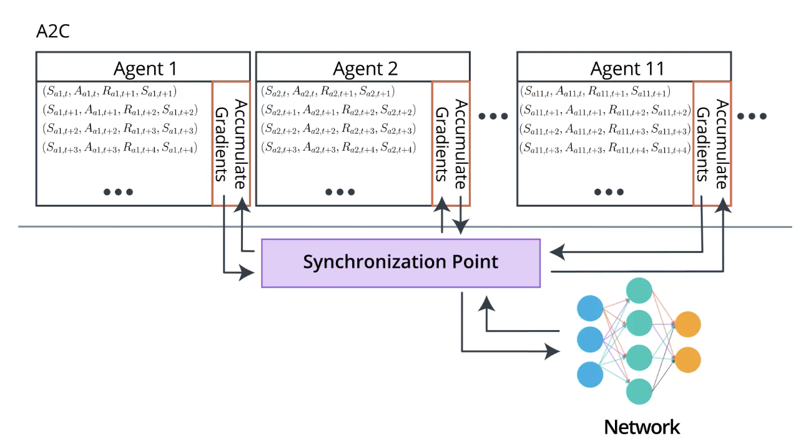
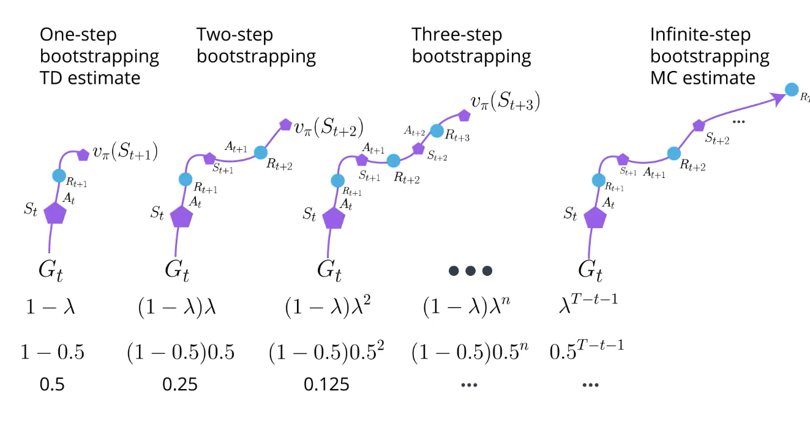

# C-3: Advanced Policy Optimization

1. Proximal Policy Optimization (PPO)
    - Clipped Surrogate Objective
    - Trust Region Optimization
    - Policy Update Clipping
    - The PPO Algorithm
2. Actor-Critic Methods
    - Actor-Critic Framework
    - Advantage Estimation
    - Bias-Variance Trade-off
    - Monte Carlo vs TD Learning
3. Asynchronous Advantage Actor-Critic (A3C)
    - Parallel Learning
    - On-policy vs Off-policy Learning
    - A2C: Synchronous Alternative
    - Generalized Advantage Estimation (GAE)

#### Proximal Policy Optimization (PPO)

Proximal Policy Optimization (PPO) represents a significant advancement in policy gradient methods, addressing the
fundamental challenges of stability and sample efficiency that plagued earlier approaches like REINFORCE. PPO achieves a
delicate balance between optimization performance and implementation simplicity, making it one of the most widely
adopted algorithms in contemporary reinforcement learning research and applications.

##### Clipped Surrogate Objective

The cornerstone innovation of PPO lies in its clipped surrogate objective function, which elegantly constrains policy
updates to prevent destructively large changes. The objective is formulated as:

$$L^{\text{CLIP}}(\theta) = \mathbb{E}_t[\min(r_t(\theta)A_t, \text{clip}(r_t(\theta), 1-\epsilon, 1+\epsilon)A_t)]$$

Where:

- $r_t(\theta) = \frac{\pi_\theta(a_t|s_t)}{\pi_{\theta_{\text{old}}}(a_t|s_t)}$ represents the probability ratio
  between the new policy $\pi_\theta$ and the old policy $\pi_{\theta_{\text{old}}}$
- $A_t$ is the estimated advantage of taking action $a_t$ in state $s_t$
- $\epsilon$ is a small hyperparameter (typically 0.1 or 0.2) that controls the size of the trust region

<div align="center">  <p style="color: #555;">Figure: Visualization of the clipped surrogate objective function</p> </div>

The genius of this formulation becomes apparent when we analyze how it behaves in different scenarios:

1. **For positive advantages ($A_t > 0$)**: The objective encourages increasing the probability of the action, but only
   up to a certain point (1+ε). Beyond this, the objective flattens, providing no further incentive to increase the
   action probability.
2. **For negative advantages ($A_t < 0$)**: The objective encourages decreasing the probability of the action, but again
   only to a certain point (1-ε), after which further decreases provide no additional benefit.

This mechanism effectively creates a "trust region" that prevents policies from diverging too rapidly, while still
allowing meaningful updates. The clipping mechanism can be understood as a first-order approximation to more complex
trust region methods, offering similar benefits with significantly reduced computational overhead.

##### Trust Region Optimization

PPO draws significant inspiration from Trust Region Policy Optimization (TRPO), which constrains policy updates by
enforcing a limit on the Kullback-Leibler (KL) divergence between consecutive policies. While TRPO achieves this through
a constrained optimization problem that requires complex second-order methods, PPO implements a simpler, more practical
approach.

The clipping mechanism in PPO implicitly defines a trust region around the current policy. By limiting the ratio
$r_t(\theta)$ to the range $[1-\epsilon, 1+\epsilon]$, PPO ensures that the new policy doesn't deviate too drastically
from the old one. This constraint serves several critical purposes:

1. **Stability**: By preventing excessive policy changes, PPO avoids the catastrophic performance collapses that can
   occur with unconstrained policy gradient methods.
2. **Smoother Learning**: The trust region creates a more gradual optimization landscape, leading to more consistent
   improvements.
3. **Robustness to Hyperparameters**: The clipping mechanism makes PPO less sensitive to learning rate and other
   hyperparameter choices.

Some implementations of PPO also incorporate an adaptive KL penalty term as a safeguard:

$$L^{\text{CLIP+KL}}(\theta) = L^{\text{CLIP}}(\theta) - \beta \cdot \text{KL}[\pi_{\theta_{\text{old}}}, \pi_\theta]$$

Where $\beta$ is adjusted dynamically based on whether the KL divergence is above or below a target threshold. This adds
an additional layer of protection against policy divergence while maintaining the computational efficiency of
first-order optimization.

##### Policy Update Clipping

<div align="center">  <p style="color: #555;">Figure: The policy/reward cliff problem</p> </div>

This figure illustrates the "policy/reward cliff" problem that PPO addresses. In reinforcement learning, the
relationship between policy parameters and performance often contains sharp transitions—areas where small changes in
policy parameters can lead to dramatic drops in performance.

Without appropriate constraints, standard policy gradient methods can easily "fall off the cliff," making updates that
appear beneficial according to the surrogate objective but actually result in catastrophic performance degradation. The
policy can become "flat" in parameter space, making recovery difficult or impossible without restarting training.

<div align="center">  <p style="color: #555;">Figure: Detailed explanation of the clipped surrogate mechanism</p> </div>

This figure provides a detailed visualization of how the clipping mechanism works. The horizontal axis represents the
policy parameter space, while the vertical axis shows the corresponding objective value. The red curve represents the
unclipped surrogate objective, which can encourage excessive policy changes. The blue curve shows the clipped objective,
which flattens when the policy ratio moves outside the prescribed bounds.

The clipping function can be formally defined as:

$$\text{clip}(r_t(\theta), 1-\epsilon, 1+\epsilon) = \max(\min(r_t(\theta), 1+\epsilon), 1-\epsilon)$$

This function constrains $r_t(\theta)$ to lie within $[1-\epsilon, 1+\epsilon]$, effectively creating a plateau in the
objective landscape that prevents gradient-based optimization from making excessive updates.

##### The PPO Algorithm

The complete PPO algorithm combines the clipped surrogate objective with several practical implementation details that
enhance its performance:

1. **Data Collection**: Collect a set of trajectories using the current policy $\pi_{\theta_{\text{old}}}$ by
   interacting with the environment.
2. **Advantage Estimation**: Compute advantage estimates $A_t$ for each state-action pair, typically using Generalized
   Advantage Estimation (GAE): $$A_t^{\text{GAE}} = \sum_{l=0}^{\infty} (\gamma\lambda)^l \delta_{t+l}$$ where
   $\delta_t = r_t + \gamma V(s_{t+1}) - V(s_t)$ is the temporal difference error.
3. **Policy Optimization**: Perform multiple epochs of minibatch updates (typically 3-10) on the collected data using
   the clipped surrogate objective:
   $$L^{\text{CLIP}}(\theta) = \mathbb{E}_t[\min(r_t(\theta)A_t, \text{clip}(r_t(\theta), 1-\epsilon, 1+\epsilon)A_t)]$$
4. **Value Function Optimization**: Simultaneously update the value function to minimize the squared error:
   $$L^{VF}(\phi) = \mathbb{E}*t[(V*\phi(s_t) - V_t^{\text{target}})^2]$$ where $V_t^{\text{target}}$ is often computed
   using n-step returns or GAE targets.
5. **Entropy Bonus**: Optionally include an entropy bonus to encourage exploration:
   $$L^{ENT}(\theta) = \mathbb{E}*t[H(\pi*\theta(\cdot|s_t))]$$ where $H$ is the entropy function.
6. **Combined Objective**: Optimize the combined objective:
   $$L^{\text{TOTAL}}(\theta, \phi) = L^{\text{CLIP}}(\theta) - c_1 L^{VF}(\phi) + c_2 L^{ENT}(\theta)$$ where $c_1$ and
   $c_2$ are coefficients that weight the different components.
7. **Policy Update**: After completing the optimization, set $\theta_{\text{old}} \leftarrow \theta$ and repeat from
   step 1.

The pseudocode for PPO can be implemented as follows:

```python
def proximal_policy_optimization(env, policy_net, value_net, num_iterations=1000):
    for iteration in range(num_iterations):
        # Collect trajectories using current policy
        trajectories = collect_trajectories(env, policy_net)
        states, actions, rewards, next_states, dones = process_trajectories(trajectories)

        # Compute advantages using GAE
        values = value_net(states)
        next_values = value_net(next_states)
        advantages = compute_gae(rewards, values, next_values, dones)

        # Normalize advantages (variance reduction)
        advantages = (advantages - advantages.mean()) / (advantages.std() + 1e-8)

        # Get log probabilities of actions under old policy
        with torch.no_grad():
            old_log_probs = policy_net.log_prob(states, actions)

        # Perform multiple epochs of optimization
        for epoch in range(K_epochs):
            # Create minibatches
            minibatches = create_minibatches(states, actions, old_log_probs, advantages)

            for mini_batch in minibatches:
                mb_states, mb_actions, mb_old_log_probs, mb_advantages = mini_batch

                # Get current policy log probabilities and entropy
                new_log_probs = policy_net.log_prob(mb_states, mb_actions)
                entropy = policy_net.entropy(mb_states)

                # Compute probability ratio
                ratio = torch.exp(new_log_probs - mb_old_log_probs)

                # Compute surrogate losses
                surr1 = ratio * mb_advantages
                surr2 = torch.clamp(ratio, 1.0 - clip_epsilon, 1.0 + clip_epsilon) * mb_advantages

                # Compute policy loss
                policy_loss = -torch.min(surr1, surr2).mean()

                # Compute value loss
                value_loss = F.mse_loss(value_net(mb_states), target_values)

                # Compute total loss
                loss = policy_loss + value_coef * value_loss - entropy_coef * entropy.mean()

                # Update networks
                optimizer.zero_grad()
                loss.backward()
                optimizer.step()

    return policy_net, value_net
```

PPO offers several significant advantages over previous algorithms:

1. **Simplicity**: Much easier to implement than TRPO, requiring only first-order optimization methods.
2. **Sample Efficiency**: Better utilization of collected experience through multiple update epochs.
3. **Stability**: More robust learning across a variety of environments without extensive hyperparameter tuning.
4. **Compatibility**: Works well with various neural network architectures, including recurrent networks.
5. **Scalability**: Easily parallelizable for distributed training.

These advantages have made PPO a cornerstone algorithm in practical reinforcement learning applications, from robotic
control to game playing and beyond.

#### 2. Actor-Critic Methods

Actor-Critic methods represent a powerful hybrid approach that combines the strengths of both policy-based and
value-based reinforcement learning. By simultaneously learning a policy (the actor) and a value function (the critic),
these methods achieve superior sample efficiency, reduced gradient variance, and more stable learning dynamics.

##### Actor-Critic Framework

The actor-critic architecture consists of two primary components:

1. **Actor**: The policy network $\pi_\theta(a|s)$ that selects actions based on the current state. The actor is trained
   to maximize expected returns by following the policy gradient with feedback from the critic.
2. **Critic**: The value network $V_\phi(s)$ or $Q_\phi(s,a)$ that evaluates states or state-action pairs. The critic
   provides a baseline for policy updates and is trained to accurately predict expected returns.

This dual network structure creates a symbiotic relationship: the critic provides more accurate advantage estimates to
guide the actor's policy updates, while the actor collects relevant experiences that help the critic improve its value
estimates.

<div align="center">  <p style="color: #555;">Figure: A2C architecture with synchronization point</p> </div>

The figure illustrates the Advantage Actor-Critic (A2C) architecture, where multiple agents collect experiences in
parallel environments. Each agent maintains local copies of both actor and critic networks, computes gradients based on
its experiences, and then synchronizes these gradients at a central point. This parallel architecture enhances
exploration and stabilizes training by averaging gradients across different trajectories.

The general flow of information in the actor-critic framework is:

1. The actor selects actions according to the current policy $\pi_\theta(a|s)$
2. The environment transitions to a new state and provides a reward
3. The critic evaluates the new state and computes the advantage estimate
4. The actor updates its policy based on the advantage estimate
5. The critic updates its value function to minimize prediction error

This continuous feedback loop allows for more informed policy updates compared to pure policy gradient methods like
REINFORCE.

##### Advantage Estimation

A crucial innovation in actor-critic methods is the use of advantage functions rather than raw returns for policy
updates. The advantage function quantifies how much better taking a specific action is compared to the average action in
a given state:

$$A(s_t, a_t) = Q(s_t, a_t) - V(s_t)$$

Where:

- $Q(s_t, a_t)$ is the action-value function, representing the expected return from taking action $a_t$ in state $s_t$
  and following the policy thereafter
- $V(s_t)$ is the state-value function, representing the expected return from state $s_t$ under the current policy

The advantage function provides several benefits:

1. **Reduced Variance**: By subtracting the state value as a baseline, the advantage function reduces the variance of
   policy gradient estimates without introducing bias.
2. **Better Credit Assignment**: Advantages more precisely identify which actions contribute positively or negatively to
   performance.
3. **Relative Action Evaluation**: By measuring relative action quality rather than absolute returns, advantages
   normalize feedback across different states.

In practice, directly estimating $Q(s_t, a_t)$ can be challenging. Instead, we often use temporal difference (TD) errors
as one-step advantage estimates:

$$A(s_t, a_t) \approx \delta_t = r_t + \gamma V(s_{t+1}) - V(s_t)$$

This approximation is the foundation for many actor-critic variants, including A2C, A3C, and PPO. More sophisticated
methods like Generalized Advantage Estimation (GAE) extend this approach to balance bias and variance.

##### Bias-Variance Trade-off

A fundamental consideration in reinforcement learning is the bias-variance trade-off in estimating returns and
advantages. This trade-off directly impacts the stability and efficiency of learning:

- **High Variance, Low Bias Estimates** (e.g., Monte Carlo returns): Use actual returns from complete episodes. These
  estimates are unbiased but have high variance, especially for long trajectories with stochastic environments.
- **Low Variance, High Bias Estimates** (e.g., one-step TD errors): Bootstrap from value function approximations. These
  estimates have lower variance but introduce bias from inaccuracies in the value function.

<div align="center">  <p style="color: #555;">Figure: Generalized Advantage Estimation balancing bias and variance</p> </div>

Generalized Advantage Estimation (GAE) provides a flexible mechanism to balance this trade-off through an
exponentially-weighted average of n-step advantage estimates:

$$A^{\text{GAE}}(s_t, a_t) = \sum_{k=0}^{\infty} (\gamma\lambda)^k \delta_{t+k}$$

Where:

- $\delta_t = r_t + \gamma V(s_{t+1}) - V(s_t)$ is the TD error
- $\lambda \in [0,1]$ is a hyperparameter that controls the bias-variance trade-off
- $\gamma$ is the discount factor

The $\lambda$ parameter allows continuous interpolation between one-step TD ($\lambda = 0$) and Monte Carlo estimation
($\lambda = 1$):

- When $\lambda = 0$, GAE reduces to the one-step TD error: $A^{\text{GAE}} = \delta_t$
- When $\lambda = 1$, GAE becomes equivalent to the discounted sum of rewards minus the baseline:
  $A^{\text{GAE}} = \sum_{k=0}^{\infty} \gamma^k r_{t+k} - V(s_t)$

This flexibility makes GAE a powerful tool for advantage estimation in modern actor-critic algorithms.

##### Monte Carlo vs TD Learning

Actor-critic methods can incorporate different approaches to learning value functions, primarily distinguished by their
temporal scope:

###### Monte Carlo Learning

Monte Carlo methods use complete trajectories to compute returns:

$$G_t = \sum_{k=0}^{T-t-1} \gamma^k r_{t+k}$$

Characteristics:

- No bias (uses actual returns)
- High variance (sensitive to randomness in the environment)
- Only applicable to episodic tasks
- Learns from complete trajectories
- No bootstrapping (doesn't build estimates from other estimates)

###### Temporal Difference Learning

TD methods update estimates based on subsequent estimates (bootstrapping):

$$G_t \approx r_t + \gamma V(s_{t+1})$$

Characteristics:

- Some bias (from inaccuracies in value estimates)
- Lower variance (less sensitive to individual reward fluctuations)
- Applicable to both episodic and continuing tasks
- Learns incrementally after each step
- Uses bootstrapping

###### n-step Methods

n-step methods balance between TD and MC approaches by looking n steps ahead before bootstrapping:

$$G_t^{(n)} = r_t + \gamma r_{t+1} + ... + \gamma^{n-1} r_{t+n-1} + \gamma^n V(s_{t+n})$$

<div align="center">  <p style="color: #555;">Figure: Spectrum from TD to MC methods with different n-step returns</p> </div>

The figure illustrates how different methods span the spectrum from pure TD learning to Monte Carlo estimation. As we
move from left to right, the methods incorporate more actual rewards before bootstrapping, increasing variance but
reducing bias. The $\lambda$ parameter in GAE provides a continuous interpolation across this spectrum.

GAE expresses this trade-off mathematically by weighting different n-step returns:

$$A^{\text{GAE}}(s_t, a_t) = (1 - \lambda) \sum_{n=1}^{\infty} \lambda^{n-1} A^{(n)}(s_t, a_t)$$

Where $A^{(n)}(s_t, a_t)$ is the n-step advantage estimate. This formulation allows us to adjust the bias-variance
trade-off by tuning a single parameter $\lambda$, making it much more practical than manually selecting a fixed n-step
return.

The implementation for GAE can be expressed as:

```python
def compute_gae(rewards, values, next_values, dones, gamma=0.99, lambda_=0.95):
    """Compute Generalized Advantage Estimation."""
    advantages = np.zeros_like(rewards)
    gae = 0

    for t in reversed(range(len(rewards))):
        if t == len(rewards) - 1:
            next_value = next_values[t]
        else:
            next_value = values[t + 1]

        # Compute delta (TD error)
        delta = rewards[t] + gamma * next_value * (1 - dones[t]) - values[t]

        # Compute GAE recursively
        gae = delta + gamma * lambda_ * (1 - dones[t]) * gae
        advantages[t] = gae

    return advantages
```

By properly balancing bias and variance through techniques like GAE, actor-critic methods achieve more stable and
efficient learning across a wide range of reinforcement learning tasks.

#### 3. Asynchronous Advantage Actor-Critic (A3C)

Asynchronous Advantage Actor-Critic (A3C) represents a significant architectural innovation in reinforcement learning,
introducing parallelized, asynchronous training across multiple agent instances. This approach dramatically improves
learning efficiency, stability, and exploration.

##### Parallel Learning

A3C exploits parallel computation to accelerate and stabilize reinforcement learning:

<div align="center">  <p style="color: #555;">Figure: Parallel actor-critic agents with central parameter synchronization</p> </div>

The fundamental architecture of A3C consists of:

1. **Multiple Workers**: Several independent actors, each with its own copy of the environment, collect experiences in
   parallel. This parallelization increases the diversity and volume of experience available for learning.
2. **Asynchronous Updates**: Each worker computes gradients based on its collected experiences and asynchronously
   updates a shared global network. This approach eliminates the need for experience replay buffers, as diversity comes
   from the different workers.
3. **Parameter Synchronization**: Workers periodically synchronize their local networks with the global network,
   incorporating updates from all workers. This synchronization creates an implicit regularization effect.

The parallel architecture offers several significant advantages:

1. **Exploration Efficiency**: Different workers naturally explore different parts of the state space, leading to more
   diverse experiences and better exploration without explicit exploration strategies.
2. **Decorrelated Updates**: By collecting experiences in different environments, the correlation between consecutive
   updates is reduced, improving learning stability.
3. **Computational Efficiency**: Makes efficient use of multi-core CPU architectures without requiring GPU resources or
   large replay buffers.
4. **Scalability**: Performance often scales near-linearly with the number of workers (up to a point), enabling faster
   training.

The pseudocode for a single A3C worker can be implemented as:

```python
def a3c_worker(worker_id, global_actor, global_critic, global_optimizer, env_factory):
    # Create local environment
    env = env_factory()

    # Create local copies of networks
    local_actor = copy.deepcopy(global_actor)
    local_critic = copy.deepcopy(global_critic)

    while not global_done:
        # Synchronize with global networks
        local_actor.load_state_dict(global_actor.state_dict())
        local_critic.load_state_dict(global_critic.state_dict())

        # Collect experiences for n steps or until episode end
        states, actions, rewards = [], [], []
        state = env.reset()
        done = False
        episode_reward = 0

        for step in range(max_steps_per_update):
            # Select action from local actor
            action_probs = local_actor(torch.FloatTensor(state))
            action_dist = torch.distributions.Categorical(action_probs)
            action = action_dist.sample().item()

            # Take action in environment
            next_state, reward, done, _ = env.step(action)

            # Store experience
            states.append(state)
            actions.append(action)
            rewards.append(reward)

            episode_reward += reward
            state = next_state

            if done:
                break

        # Compute returns and advantages
        R = 0 if done else local_critic(torch.FloatTensor(state)).item()
        discounted_rewards = []
        for reward in reversed(rewards):
            R = reward + gamma * R
            discounted_rewards.insert(0, R)

        # Convert to tensors
        states = torch.FloatTensor(states)
        actions = torch.LongTensor(actions)
        returns = torch.FloatTensor(discounted_rewards)

        # Get value predictions
        values = local_critic(states)

        # Compute advantages
        advantages = returns - values.detach()

        # Compute losses
        actor_loss = 0
        for log_prob, advantage in zip(local_actor.log_probs(states, actions), advantages):
            actor_loss += -log_prob * advantage

        critic_loss = F.mse_loss(values, returns)

        # Compute gradients
        total_loss = actor_loss + value_coef * critic_loss
        total_loss.backward()

        # Asynchronously update global networks
        with global_lock:
            global_optimizer.zero_grad()
            for global_param, local_param in zip(global_actor.parameters(), local_actor.parameters()):
                if global_param.grad is None:
                    global_param.grad = local_param.grad
                else:
                    global_param.grad += local_param.grad

            for global_param, local_param in zip(global_critic.parameters(), local_critic.parameters()):
                if global_param.grad is None:
                    global_param.grad = local_param.grad
                else:
                    global_param.grad += local_param.grad

            global_optimizer.step()
```

##### On-policy vs Off-policy Learning

A3C is fundamentally an on-policy algorithm, which has important implications for its learning dynamics:

###### On-policy Learning

In on-policy learning, the same policy is used for both action selection and learning. A3C follows this approach:

1. Each worker collects experiences using its current policy $\pi_\theta$
2. These experiences are immediately used to update the policy
3. After the update, old experiences are discarded
4. The process repeats with the updated policy

Characteristics:

- Simpler implementation (no need for importance sampling)
- More stable updates (no distribution mismatch)
- Less sample efficient (experiences can't be reused)
- Better convergence guarantees for certain classes of problems

###### Off-policy Learning

In contrast, off-policy methods like Deep Q-Networks (DQN) separate the behavior policy (used for action selection) from
the target policy (being learned):

1. Experiences are collected using a behavior policy (often with added exploration)
2. These experiences are stored in a replay buffer
3. Random batches from the buffer are used to update the target policy
4. This allows reuse of experiences across multiple updates

Characteristics:

- More sample efficient (experiences can be reused)
- Potentially higher variance (requires importance sampling)
- Can learn from demonstrations or other agents' experiences
- May suffer from instability due to distribution mismatch

The on-policy nature of A3C means that it must continually collect fresh data, which can be computationally intensive.
However, the parallel architecture mitigates this limitation by collecting experiences more rapidly. Some variants of
A3C incorporate elements of off-policy learning to improve sample efficiency while maintaining the benefits of parallel
training.

##### A2C: Synchronous Alternative

Advantage Actor-Critic (A2C) is a synchronous variant of A3C that addresses some practical limitations of the
asynchronous approach:

###### Synchronous Updates

In A2C, all workers collect experiences in parallel, but they synchronize before updating the global network:

1. Each worker collects a fixed number of steps or complete episodes
2. All workers wait at a synchronization barrier
3. Gradients from all workers are averaged and applied to the global network
4. Updated parameters are distributed back to all workers
5. The cycle repeats

This synchronous approach offers several advantages:

1. **Determinism**: More reproducible results due to synchronized updates
2. **GPU Utilization**: Better leverages GPU acceleration for batch processing
3. **Implementation Simplicity**: Easier to implement and debug without asynchronous complications
4. **More Stable Gradients**: Averaging across all workers provides a more reliable gradient signal

The core implementation of A2C is similar to A3C but with explicit synchronization:

```python
def a2c_update(envs, actor, critic, optimizer, gamma=0.99):
    """Perform a synchronized A2C update across multiple environments."""
    # Collect experiences from all environments in parallel
    states, actions, rewards, next_states, dones = [], [], [], [], []

    # Reset environments if necessary
    current_states = [env.reset() if done else state
                     for env, state, done in zip(envs, current_states, episode_dones)]

    # Step through environments
    for _ in range(n_steps):
        # Convert states to tensors
        states_tensor = torch.FloatTensor(current_states)

        # Get action probabilities and values
        action_probs = actor(states_tensor)
        values = critic(states_tensor)

        # Sample actions
        action_dists = [torch.distributions.Categorical(probs) for probs in action_probs]
        actions = [dist.sample().item() for dist in action_dists]

        # Step environments
        next_states = []
        rewards = []
        dones = []

        for env_idx, (env, action) in enumerate(zip(envs, actions)):
            next_state, reward, done, _ = env.step(action)
            next_states.append(next_state)
            rewards.append(reward)
            dones.append(done)

        # Store experiences
        states.append(current_states)
        actions_list.append(actions)
        rewards_list.append(rewards)
        dones_list.append(dones)

        # Update current states
        current_states = next_states

    # Compute returns and advantages
    next_values = critic(torch.FloatTensor(next_states)).detach().numpy()
    advantages = compute_gae(rewards_list, values.detach().numpy(), next_values, dones_list)
    returns = advantages + values.detach().numpy()

    # Convert to tensors
    states_tensor = torch.FloatTensor(np.vstack(states))
    actions_tensor = torch.LongTensor(np.vstack(actions_list))
    returns_tensor = torch.FloatTensor(returns)
    advantages_tensor = torch.FloatTensor(advantages)

    # Update actor and critic
    new_values = critic(states_tensor)
    new_action_probs = actor(states_tensor)

    # Compute critic loss
    critic_loss = F.mse_loss(new_values, returns_tensor)

    # Compute actor loss
    log_probs = torch.log(new_action_probs.gather(1, actions_tensor))
    actor_loss = -(log_probs * advantages_tensor).mean()

    # Add entropy bonus for exploration
    entropy = -(new_action_probs * torch.log(new_action_probs)).sum(dim=1).mean()

    # Compute total loss
    loss = actor_loss + value_coef * critic_loss - entropy_coef * entropy

    # Update networks
    optimizer.zero_grad()
    loss.backward()
    optimizer.step()

    return loss.item()
```

Some implementations of A2C include additional features:

- Value function clipping to prevent large updates
- Gradient clipping to improve stability
- Reward normalization to handle different scales
- Entropy regularization to encourage exploration

The synchronous nature of A2C makes it particularly well-suited for implementation on modern deep learning frameworks
that excel at batch processing.

##### Generalized Advantage Estimation (GAE)

Generalized Advantage Estimation (GAE) significantly enhances the performance of actor-critic methods by providing a
flexible framework for advantage estimation:

$$A^{\text{GAE}}(s_t, a_t) = \sum_{k=0}^{\infty} (\gamma\lambda)^k \delta_{t+k}$$

Where:

- $\gamma$ is the discount factor for rewards
- $\lambda$ controls the bias-variance trade-off
- $\delta_t = r_t + \gamma V(s_{t+1}) - V(s_t)$ is the TD error

<div align="center">  <p style="color: #555;">Figure: Generalized Advantage Estimation with different λ values</p> </div>

The figure illustrates how different values of λ in GAE correspond to different weightings of n-step returns. The
parameter λ provides a continuous spectrum of estimation methods:

- **λ = 0**: Pure one-step TD learning (low variance, high bias)
- **λ = 1**: Monte Carlo estimation (high variance, no bias)
- **0 < λ < 1**: Weighted combination of different n-step returns

This flexibility is particularly valuable in complex environments where neither pure TD nor Monte Carlo methods may be
optimal. By adjusting λ, researchers can fine-tune the bias-variance trade-off to match the characteristics of the
environment.

The mathematical formulation of GAE can also be expressed as a weighted average of n-step advantage estimates:

$$A^{\text{GAE}}(s_t, a_t) = (1-\lambda) \sum_{n=1}^{\infty} \lambda^{n-1} A^{(n)}(s_t, a_t)$$

Where $A^{(n)}(s_t, a_t)$ is the n-step advantage estimate. This formulation explicitly shows how GAE combines advantage
estimates from different time scales, with exponentially decreasing weights controlled by λ.

The implementation of GAE typically follows a recursive formula that is more computationally efficient:

```python
def compute_gae(rewards, values, next_value, dones, gamma=0.99, lambda_=0.95):
    """
    Compute Generalized Advantage Estimation.

    Parameters:
    - rewards: List of rewards for each timestep
    - values: Predicted values for each state
    - next_value: Predicted value for the final next state
    - dones: Binary indicators for episode termination
    - gamma: Discount factor
    - lambda_: GAE parameter controlling bias-variance tradeoff

    Returns:
    - advantages: GAE advantage estimates
    """
    # Initialize advantage array
    advantages = np.zeros_like(rewards, dtype=np.float32)

    # Initialize last advantage for recursive computation
    last_gae = 0

    # Iterate backwards through timesteps
    for t in reversed(range(len(rewards))):
        # For the last step, use the provided next_value
        # Otherwise, use the value from the next timestep
        if t == len(rewards) - 1:
            next_val = next_value
        else:
            next_val = values[t + 1]

        # If episode terminated, there is no next state value
        mask = 1.0 - dones[t]

        # Calculate TD error (delta)
        delta = rewards[t] + gamma * next_val * mask - values[t]

        # Calculate GAE recursively
        last_gae = delta + gamma * lambda_ * mask * last_gae
        advantages[t] = last_gae

    # Calculate returns as advantages + values
    returns = advantages + values

    return advantages, returns
```

GAE offers several critical benefits for actor-critic algorithms:

1. **Adaptive Credit Assignment**: By properly weighting temporal contributions, GAE provides more accurate credit
   assignment, particularly in environments with delayed rewards.
2. **Improved Learning Stability**: The bias-variance balance leads to more consistent policy improvement with fewer
   oscillations.
3. **Better Sample Efficiency**: More accurate advantage estimates enable more effective use of collected experiences.
4. **Hyperparameter Flexibility**: The λ parameter provides a simple knob to tune based on the specific characteristics
   of the environment.

GAE has become a standard component in modern implementations of policy gradient methods, including PPO, A2C, and A3C.
Its ability to balance bias and variance makes it particularly valuable in environments with complex dynamics and sparse
rewards.

In conclusion, advanced policy optimization algorithms like PPO, Actor-Critic methods, and A3C/A2C represent significant
advances in reinforcement learning. These approaches address fundamental challenges in policy optimization through
innovations like clipped surrogate objectives, parallel learning architectures, and sophisticated advantage estimation
techniques like GAE. By combining these approaches, researchers have developed algorithms capable of solving
increasingly complex sequential decision-making problems across a wide range of domains, from robotics to game playing
and beyond.
