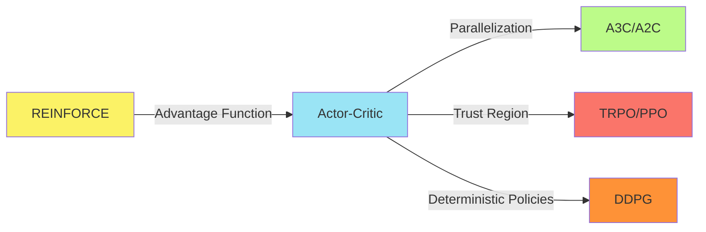

# C-4: Continuous Action Spaces and Applications

1. Deep Deterministic Policy Gradient (DDPG)
    - Continuous Action Control
    - Deterministic Policy Gradients
    - Target Networks and Soft Updates
    - Exploration in Continuous Domains
2. Applications in Finance
    - RL for Trading and Investment
    - Short-term vs Long-term Strategies
    - Optimal Liquidation Problem
    - Almgren-Chriss Model

#### Deep Deterministic Policy Gradient (DDPG)

Deep Deterministic Policy Gradient (DDPG) represents a significant advancement in reinforcement learning by extending
policy gradient methods to continuous action spaces. While algorithms like REINFORCE and PPO excel in discrete action
environments, many real-world problems—from robotic control to financial trading—require precise, continuous actions.
DDPG elegantly combines the strengths of deep Q-learning with deterministic policy gradients to tackle these challenging
domains.

##### Continuous Action Control

Continuous action spaces present fundamental challenges that discrete action methods cannot easily address:

###### The Infinite Action Challenge

In continuous domains, the agent must select actions from an uncountable set. For example, a robotic arm might need to
apply a specific torque value from a continuous range like [-1.0, 1.0]. This fundamentally differs from discrete cases
(like choosing to move up, down, left, or right) in several important ways:

1. **Action Selection Complexity**: With infinitely many possible actions, we cannot enumerate and evaluate each option.
2. **Exploration Strategy**: Simple exploration techniques like ε-greedy become insufficient, as random sampling from
   continuous spaces often produces inefficient exploration.
3. **Function Approximation Requirements**: Value functions and policies must generalize across the continuous action
   domain, requiring more sophisticated representations.

###### Limitations of Value-Based Methods

Traditional value-based methods like Q-learning face a critical limitation in continuous action spaces:

$$a^* = \arg\max_a Q(s, a)$$

This maximization operation becomes computationally intractable when $a$ spans a continuous space. Even discretizing the
action space leads to an exponential explosion in complexity with increasing action dimensions.

For example, if we discretize each dimension of a 6-dimensional action space (like a robotic arm with 6 joints) into
just 10 values per dimension, we would need to evaluate $10^6 = 1,000,000$ action-value pairs for each state—clearly
impractical for real-time control.

###### DDPG's Approach

DDPG addresses these challenges by learning a deterministic policy $\mu_\theta(s)$ that directly maps states to optimal
actions:

$$a = \mu_\theta(s)$$

This approach offers two key advantages:

1. **Direct Action Output**: No need for explicit maximization over action spaces
2. **Efficiency**: Lower variance in policy updates compared to stochastic policies

The DDPG architecture employs two neural networks:

1. **Actor Network** ($\mu_\theta(s)$): Maps states directly to actions
2. **Critic Network** ($Q_\phi(s,a)$): Evaluates the quality of state-action pairs

```python
class Actor(nn.Module):
    """Deterministic policy network that maps states to actions."""
    def __init__(self, state_dim, action_dim, max_action, hidden_dim=256):
        super(Actor, self).__init__()
        self.network = nn.Sequential(
            nn.Linear(state_dim, hidden_dim),
            nn.ReLU(),
            nn.Linear(hidden_dim, hidden_dim),
            nn.ReLU(),
            nn.Linear(hidden_dim, action_dim),
            nn.Tanh()  # Output scaled to [-1, 1]
        )
        self.max_action = max_action

    def forward(self, state):
        # Scale the actions to the appropriate range
        return self.network(state) * self.max_action

class Critic(nn.Module):
    """Q-function network that evaluates state-action pairs."""
    def __init__(self, state_dim, action_dim, hidden_dim=256):
        super(Critic, self).__init__()
        # Q1 architecture
        self.l1 = nn.Linear(state_dim + action_dim, hidden_dim)
        self.l2 = nn.Linear(hidden_dim, hidden_dim)
        self.l3 = nn.Linear(hidden_dim, 1)

    def forward(self, state, action):
        # Concatenate state and action
        sa = torch.cat([state, action], 1)

        q = F.relu(self.l1(sa))
        q = F.relu(self.l2(q))
        q = self.l3(q)

        return q
```

This dual network structure forms the foundation of DDPG's actor-critic architecture, enabling it to handle the
complexities of continuous control.

##### Deterministic Policy Gradients

The theoretical foundation of DDPG is the deterministic policy gradient theorem, which provides a mathematically sound
approach for updating deterministic policies. This theorem represents a significant departure from stochastic policy
gradients used in algorithms like REINFORCE.

###### The Deterministic Policy Gradient Theorem

For a deterministic policy $\mu_\theta(s)$, the policy gradient is:

$$\nabla_\theta J(\mu_\theta) = \mathbb{E}*{s\sim\rho^\mu}[\nabla*\theta \mu_\theta(s) \nabla_a Q^\mu(s,a)|*{a=\mu*\theta(s)}]$$

This formulation reveals two gradient components:

1. $\nabla_\theta \mu_\theta(s)$: How the action changes with respect to policy parameters
2. $\nabla_a Q^\mu(s,a)|*{a=\mu*\theta(s)}$: How the Q-value changes with respect to actions

The overall gradient points in the direction that increases the Q-value of selected actions, effectively moving the
policy toward actions that yield higher expected returns.

###### Comparison with Stochastic Policy Gradients

Deterministic policy gradients differ from stochastic policy gradients in several fundamental ways:

1. **Sampling Efficiency**: Deterministic policies require only the gradient through the Q-function, whereas stochastic
   policies use likelihood ratios that often exhibit higher variance.
2. **Exploration Mechanism**: Stochastic policies naturally explore through their probability distributions, while
   deterministic policies require external noise for exploration.
3. **Gradient Complexity**: The deterministic policy gradient integrates only over the state space, while stochastic
   policy gradients integrate over both state and action spaces.

This mathematical formulation can be visualized in the DDPG implementation:

```python
def update_actor(self, states):
    # Actor loss is negative of Q-value
    actor_loss = -self.critic(states, self.actor(states)).mean()

    # Update actor parameters
    self.actor_optimizer.zero_grad()
    actor_loss.backward()
    self.actor_optimizer.step()

    return actor_loss.item()
```

The actor update directly maximizes the Q-value of chosen actions, implementing the deterministic policy gradient
through automatic differentiation.

###### Gradient Flow in DDPG

To understand how DDPG learns, consider the gradient flow through the network:

1. The critic evaluates the current policy's actions: $Q_\phi(s, \mu_\theta(s))$
2. Gradients flow back through the critic to indicate how actions affect Q-values:
   $\nabla_a Q_\phi(s,a)|*{a=\mu*\theta(s)}$
3. These gradients then flow through the actor to update policy parameters: $\nabla_\theta \mu_\theta(s)$

This end-to-end differentiation is what makes DDPG powerful—it directly optimizes the policy to select actions that
maximize expected returns, without needing to solve complex optimization problems at each step.

##### Target Networks and Soft Updates

DDPG incorporates key stabilization techniques from Deep Q-Networks (DQN), notably the use of target networks. However,
DDPG implements these targets with an important innovation: soft updates.

###### The Instability Problem

Reinforcement learning with function approximation often suffers from instability and divergence due to:

1. **Moving Targets**: The Q-function update depends on its own estimates, creating a bootstrapping effect
2. **Correlated Updates**: Sequential updates based on correlated samples can lead to oscillation
3. **Nonstationary Objectives**: Policy improvements change the data distribution during training

These issues are particularly pronounced in continuous domains where small changes in policy can drastically alter the
visited state distribution.

###### Target Networks

DDPG employs two target networks to combat these issues:

1. **Target Actor Network** ($\mu'_{\theta'}$): A lagged copy of the actor
2. **Target Critic Network** ($Q'_{\phi'}$): A lagged copy of the critic

These target networks provide stable, slowly changing targets for learning, breaking the harmful correlation between the
policy updates and value estimation.

###### Soft Update Mechanism

Unlike DQN's periodic hard updates, DDPG employs soft updates (also called Polyak averaging):

$$\theta' \leftarrow \tau\theta + (1-\tau)\theta'$$ $$\phi' \leftarrow \tau\phi + (1-\tau)\phi'$$

Where:

- $\theta$ and $\phi$ are the main network parameters
- $\theta'$ and $\phi'$ are the target network parameters
- $\tau \ll 1$ (typically 0.001-0.005) is the soft update coefficient

This approach offers several advantages:

1. **Stability**: Gradual parameter updates prevent dramatic oscillations
2. **Continuity**: No sudden changes in learning targets
3. **Smoothness**: Learning progresses along a smoother trajectory

The implementation of soft updates is straightforward:

```python
def soft_update(self, target, source, tau=0.005):
    """Perform soft update of target network parameters."""
    for target_param, param in zip(target.parameters(), source.parameters()):
        target_param.data.copy_(
            target_param.data * (1.0 - tau) + param.data * tau
        )
```

The target networks are used in computing the learning targets for the critic:

```python
def compute_critic_target(self, rewards, next_states, dones, gamma=0.99):
    # Get next actions from target actor
    next_actions = self.target_actor(next_states)

    # Get Q-values for next states from target critic
    target_q = self.target_critic(next_states, next_actions)

    # Compute target values using Bellman equation
    target_values = rewards + gamma * (1 - dones) * target_q

    return target_values
```

This combination of target networks and soft updates forms a critical stabilizing mechanism in DDPG, enabling reliable
learning in complex continuous domains.

##### Exploration in Continuous Domains

Effective exploration is critical in reinforcement learning but presents unique challenges in continuous action spaces.
Unlike discrete spaces where techniques like ε-greedy naturally provide exploration, deterministic policies require
special exploration strategies.

###### The Exploration Challenge

A purely deterministic policy would always select the same action in a given state, leading to insufficient exploration
of the action space. This creates several problems:

1. **Local Optima**: The agent may converge to suboptimal policies
2. **Limited Experience**: The agent fails to discover potentially rewarding regions of the state-action space
3. **Overfitting**: The policy may specialize to a narrow range of states

###### Ornstein-Uhlenbeck Process

DDPG originally employed the Ornstein-Uhlenbeck (OU) process for exploration, described by the stochastic differential
equation:

$$dx_t = \theta(\mu - x_t)dt + \sigma dW_t$$

Where:

- $\theta$ controls the mean reversion rate
- $\mu$ is the mean (typically 0)
- $\sigma$ scales the noise magnitude
- $W_t$ is a Wiener process (Brownian motion)

The OU process generates temporally correlated noise, making it particularly suitable for physical control tasks where
smooth, consistent exploration is beneficial. For example, a robot arm would move in a somewhat smooth rather than
jittery fashion.

```python
class OrnsteinUhlenbeckNoise:
    """Ornstein-Uhlenbeck process for generating temporally correlated exploration noise."""
    def __init__(self, action_dim, mu=0, theta=0.15, sigma=0.2):
        self.action_dim = action_dim
        self.mu = mu
        self.theta = theta
        self.sigma = sigma
        self.reset()

    def reset(self):
        self.state = np.ones(self.action_dim) * self.mu

    def sample(self):
        x = self.state
        dx = self.theta * (self.mu - x) + self.sigma * np.random.randn(self.action_dim)
        self.state = x + dx
        return self.state
```

During training, this noise is added to the deterministic policy's actions:

```python
def select_action(self, state, add_noise=True):
    """Select an action from the policy, optionally adding exploration noise."""
    state = torch.FloatTensor(state).unsqueeze(0)
    action = self.actor(state).cpu().data.numpy().flatten()

    if add_noise:
        noise = self.noise.sample()
        action += noise

    return np.clip(action, -self.max_action, self.max_action)
```

###### Alternative Exploration Strategies

While the OU process was proposed in the original DDPG paper, subsequent research has shown that simpler approaches can
be equally effective:

1. **Gaussian Noise**: Simply adding zero-mean Gaussian noise to actions:
   $$a = \mu_\theta(s) + \mathcal{N}(0, \sigma^2)$$
2. **Parameter Space Noise**: Adding noise directly to the policy parameters:
   $$\tilde{\theta} = \theta + \mathcal{N}(0, \sigma^2)$$ This creates a more consistent exploration strategy across
   similar states.
3. **Adaptive Noise Scaling**: Decreasing the exploration noise over time: $$\sigma_t = \sigma_0 \cdot \text{decay}^t$$
   This encourages broader exploration early in training and more exploitation later.

The choice of exploration strategy can significantly impact DDPG's performance, with different environments benefiting
from different approaches. Modern implementations often use simpler Gaussian noise and focus more on tuning other
aspects of the algorithm.

```python
def gaussian_exploration(action, scale=0.1):
    """Add Gaussian noise to actions for exploration."""
    noise = np.random.normal(0, scale, size=action.shape)
    return action + noise
```

###### Batch Normalization

DDPG implementations often include batch normalization to improve training stability. By normalizing inputs across the
batch dimension, batch normalization helps manage the shifting distributions encountered during training:

```python
class Actor(nn.Module):
    def __init__(self, state_dim, action_dim, max_action):
        super(Actor, self).__init__()
        self.l1 = nn.Linear(state_dim, 400)
        self.bn1 = nn.BatchNorm1d(400)
        self.l2 = nn.Linear(400, 300)
        self.bn2 = nn.BatchNorm1d(300)
        self.l3 = nn.Linear(300, action_dim)
        self.max_action = max_action

    def forward(self, state):
        a = F.relu(self.bn1(self.l1(state)))
        a = F.relu(self.bn2(self.l2(a)))
        a = torch.tanh(self.l3(a)) * self.max_action
        return a
```

These normalization techniques, combined with effective exploration strategies, enable DDPG to efficiently learn in
challenging continuous action domains, from robotic manipulation to autonomous driving and beyond.

#### 2. Applications in Finance

Reinforcement learning, particularly policy-based methods, has emerged as a powerful tool in quantitative finance. The
adaptive and sequential decision-making nature of RL aligns well with the dynamic, uncertain environment of financial
markets, where decisions must be made under incomplete information and changing conditions.

##### RL for Trading and Investment

Financial markets present a natural application domain for policy-based RL methods, offering both significant
opportunities and unique challenges.

###### Market Characteristics as an RL Environment

Financial markets exhibit several properties that make them well-suited for reinforcement learning:

1. **Sequential Decision Making**: Trading inherently involves making a series of decisions over time.
2. **Delayed Rewards**: The consequences of trading decisions may only become apparent after multiple time steps.
3. **Partial Observability**: Market participants have access to limited information about the true state of the market.
4. **Non-stationarity**: Market dynamics change over time due to economic cycles, regulatory changes, and evolving
   participant behavior.
5. **High-dimensional State Space**: Relevant information includes prices, volumes, economic indicators, news sentiment,
   and more.

###### Policy-Based Advantages in Finance

Policy-based methods offer several specific advantages in financial applications:

1. **Adaptability to Non-stationarity**: By directly optimizing policies rather than value functions, policy-based
   methods can more quickly adapt to changing market regimes.
2. **Risk Management Integration**: Policy functions can be designed to output not just trading decisions but also
   position sizes, allowing for direct optimization of risk-adjusted returns.
3. **Realistic Constraints**: Continuous action spaces enable natural incorporation of practical constraints like
   maximum position sizes, transaction costs, and liquidity limitations.
4. **Probabilistic Decision Making**: Stochastic policies can express uncertainty about optimal actions, enabling more
   nuanced trading strategies.

###### RL Trading System Components

A complete RL trading system typically consists of:

1. **State Representation**: The state space in financial applications usually includes:

    - Price data (e.g., OHLCV - Open, High, Low, Close, Volume)
    - Technical indicators (e.g., moving averages, RSI, MACD)
    - Fundamental data (e.g., earnings, valuation metrics)
    - Market microstructure features (e.g., order book imbalance, spread)
    - Macroeconomic indicators (e.g., interest rates, GDP growth)

2. **Action Space**: Actions typically represent trading decisions:

    - Discrete: Buy/Sell/Hold decisions
    - Continuous: Portfolio weights, position sizing, trading rates

3. **Reward Function**: The reward function can incorporate various financial objectives:

    ```
    Reward = Returns - λ₁ * Risk - λ₂ * Transaction_Costs
    ```

    Common metrics include:

    - Profit and loss (P&L)
    - Sharpe ratio (risk-adjusted returns)
    - Maximum drawdown (downside risk)
    - Transaction costs and market impact

4. **Policy Network Architecture**: Financial policy networks often have specialized components:

```python
class TradingPolicyNetwork(nn.Module):
    def __init__(self, input_dim, hidden_dim, action_dim):
        super().__init__()

        # Feature extraction layers
        self.feature_extractor = nn.Sequential(
            nn.Linear(input_dim, hidden_dim),
            nn.ReLU(),
            nn.Dropout(0.3),  # Helps prevent overfitting to market noise
            nn.Linear(hidden_dim, hidden_dim),
            nn.ReLU(),
        )

        # Policy head for trading decisions
        self.policy_head = nn.Linear(hidden_dim, action_dim)

        # Value head for critic (if using actor-critic)
        self.value_head = nn.Linear(hidden_dim, 1)

    def forward(self, x):
        features = self.feature_extractor(x)

        # For portfolio allocation, use softmax to ensure weights sum to 1
        # For trading signals, use appropriate activation (tanh, sigmoid, etc.)
        policy_output = F.softmax(self.policy_head(features), dim=-1)
        value = self.value_head(features)

        return policy_output, value
```

1. Training Process

    : Training an RL agent for trading typically involves:

    - Historical market data for initial training
    - Backtesting across different market regimes
    - Validation on out-of-sample data
    - Gradual deployment with increasing capital allocation

###### Challenges and Considerations

Several unique challenges arise when applying RL to financial markets:

1. **Overfitting**: Financial data contains significant noise, making it easy to learn spurious patterns that don't
   generalize.
2. **Sample Efficiency**: Financial markets offer limited historical data compared to other RL domains where millions of
   samples can be generated.
3. **Distribution Shift**: Training on historical data doesn't guarantee performance in future market conditions.
4. **Market Impact**: Large trades can influence market prices, changing the environment in response to the agent's
   actions.
5. **Regulatory Constraints**: Trading strategies must comply with regulatory requirements that vary across
   jurisdictions.

Addressing these challenges requires careful system design, specialized training methodologies, and robust validation
procedures.

##### Short-term vs Long-term Strategies

Trading strategies exist across a spectrum of time horizons, from microsecond-level high-frequency trading to multi-year
investment approaches. RL methods can be applied across this entire spectrum, but with important differences in
implementation.

###### Short-Term Trading Strategies

Short-term trading operates on timeframes ranging from microseconds to days and focuses on capturing small price
movements with high frequency.

**Key Characteristics**:

1. **Real-Time Decision Making**:

    - Ultra-low latency requirements (microseconds to milliseconds)
    - High update frequency for the policy
    - Emphasis on market microstructure factors
    - Rapid adaptation to changing conditions

    Short-term trading requires policies that can process market data and make decisions with minimal delay:

    ```python
    def high_frequency_state_encoder(orderbook_data, recent_trades, market_imbalance):
        """Encode market microstructure data for HFT agent state."""
        # Process order book levels
        bid_ask_spreads = calculate_spreads(orderbook_data)
        volume_imbalances = calculate_imbalances(orderbook_data)

        # Process recent trade flow
        trade_flow_features = extract_trade_patterns(recent_trades)

        # Combine features
        state = np.concatenate([
            bid_ask_spreads,
            volume_imbalances,
            trade_flow_features,
            [market_imbalance]
        ])

        return state
    ```

2. **Risk Management**:

    - Precise position sizing based on volatility
    - Automated stop-loss mechanisms
    - Intraday risk limit enforcement
    - Real-time portfolio exposure monitoring

    RL agents for short-term trading typically incorporate risk directly into the reward function:

    ```
    Risk_adjusted_return = Return - λ × Risk
    ```

    Where λ represents the risk aversion parameter and Risk might be measured as volatility, VaR (Value at Risk), or
    maximum drawdown.

3. **Market Making Strategies**: A common short-term strategy is market making, where the agent provides liquidity by
   quoting bid and ask prices:

    - Optimal spread determination based on inventory and volatility
    - Dynamic inventory management
    - Queue position optimization
    - Adverse selection avoidance

    Market making policies output bid/ask quotes and volumes:

    ```python
    class MarketMakingPolicy(nn.Module):
        def __init__(self, input_dim, hidden_dim):
            super().__init__()
            self.network = nn.Sequential(
                nn.Linear(input_dim, hidden_dim),
                nn.ReLU(),
                nn.Linear(hidden_dim, hidden_dim),
                nn.ReLU(),
            )
            # Output bid/ask quotes and volumes
            self.quote_head = nn.Linear(hidden_dim, 4)

        def forward(self, state):
            features = self.network(state)
            # Outputs: [bid_price_offset, ask_price_offset, bid_volume, ask_volume]
            quotes = self.quote_head(features)

            # Apply appropriate scaling and constraints
            bid_offset = -torch.abs(quotes[:, 0])  # Negative (below mid)
            ask_offset = torch.abs(quotes[:, 1])   # Positive (above mid)
            bid_volume = F.softplus(quotes[:, 2])  # Positive volume
            ask_volume = F.softplus(quotes[:, 3])  # Positive volume

            return torch.cat([bid_offset, ask_offset, bid_volume, ask_volume], dim=1)
    ```

###### Long-Term Investment Strategies

Long-term investment operates on timeframes ranging from months to years and focuses on fundamental value and
macroeconomic trends.

**Key Characteristics**:

1. **Portfolio Optimization**:

    - Strategic asset allocation across asset classes
    - Factor-based portfolio construction
    - Risk-parity and other risk-balanced approaches
    - Optimal rebalancing schedules

    Long-term policies typically output portfolio weights:

    ```python
    class PortfolioAllocationPolicy(nn.Module):
        def __init__(self, input_dim, hidden_dim, num_assets):
            super().__init__()
            self.network = nn.Sequential(
                nn.Linear(input_dim, hidden_dim),
                nn.ReLU(),
                nn.Linear(hidden_dim, hidden_dim),
                nn.ReLU(),
            )
            self.allocation_head = nn.Linear(hidden_dim, num_assets)

        def forward(self, state):
            features = self.network(state)
            # Use softmax to ensure weights sum to 1
            portfolio_weights = F.softmax(self.allocation_head(features), dim=1)
            return portfolio_weights
    ```

    The objective function typically balances return, risk, and transaction costs:

    ```
    Portfolio_objective = E[Return] - λ₁ × Variance - λ₂ × Transaction_costs
    ```

2. **Macro Analysis**:

    - Integration of economic indicators (GDP, inflation, employment)
    - Central bank policy anticipation
    - Regime change detection (bull/bear markets, recessions/expansions)
    - Cross-asset correlations and spillover effects

    Long-term state representations incorporate macroeconomic variables:

    ```python
    def macro_state_encoder(
            asset_prices,
            economic_indicators,
            monetary_policy,
            valuation_metrics):
        """Encode macroeconomic data for long-term investment agent."""
        # Process asset price trends and relationships
        price_features = extract_price_trends(asset_prices)

        # Process economic data
        economy_features = process_economic_indicators(economic_indicators)

        # Process monetary policy stance
        policy_features = encode_monetary_policy(monetary_policy)

        # Process valuation metrics
        valuation_features = process_valuation_metrics(valuation_metrics)

        # Combine features
        state = np.concatenate([
            price_features,
            economy_features,
            policy_features,
            valuation_features
        ])

        return state
    ```

###### Key Differences in RL Implementation

The application of RL differs significantly between short and long-term strategies:

1. **State Representation**:
    - Short-term: Market microstructure, technical indicators, order flow
    - Long-term: Fundamentals, macroeconomic indicators, valuations, factor exposures
2. **Action Frequency**:
    - Short-term: Multiple times per day, potentially sub-second
    - Long-term: Weekly, monthly, or quarterly rebalancing
3. **Reward Formulation**:
    - Short-term: Emphasis on Sharpe ratio, win rate, PnL per trade
    - Long-term: Focus on risk-adjusted returns, maximum drawdown, long-term growth
4. **Exploration Strategy**:
    - Short-term: Careful exploration due to higher costs of mistakes
    - Long-term: More aggressive exploration given longer evaluation horizons
5. **Policy Update Mechanism**:
    - Short-term: Requires rapid adaptation to changing market dynamics
    - Long-term: More stable policies with gradual updates based on accumulated evidence

This spectrum of strategies allows RL practitioners to select appropriate methodologies based on their specific
investment objectives, constraints, and market focus.

##### Optimal Liquidation Problem

The optimal liquidation problem represents one of the most practical and well-researched applications of reinforcement
learning in finance. It addresses the challenge of executing large orders without adversely impacting market prices—a
problem faced daily by institutional investors and trading desks.

###### Problem Formulation

When a trader needs to buy or sell a large block of shares, they face a fundamental trade-off:

- **Market Impact**: Trading aggressively (quickly) pushes prices unfavorably (up when buying, down when selling)
- **Timing Risk**: Trading slowly exposes the order to price volatility over time

The optimal liquidation problem seeks to find the trading schedule that minimizes a combination of execution costs,
including both market impact and timing risk.

###### Mathematical Formulation

The standard formulation defines the problem as:

**Objective Function**:

```
min E[∑(Implementation_Shortfall + Risk_Penalty)]
```

**Implementation Shortfall**:

```
IS = ∑(P_t - P_0)v_t + ∑η(v_t)
```

Where:

- $P_t$: execution price at time t
- $P_0$: initial price (benchmark)
- $v_t$: volume traded at time t
- $η(v_t)$: market impact function, typically modeled as $η(v_t) = γ \cdot v_t^α$ where $γ$ and $α$ are market impact
  parameters

**Risk Penalty**:

```
Risk_Penalty = λ × Var[Execution_Cost]
```

Where $λ$ represents the trader's risk aversion.

###### Traditional Approaches

Classical solutions to the optimal liquidation problem include:

1. **Time-Weighted Average Price (TWAP)**: Divides the order evenly across time periods
2. **Volume-Weighted Average Price (VWAP)**: Trades in proportion to expected market volume
3. **Implementation Shortfall Algorithm**: Dynamic adjustment based on price movements
4. **Almgren-Chriss Model**: Closed-form solution based on quadratic impact assumption

These approaches typically rely on strong assumptions about market dynamics and impact functions.

###### RL Approach to Optimal Liquidation

Reinforcement learning offers a more adaptive and data-driven approach to this problem:

1. **State Space**: The state representation for an RL liquidation agent typically includes:

    - Remaining shares to liquidate ($x_t$)
    - Time remaining until deadline ($T-t$)
    - Current market conditions:
        - Bid-ask spread
        - Market volatility
        - Order book depth
        - Recent price momentum
        - Trading volume

    ```python
    def get_liquidation_state(
            remaining_shares,
            remaining_time,
            market_features,
            execution_history):
        """Construct state representation for liquidation agent."""
        # Normalize remaining shares and time
        normalized_shares = remaining_shares / initial_order_size
        normalized_time = remaining_time / total_execution_horizon

        # Market features might include volatility, spread, depth, etc.
        processed_market_features = process_market_features(market_features)

        # Execution history provides context on past actions and outcomes
        execution_features = process_execution_history(execution_history)

        # Combine into state vector
        state = np.concatenate([
            [normalized_shares, normalized_time],
            processed_market_features,
            execution_features
        ])

        return state
    ```

2. **Action Space**: In the continuous case, actions represent trading rates:

    - $a_t \in [0, 1]$: Normalized trading rate (portion of remaining shares to trade)

    Or, in a more sophisticated formulation:

    - Trading rate for the current period
    - Order type selection (market, limit, iceberg)
    - Placement strategy (passive/aggressive)
    - Venue selection for multi-venue execution

3. **Reward Function**: The reward function balances execution costs and risk:

    ```
    R_t = -(Price_Impact_t + λ × Timing_Risk_t + Transaction_Costs_t)
    ```

    A simplified implementation:

    ```python
    def compute_liquidation_reward(
            executed_price,
            benchmark_price,
            execution_volume,
            market_impact_parameter,
            risk_aversion,
            price_volatility,
            remaining_shares):
        """Compute reward for a liquidation action."""
        # Price impact component
        price_impact = (benchmark_price - executed_price) * execution_volume

        # Transaction cost component (commissions, fees, etc.)
        transaction_costs = compute_transaction_costs(execution_volume)

        # Timing risk component (risk of holding remaining position)
        timing_risk = risk_aversion * price_volatility * remaining_shares

        # Combine components (negative because we're minimizing costs)
        reward = -(price_impact + transaction_costs + timing_risk)

        return reward
    ```

4. **Policy Architecture**: A policy network for optimal liquidation typically outputs adaptive trading rates:

    ```python
    class LiquidationPolicy(nn.Module):
       def __init__(self, input_dim, hidden_dim):
           super().__init__()
           self.network = nn.Sequential(
               nn.Linear(input_dim, hidden_dim),
               nn.ReLU(),
               nn.Linear(hidden_dim, hidden_dim),
               nn.ReLU(),
           )
           # Output trading rate as fraction of remaining shares
           self.rate_head = nn.Linear(hidden_dim, 1)

       def forward(self, state):
           features = self.network(state)
           # Use sigmoid to ensure trading rate is between 0 and 1
           trading_rate = torch.sigmoid(self.rate_head(features))
           return trading_rate
    ```

###### Advantages of RL for Optimal Liquidation

RL-based liquidation strategies offer several advantages over traditional approaches:

1. **Adaptivity**: RL strategies dynamically adjust to changing market conditions, unlike fixed schedules like
   TWAP/VWAP.
2. **Data-Driven Impact Modeling**: RL can learn market impact functions directly from data without making strong
   parametric assumptions.
3. **Context Sensitivity**: RL policies can incorporate a richer set of market features beyond just price and volume.
4. **Objective Alignment**: The reward function can be directly aligned with the trader's actual performance metrics.
5. **Continuous Learning**: RL agents can continue to improve with experience, adapting to regime changes over time.

Studies have shown that RL-based liquidation algorithms can significantly outperform traditional approaches,
particularly in volatile or illiquid markets where static execution strategies often underperform.

##### Almgren-Chriss Model

The Almgren-Chriss model represents a seminal analytical framework for the optimal execution problem and serves as both
a theoretical benchmark and a foundation for more advanced RL approaches.

###### Core Model Formulation

Developed by Robert Almgren and Neil Chriss in 2000, the model provides a mathematical framework for balancing market
impact costs against timing risk.

**Key Components**:

1. **Trading Trajectory**: The model describes a trading schedule as a sequence of positions $x(t)$ representing shares
   remaining at time $t$:

    ```
    x(0) = X (initial position)
    x(T) = 0 (final position, complete liquidation)
    ```

    The trading rate is defined as:

    ```
    v(t) = -dx/dt
    ```

2. **Price Impact Model**: The model distinguishes between two types of price impact:

    - **Permanent Impact**: Affects all future trades and is modeled as linear:

        ```
        S(t) = S₀ + σB(t) + γ(x(0)-x(t))
        ```

    - **Temporary Impact**: Affects only the current trade and is typically modeled as power-law:

        ```
        S_exec(t) = S(t) + ηv(t)
        ```

    Where:

    - $S₀$: Initial price
    - $σ$: Volatility
    - $B(t)$: Brownian motion (random price movement)
    - $γ$: Permanent impact coefficient
    - $η$: Temporary impact coefficient

3. **Optimization Problem**: The trader aims to minimize a combination of expected cost and risk:

    ```
    min E[C] + λVar[C]
    ```

    Where:

    - $C$: Total execution cost
    - $λ$: Risk aversion parameter

###### Analytical Solution

Under linear impact assumptions, the Almgren-Chriss model yields a closed-form solution for the optimal trading
schedule:

```
x(t) = x₀ cosh(κ(T-t))/cosh(κT)
```

Where:

- $κ = √(λσ²/η)$ is a parameter that balances impact and risk
- $T$: Liquidation horizon

This solution interpolates between two extremes:

- As $λ → 0$ (no risk aversion): TWAP strategy (constant trading rate)
- As $λ → ∞$ (infinite risk aversion): Immediate execution (market order)

The implementation of the Almgren-Chriss optimal trajectory can be expressed as:

```python
def almgren_chriss_trajectory(initial_size, time_horizon, kappa):
    """Compute optimal trading schedule according to Almgren-Chriss model."""

    # Generate time points
    times = np.linspace(0, time_horizon, num=100)

    # Compute cosh terms
    cosh_term = np.cosh(kappa * (time_horizon - times)) / np.cosh(kappa * time_horizon)

    # Compute remaining inventory at each time
    inventory = initial_size * cosh_term

    # Compute trading rate (derivative of inventory)
    trading_rates = -np.gradient(inventory, times)

    return times, inventory, trading_rates
```

###### RL Extensions of Almgren-Chriss

While the Almgren-Chriss model provides an elegant analytical framework, it relies on simplifying assumptions about
market impact and dynamics. Reinforcement learning extends this framework in several important ways:

1. **Non-linear Impact Functions**: RL can learn complex, non-linear impact functions directly from data, beyond the
   linear/power-law assumptions of Almgren-Chriss.
2. **Dynamic Adaptation**: RL policies can adapt to changing market conditions in real-time, unlike the static
   Almgren-Chriss solution that must be computed beforehand.
3. **Multi-asset Considerations**: RL frameworks can naturally incorporate cross-asset effects and correlations that are
   difficult to model analytically.
4. **Market Microstructure**: RL can learn to exploit order book dynamics and microstructure features that the
   Almgren-Chriss model abstracts away.

A hybrid approach might use the Almgren-Chriss model to initialize an RL policy, then allow the policy to refine itself
through experience:

```python
class ACRLLiquidationPolicy(nn.Module):
    def __init__(self, input_dim, hidden_dim):
        super().__init__()
        self.network = nn.Sequential(
            nn.Linear(input_dim, hidden_dim),
            nn.ReLU(),
            nn.Linear(hidden_dim, hidden_dim),
            nn.ReLU(),
        )
        # Output deviation from AC strategy
        self.adjustment_head = nn.Linear(hidden_dim, 1)

    def forward(self, state, ac_rate):
        features = self.network(state)
        # Output adjustment to AC trading rate
        adjustment = torch.tanh(self.adjustment_head(features)) * 0.5  # Scale to ±50%
        # Final rate combines AC baseline with learned adjustment
        trading_rate = ac_rate * (1 + adjustment)
        # Ensure rate remains between 0 and 1
        trading_rate = torch.clamp(trading_rate, 0.0, 1.0)
        return trading_rate
```

This hybridization leverages the theoretical soundness of the Almgren-Chriss model while allowing for the adaptability
and learning capabilities of reinforcement learning approaches.

Empirical studies have shown that RL-enhanced execution strategies can significantly outperform traditional
Almgren-Chriss implementations, particularly in volatile markets or when trading illiquid assets where the model's
assumptions are less likely to hold.

#### Summary and Future Directions

Policy-based deep reinforcement learning has evolved dramatically, from foundational methods like REINFORCE to
sophisticated algorithms capable of handling complex continuous control tasks and real-world financial applications.
This evolution represents a confluence of theoretical advances, computational capabilities, and practical use cases.

##### Evolution of Policy-Based Methods

The development of policy-based methods has progressed through several key innovations:

###### Gradient Estimation

Policy gradient methods have refined how they estimate and utilize gradient information:

1. **Monte Carlo Estimation**: Early methods like REINFORCE used complete trajectory returns, leading to unbiased but
   high-variance estimates.
2. **Advantage Functions**: Actor-critic methods introduced advantage functions to reduce variance while preserving the
   direction of the true gradient.
3. **Generalized Advantage Estimation (GAE)**: Modern methods use GAE to balance bias and variance through an elegantly
   parameterized combination of temporal difference errors.
4. **Deterministic Policy Gradients**: DDPG introduced a way to compute gradients directly for deterministic policies,
   enabling efficient learning in continuous action spaces.



###### Policy Representation

The representation of policies has become increasingly sophisticated:

1. **Tabular Policies**: Early methods used lookup tables for discrete state-action mappings.
2. **Linear Function Approximation**: Simplified parametric forms provided generalization across states.
3. **Deep Neural Networks**: Modern methods use deep networks to represent complex, non-linear policies in
   high-dimensional spaces.
4. **Probabilistic Models**: Policies now incorporate uncertainty through various distributions (Gaussian, Categorical,
   Beta, etc.).
5. **Hierarchical Policies**: Emerging approaches use hierarchical representations to operate at multiple temporal
   scales.

###### Variance Reduction

Addressing the high variance of policy gradient estimates has been a central focus:

1. **Baselines**: Subtracting state-dependent baselines from returns.
2. **Critic Networks**: Learning value functions to provide lower-variance advantage estimates.
3. **Multiple Trajectories**: Averaging gradients across many trajectories.
4. **Normalized Advantages**: Standardizing advantages to stabilize learning.
5. **Trust Regions**: Constraining policy updates to prevent destructive large steps.

###### Sample Efficiency

Improving data efficiency remains a critical area of development:

1. **On-Policy Methods**: Traditional algorithms like REINFORCE and A2C require fresh samples for each update.
2. **Experience Replay**: DDPG adopted experience replay from DQN to reuse past experiences.
3. **Off-Policy Correction**: Methods like ACER and SAC incorporate importance sampling to learn from off-policy data.
4. **Model-Based Approaches**: Emerging hybrid methods combine policy optimization with learned environment models.

##### Key Strengths of Policy-Based Methods

Policy-based methods have established several distinct advantages:

1. **Direct Policy Optimization**: By directly optimizing the policy function, these methods avoid the complications of
   inferring policies from value functions.
2. **Continuous Action Spaces**: Policy-based methods naturally handle continuous and high-dimensional action spaces
   without discretization.
3. **Stochastic Policies**: The ability to learn probabilistic policies enables better exploration and handling of
   uncertainty.
4. **Theoretical Foundations**: Policy gradient methods have strong theoretical underpinnings with convergence
   guarantees under certain conditions.
5. **Flexibility**: These approaches can incorporate various constraints, regularization techniques, and auxiliary
   objectives.

##### Challenges and Future Directions

Despite significant progress, several challenges and opportunities remain:

###### Exploration Efficiency

Current exploration approaches often rely on simple noise processes or entropy bonuses, which may not effectively
explore complex environments:

1. **Intrinsic Motivation**: Incorporating curiosity and novelty-based exploration signals.
2. **Uncertainty-Aware Exploration**: Using uncertainty estimates in policy and value functions to guide exploration.
3. **Meta-Learning Exploration**: Learning to explore across different environments or tasks.
4. **Curriculum Learning**: Progressively increasing environment complexity to build exploration skills.

###### Sample Efficiency

Policy-based methods typically require large amounts of environment interaction:

1. **Data Augmentation**: Applying transformations to existing experiences to generate additional training data.
2. **Representation Learning**: Learning compact, informative state representations to accelerate policy learning.
3. **Transfer Learning**: Leveraging knowledge from related tasks or environments.
4. **Self-Supervised Learning**: Using unlabeled data to pretrain components of the policy.

###### Transfer Learning

The ability to transfer knowledge between tasks remains limited:

1. **Domain Adaptation**: Adapting policies to new domains with different dynamics or observations.
2. **Meta-RL**: Learning to quickly adapt to new tasks with minimal experience.
3. **Modular Policies**: Developing reusable policy components that can be combined for new tasks.
4. **Knowledge Distillation**: Transferring expertise from complex to simpler policy models.

###### Multi-Agent Learning

Extending policy-based methods to multi-agent settings introduces additional complexities:

1. **Cooperative Learning**: Developing methods for coordinated policy optimization across agents.
2. **Competitive Learning**: Finding stable equilibria in adversarial settings.
3. **Mixed Cooperative-Competitive**: Handling the complexities of partially aligned incentives.
4. **Emergent Communication**: Learning communication protocols between agents.

###### Interpretability

As RL systems are deployed in critical applications, understanding learned policies becomes increasingly important:

1. **Explainable Policies**: Developing policy architectures that are inherently more interpretable.
2. **Post-hoc Explanation**: Techniques to analyze and explain existing black-box policies.
3. **Verification**: Formal methods to verify policy behavior under various conditions.
4. **Policy Distillation**: Converting complex policies into simpler, more interpretable forms.

##### Recent Innovations

Several exciting developments are expanding the capabilities of policy-based methods:

###### Offline RL

Learning policies from fixed datasets without environment interaction:

1. **Conservative Q-Learning (CQL)**: Addressing the distribution shift in offline policy learning.
2. **Behavior Regularization**: Constraining policies to stay close to the data distribution.
3. **Uncertainty Estimation**: Quantifying uncertainty to avoid extrapolation errors.

This is particularly relevant for financial applications where live testing may be costly or risky.

###### Meta-RL

Learning to quickly adapt to new tasks with minimal experience:

1. **MAML (Model-Agnostic Meta-Learning)**: Finding policy initializations that can rapidly adapt.
2. **RL²**: Using recurrent policies that implicitly perform adaptation.
3. **Task Embeddings**: Learning representations of tasks to guide adaptation.

###### Hierarchical RL

Learning policies at multiple levels of temporal abstraction:

1. **Option-Critic**: Learning temporally extended actions (options) alongside the policy.
2. **Feudal Networks**: Using manager-worker hierarchies to decompose complex tasks.
3. **HIRO**: Learning hierarchical policies for continuous control.

###### Model-based Policy Optimization

Combining model-based planning with policy optimization:

1. **MBPO (Model-Based Policy Optimization)**: Using short-horizon model rollouts to augment policy learning.
2. **PETS (Probabilistic Ensemble with Trajectory Sampling)**: Planning with ensembles of probabilistic models.
3. **Dyna-style Algorithms**: Alternating between model learning, planning, and policy optimization.

##### Conclusion

Policy-based deep reinforcement learning has evolved into a powerful framework for addressing complex sequential
decision-making problems. From robotic control to financial trading, these methods offer a principled approach to
learning optimal behaviors from experience.

The field stands at an exciting juncture where theoretical advances and practical applications are driving mutual
progress. As algorithmic innovations continue and computational resources expand, policy-based methods will likely push
the boundaries of what's possible in reinforcement learning, addressing increasingly complex real-world challenges
across diverse domains.

The integration of policy-based methods with other AI techniques—from unsupervised representation learning to causal
inference—presents particularly promising avenues for future research. This cross-pollination of ideas will likely lead
to more sample-efficient, robust, and interpretable reinforcement learning systems capable of tackling the most
challenging sequential decision problems in finance, robotics, healthcare, and beyond.
