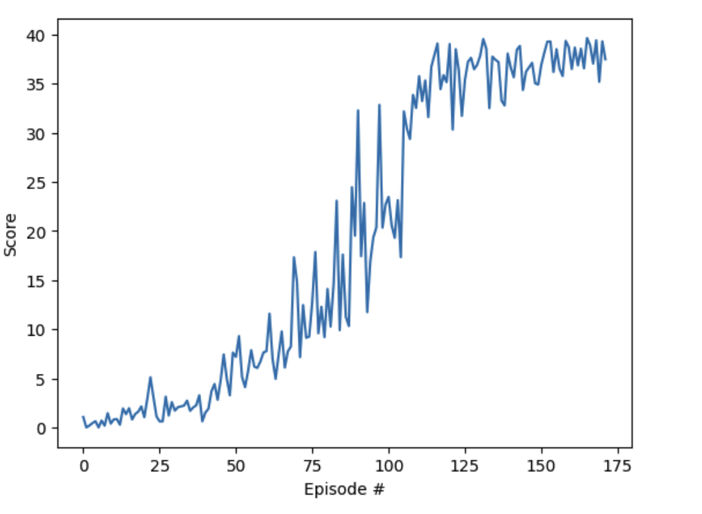

# DDPG Implementation Report for Continuous Control

## 1. Algorithm Selection and Architecture

### Algorithm: Deep Deterministic Policy Gradient (DDPG)
Selected for its ability to handle continuous action spaces effectively, making it ideal for robotic control tasks. DDPG combines:
- Actor-Critic architecture
- Deterministic policy gradient
- Experience replay
- Target networks

### Network Architecture
**Actor Network:**
- Input Layer: State size (33)
- Hidden Layer 1: 128 units with ReLU + Batch Normalization
- Hidden Layer 2: 128 units with ReLU
- Output Layer: Action size (4) with tanh activation

**Critic Network:**
- State Input Branch: 
  - FC Layer: 128 units with ReLU + Batch Normalization
- Action Input: Concatenated after first layer
- Combined Processing:
  - FC Layer: 128 units with ReLU
  - Output: Single Q-value

## 2. Hyperparameters

### Final Values:
- Learning Rate (LR): 3e-4
- Discount Factor (GAMMA): 0.99
- Soft Update Rate (TAU): 1e-3
- Replay Buffer Size: 1,000,000
- Batch Size: 64
- Episodes: 1000 (max)
- Max Timesteps per Episode: 1000

### Exploration:
Ornstein-Uhlenbeck Noise Parameters:
- θ (theta): 0.1
- σ (sigma): 0.2
- μ (mu): 0.0
- Sigma decay: 0.99
- Minimum sigma: 0.1

## 3. Results Analysis

### Performance Metrics:
- Target Score Achieved: 30.01
- Episodes Required: 172
- Training Time: Relatively efficient

 

 

### Learning Progression:
1. Initial Phase (0-50 episodes):
   - Low scores (0-5)
   - Exploration dominant
2. Rapid Learning (50-100 episodes):
   - Sharp increase in scores
   - Effective policy improvement
3. Convergence (100-172 episodes):
   - Stable performance
   - Consistent scores above 30

## 4. Future Improvements

### Architecture Modifications:
1. Layer Sizes:
   - Experiment with deeper networks
   - Try different hidden layer sizes (256, 512)
2. Advanced Architectures:
   - Implement prioritized experience replay
   - Add dropout layers for better generalization

### Hyperparameter Optimization:
1. Learning Process:
   - Test different learning rates
   - Implement learning rate scheduling
2. Exploration Strategy:
   - Try different noise processes
   - Implement parameter space noise

### Training Enhancements:
1. Stability:
   - Gradient clipping
   - Layer normalization
2. Efficiency:
   - Parallel environment training
   - Implement D4PG or TD3 algorithms

### Performance Monitoring:
1. Add detailed metrics:
   - Action distribution analysis
   - Q-value statistics
2. Implement early stopping with better criteria

These improvements could potentially lead to:
- Faster convergence
- More stable training
- Better final performance
- Increased generalization capability